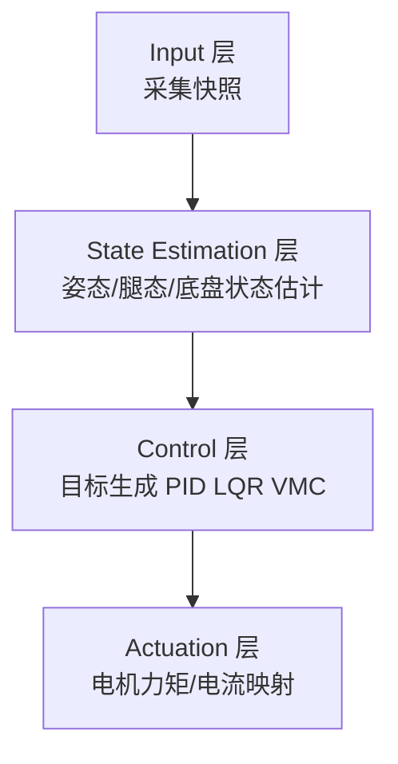
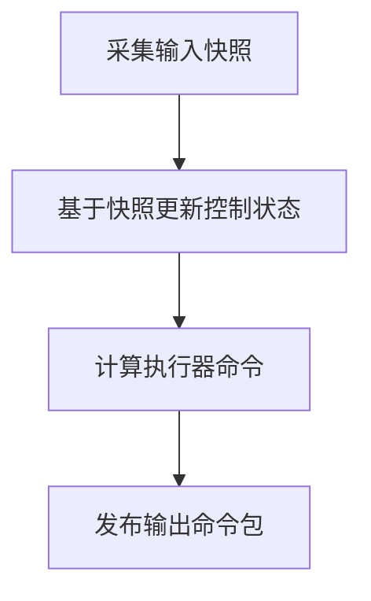

**User:**

<user_message>
'Application/Task/Src/Control_Task.c' 'Application/Task/Inc/Control_Task.h' 'Application/Task/Src/INS_Task.c' 'Application/Task/Inc/INS_Task.h' 'Application/Task/Src/CAN_Task.c' 'Application/Task/Inc/CAN_Task.h' 
你现在是一位资深的具身智能与嵌入式软件架构师。我为你挂载了偏置并联轮腿机器人（基于 STM32H7 和 FreeRTOS）在 Application/Task 层的核心调度代码。

请仔细阅读这些代码，并完成以下任务：
1. 任务拓扑分析： 列出当前系统中有哪些主要的 RTOS 任务 (Task)？它们的运行频率（周期）和优先级分别是多少？
2. 全局数据流向： 请重点分析从 INS_Task (读取欧拉角) 开始，经过 Control_Task (计算控制量)，最终到 CAN_Task (下发电机电流) 的完整数据传递链路。它们之间是通过什么全局变量或队列（Queue/Mutex）来传递数据的？
3. 架构隐患排查： 以初学者的视角来看，目前的 Task 层代码是否存在“高耦合”的问题？比如主控制循环里是否掺杂了太多底层的硬件操作代码？请给出重构或优化的建议。
</user_message>
[read_file for 'Application/Task/Src/Control_Task.c']
File: Application/Task/Src/Control_Task.c
   1 | 
   2 | #include "Control_Task.h"
   3 | #include "INS_Task.h"//陀螺仪
   4 | #include "cmsis_os.h"//FreeRTOS
   5 | #include "bsp_uart.h"//串口
   6 | #include "bsp_adc.h"//ADC--电压检测--低电压警告
   7 | #include "Remote_Control.h"//遥控器
   8 | #include "Image_Transmission.h"
   9 | #include "Ramp.h"//斜坡函数和移动平均滤波器，用于控制系统的信号平滑处理
  10 | #include "PID.h"
  11 | #include "Motor.h"
  12 | #include "arm_math.h"
  13 | 
  14 | //float K11[6] = {0,-161.117157f,196.474176f,-210.652836f,-22.628436f};
  15 | //float K12[6] = {0,12.798983f,-27.543440f,-37.270138f,-0.389884f};
  16 | //float K13[6] = {0,-69.863233f,70.467840f,-24.641029f,-22.550669f};
  17 | //float K14[6] = {0,47.504341f,-45.704640f,3.658661f,-23.154080f};
  18 | //float K15[6] = {0,-879.770236f,945.699308f,-371.024185f,73.193803f};
  19 | //float K16[6] = {0,-44.249716f,49.457747f,-20.483717f,5.913833f};
  20 | //float K21[6] = {0,-503.385834f,537.716406f,-192.249143f,46.119864f};
  21 | //float K22[6] = {0,-10.488132f,14.656765f,0.162789f,2.506017f};
  22 | //float K23[6] = {0,-325.449185f,352.124943f,-138.337810f,25.760259f};
  23 | //float K24[6] = {0,-337.260638f,354.780154f,-132.228603f,23.521027f};
  24 | //float K25[6] = {0,852.653086f,-857.295404f,299.554560f,105.138722f};
  25 | //float K26[6] = {0,65.525226f,-68.428754f,25.522485f,1.830345f};
  26 | 
  27 | 
  28 | /*Q=diag([2000 1 500 100 5000 1]);
  29 | 
  30 | 
  31 | R=diag([0.75  0.25]); */
  32 | //float K11[6] = {0,-500.905786f,460.989299f,-264.986316f,-35.170758f};
  33 | //float K12[6] = {0,1.839739f,-14.912806f,-42.788271f,-0.510816f};
  34 | //float K13[6] = {0,-67.045277f,62.200677f,-20.550515f,-23.139665f};
  35 | //float K14[6] = {0,162.051504f,-148.028801f,39.259245f,-29.799921f};
  36 | //float K15[6] = {0,-1253.481896f,1223.843174f,-446.788399f,82.393889f};
  37 | //float K16[6] = {0,-72.291579f,71.733797f,-26.974774f,6.773165f};
  38 | //float K21[6] = {0,-1193.375356f,1173.257512f,-415.447351f,82.296961f};
  39 | //float K22[6] = {0,11.285863f,-2.650088f,4.258226f,2.422298f};
  40 | //float K23[6] = {0,-275.149529f,288.134679f,-113.153230f,22.256308f};
  41 | //float K24[6] = {0,-409.194628f,398.516303f,-141.434132f,24.470515f};
  42 | //float K25[6] = {0,1528.379420f,-1363.813466f,429.617529f,92.845408f};
  43 | //float K26[6] = {0,93.876852f,-87.983942f,30.027810f,1.450183f};
  44 | 
  45 | 
  46 | /*Q=diag([1000 10 500 100 5000 1]);
  47 | 
  48 | 
  49 | R=diag([0.75  0.25]); */
  50 | // float K11[6] = {0,-412.921425f,387.990596f,-248.221187f,-28.349087f};
  51 | // float K12[6] = {0,-0.922566f,-18.491245f,-37.011157f,-2.290644f};
  52 | // float K13[6] = {0,-92.727783f,88.643227f,-30.230386f,-21.823378f};
  53 | // float K14[6] = {0,105.630452f,-93.945519f,19.668294f,-26.112547f};
  54 | // float K15[6] = {0,-1043.655528f,1080.127134f,-422.434524f,83.128812f};
  55 | // float K16[6] = {0,-59.200577f,60.051940f,-23.270970f,6.282138f};
  56 | // float K21[6] = {0,-583.855375f,662.372696f,-270.230733f,66.208364f};
  57 | // float K22[6] = {0,-24.862832f,39.600787f,-14.957582f,6.326057f};
  58 | // float K23[6] = {0,-249.498529f,291.240241f,-127.192951f,26.520236f};
  59 | // float K24[6] = {0,-403.712603f,416.374845f,-158.410887f,28.690800f};
  60 | // float K25[6] = {0,1563.102977f,-1429.120660f,463.833012f,86.995166f};
  61 | // float K26[6] = {0,91.827424f,-88.152111f,31.005557f,1.174900f};
  62 | 
  63 | 
  64 | /*Q=diag([1000 10 500 100 5000 1]);
  65 | 
  66 | 
  67 | R=diag([1.0  0.25]); */
  68 | //float K11[6] = {0,-445.358703f,419.553571f,-244.519341f,-21.964859f};
  69 | //float K12[6] = {0,-7.167430f,-9.461427f,-35.026456f,-1.666917f};
  70 | //float K13[6] = {0,-114.712495f,107.885547f,-35.945491f,-17.817850f};
  71 | //float K14[6] = {0,54.177721f,-47.788673f,6.479679f,-21.506980f};
  72 | //float K15[6] = {0,-964.805955f,1011.993002f,-400.604751f,77.733483f};
  73 | //float K16[6] = {0,-50.511059f,52.412749f,-20.884504f,5.678827f};
  74 | //float K21[6] = {0,-613.911745f,717.023564f,-303.015750f,72.676599f};
  75 | //float K22[6] = {0,-18.359517f,36.638540f,-16.302213f,6.964515f};
  76 | //float K23[6] = {0,-315.237165f,362.277827f,-155.366618f,30.606798f};
  77 | //float K24[6] = {0,-486.808600f,500.622329f,-189.812622f,33.031855f};
  78 | //float K25[6] = {0,1907.648359f,-1739.606513f,561.138514f,76.185442f};
  79 | //float K26[6] = {0,110.656894f,-105.842072f,36.923602f,0.455696f};
  80 | 
  81 | 
  82 | 
  83 | float K11[6] = {0,-344.130023f,397.724995f,-265.059481f,-4.941964f};
  84 | float K12[6] = {0,11.842778f,-18.891159f,-27.922778f,0.234829f};
  85 | float K13[6] = {0,-288.953787f,281.637253f,-94.596365f,-10.720163f};
  86 | float K14[6] = {0,-177.996259f,181.622915f,-75.159282f,-7.728459f};
  87 | float K15[6] = {0,-835.889683f,930.198548f,-389.150660f,74.543061f};
  88 | float K16[6] = {0,-58.542501f,66.926377f,-29.456008f,6.433743f};
  89 | float K21[6] = {0,178.165050f,-120.123702f,-0.177096f,29.334646f};
  90 | float K22[6] = {0,38.945329f,-38.984286f,14.882355f,2.371578f};
  91 | float K23[6] = {0,-527.320926f,586.755646f,-245.391894f,46.899771f};
  92 | float K24[6] = {0,-343.006363f,380.367381f,-159.679912f,32.616099f};
  93 | float K25[6] = {0,1840.588017f,-1794.197881f,602.816532f,67.365929f};
  94 | float K26[6] = {0,151.012003f,-149.438347f,51.534782f,1.364543f};
  95 | //========================================================================================
  96 | float K_3508_t=   2700.6667f;//
  97 | //K_3508_t = 2,730.6666666;
  98 | float K_Roll = 0.0003f;
  99 | //=========================================================================================
 100 | 
 101 | //static float  PID_Leg_Length_F_Param[7] 	  = {1500.f,1.f ,200000.f,0.f ,0  ,10.f,200.f}; //腿长PID(change)
 102 | //腿长
 103 | static float  PID_Leg_Length_F_Param[7] 	  = {1300.f,1.f ,60000.f,0.f ,0.f  ,10.f,100.f}; //腿长PID(change
 104 | 
 105 | //static float  PID_Leg_Length_R_Param[7] 	  = {0.5f,0.f ,0.f,0.f ,0.f  ,0.01f,0.2f};//腿部长度横滚补偿PID
 106 | 
 107 | static float  PID_Leg_Roll_F_Param[7]         = {50.f   ,0.f ,25.f     ,0.f  ,0.f  ,0.1f  ,50.f };
 108 | 
 109 | 
 110 | static float  PID_Leg_Coordinate_param[7]   = {300.f ,0.f ,20.0f   ,0.f ,0.f,0.f ,50   }; // 腿部协调PID
 111 | 
 112 | 
 113 | //===========================================================================================
 114 | //云台
 115 | static float  PID_Yaw_P_pama[7] 			      = {4.4f  ,0.f ,60.f    ,0   ,0  ,200 ,500  }; // 偏航角位置PID
 116 | static float  PID_Yaw_V_pama[7] 			      = {0.25f ,0   ,0.4f    ,0   ,0  ,200 ,70   }; // 偏航角速度PID
 117 | 
 118 | //由于驱动轮减速箱的机械设计存在问题，两边减速箱的阻力不同，导致输出相同的力矩，左右轮速度不同
 119 | //通过调整PID参数来尽量补偿这个问题
 120 | //static float  PID_Stool_param[2]                  = {15.f,0.f,0.f,0.f,0.f,2000.f,10000.f};//驱动轮速度控制PID
 121 | 
 122 | PID_Info_TypeDef PID_Leg_Coordinate;  // 腿部协调控制器
 123 | PID_Info_TypeDef PID_Leg_length_F[2]; // 左右腿长度控制器
 124 | //PID_Info_TypeDef PID_Leg_Length_R;   //腿长横滚补偿
 125 | PID_Info_TypeDef PID_Leg_Roll_F;//横滚补偿力
 126 | 
 127 | 
 128 | 
 129 | 
 130 | PID_Info_TypeDef PID_Yaw[2];          // 偏航控制器（位置+速度）
 131 | //PID_Info_TypeDef PID_Stool[2]; // 驱动轮控制器
 132 | 
 133 | //调试区----------------------------------------------------------------------------------------------
 134 | 
 135 | 
 136 | float Test_Theta = 0;                           //测试用的摆杆倾角--0度--摆杆垂直地面
 137 | 
 138 | //float Joint_Angle_offset_Num = 0.635f;          //机械安装偏移补偿(并联腿)
 139 | 
 140 | //float Test_Vmc_Target_L0_Chassis_High   = 0.25f;//高底盘
 141 | //float Test_Vmc_Target_L0_Chassis_Normal = 0.23f;//正常高度底盘
 142 | 
 143 | Control_Info_Typedef Control_Info ={
 144 | //失控检测参数==================================================
 145 | 	//.Init.Balance_Init.Balance_Angle_Range = 0.1221730f,//区间为7度，正常平衡时角度波动在3度左右
 146 | //腿长控制参数==================================================
 147 | 	.Base_Leg_Length_Low 		= 0.14f,//基础低腿长
 148 | 	.Base_Leg_Length_High   	= 0.20f,//基础高腿长
 149 | //横滚控制参数==================================================
 150 | 	.Roll ={
 151 | 		.Distance_Two_Wheel = 0.4157f,//轮机械间距，单位米
 152 | 		.Offset = 0.0f,// //陀螺仪角度补偿
 153 |         .Target_Angle = 0.0f,////目标横滚角
 154 | 
 155 | 	},
 156 | //================================================================	
 157 | //腿的机械参数，固定值--如果是新车，这一块要改
 158 | .L_Leg_Info = {
 159 | 
 160 | 	.Biased = {
 161 | 		.L_Thigh_Link = 0.118114f,//大腿连杆，连杆直驱--动力长后杆长度（AH）
 162 | 		.L_Calf_Link  = 0.100f,//小腿连杆(仿生机器人领域标准术语）动力短前杆长度（AD）,连杆传动
 163 | 		
 164 | 		.K = 0.465116f,//连杆长度比K=AD/AH
 165 | 
 166 | 		
 167 | 	},//偏置并联
 168 | 	.Gravity_Compensation = 100.f,//重力的一半
 169 | 	//.Link_Gravity_Compensation_Angle = 0.4701917f,//连杆重心补偿角度
 170 | 	.Link_Gravity_Compensation_Angle = 0.0f,//连杆重心补偿角度
 171 | 	//.Phi_Comp_Angle =  -0.0242711f,//当车平衡时，陀螺仪读出来的数据
 172 | 	.Phi_Comp_Angle =  -0.f,//当车平衡时，陀螺仪读出来的数据
 173 | //.Phi_Comp_Angle =  0.0f,//当车平衡时，陀螺仪读出来的数据
 174 | },//单腿测试
 175 | 
 176 | 
 177 | 
 178 | //右腿
 179 | .R_Leg_Info = {
 180 | 
 181 | 	.Biased = {
 182 | 		.L_Thigh_Link = 0.118114f,//大腿连杆，连杆直驱--动力长后杆长度（AH）
 183 | 		.L_Calf_Link  = 0.100f,//小腿连杆(仿生机器人领域标准术语）动力短前杆长度（AD）,连杆传动
 184 | 		.K = 0.465116f,//连杆长度比K=AD/AH
 185 | 
 186 | 		
 187 | 	},//2
 188 | 	.Gravity_Compensation = 100.f,
 189 |     .Link_Gravity_Compensation_Angle = 0.4701917f,
 190 | //.Phi_Comp_Angle =  -0.0242711f,//当车平衡时，陀螺仪读出来的数据
 191 | 	.Phi_Comp_Angle =  -0.f,//当车平衡时，陀螺仪读出来的数据
 192 | 	//.Phi_Comp_Angle =  0.0f,//当车平衡时，陀螺仪读出来的数据
 193 | },
 194 | 
 195 | 
 196 | 
 197 | 
 198 | };   
 199 | 
 200 | 
 201 | //函数区-------------------------------------------------------------------------------------------
 202 | static void Pid_Init(Control_Info_Typedef *Control_Info);
 203 | /*清零所有状态量/设置默认PID参数/配置初始工作模式/分配内存资源/系统启动时调用一次*/
 204 | static void Check_Low_Voltage_Beep(Control_Info_Typedef *Control_Info);//1.检查电池（低电压警告）
 205 | static void Mode_Update(Control_Info_Typedef *Control_Info);           //2.模式更新
 206 | static void Joint_Angle_Offset(Control_Info_Typedef *Control_Info);    //3.看腿的形状（读关节角度，并映射到VMC坐标系）
 207 | static void VMC_Calculate(Control_Info_Typedef *Control_Info);         //4.知道形状后，连杆正运动学解算，求简化腿腿长L0和摆角Phi0，轮子速度
 208 | static void LQR_K_Update(Control_Info_Typedef *Control_Info);          //5.得到简化腿长后，更新LQR控制器的增益矩阵K
 209 | 
 210 | static void Measure_Update(Control_Info_Typedef *Control_Info);        //6.更新传感器数据和目标值
 211 | 
 212 | //底盘移动控制--前进后退（X轴），左右转（YAW轴）
 213 | static void Chassis_Move_Control(Control_Info_Typedef *Control_Info);
 214 | //底盘高度控制
 215 | static void Chassis_Height_Control(Control_Info_Typedef *Control_Info);
 216 | //底盘横滚控制
 217 | static void Chassis_Roll_Control(Control_Info_Typedef *Control_Info);
 218 | //腿长控制
 219 | static void Leg_Length_Control(Control_Info_Typedef *Control_Info);
 220 | //static void Target_Update(Control_Info_Typedef *Control_Info);
 221 | static void LQR_X_Update(Control_Info_Typedef *Control_Info);			//7.更新状态向量差值，为LQR控制器u = -K·X提供输入向量（值）
 222 | static void VMC_Measure_F_Tp_Calculate(Control_Info_Typedef *Control_Info);//8.求简化腿的顶力（F）和扭矩(Tp)
 223 | 
 224 | static void LQR_T_Tp_Calculate(Control_Info_Typedef *Control_Info);		//9.自适应的LQR，根据是否在空中来限制LQR的作用
 225 | 
 226 | static void Comprehensive_F_Calculate(Control_Info_Typedef *Control_Info);//10.综合计算
 227 | static void Joint_Tourgue_Calculate(Control_Info_Typedef *Control_Info);//11.实际向电机发送数据的计算
 228 | 
 229 | 
 230 | 
 231 | TickType_t Control_Task_SysTick = 0;
 232 | 
 233 | 
 234 | void Control_Task(void const * argument)
 235 | {
 236 |   /*只跑一次的*/
 237 |   
 238 |  	Pid_Init(&Control_Info);
 239 | 	
 240 |  /* Infinite loop */
 241 | 	for(;;)
 242 |   {
 243 | 		Control_Task_SysTick = osKernelSysTick();
 244 | 		//电池
 245 | 		Check_Low_Voltage_Beep(&Control_Info);
 246 | 		//开关
 247 | 		//上级函数
 248 |         Mode_Update(&Control_Info);
 249 | 		//K
 250 | 		//传感器-----------------------
 251 | 		Joint_Angle_Offset(&Control_Info);
 252 | 		//解码器
 253 | 		//从真实形状转化为简化模型，方便之后的目标控制
 254 | 	    VMC_Calculate(&Control_Info);
 255 | 		//上级函数--------------------------------
 256 | 		 //转化到二阶简化模型之后，按照二阶独轮车的模型进行控制
 257 | 		LQR_K_Update(&Control_Info);
 258 | 		//传感器函数
 259 | 		//测量与目标
 260 | 	    Measure_Update(&Control_Info);
 261 | 	//=======================================================
 262 | 		//底盘移动控制
 263 | 		Chassis_Move_Control(&Control_Info);
 264 | 		//底盘高度控制
 265 | 		Chassis_Height_Control(&Control_Info);
 266 | 		//底盘横滚控制
 267 | 		Chassis_Roll_Control(&Control_Info);
 268 | 
 269 | 		//腿长控制
 270 | 		Leg_Length_Control(&Control_Info);
 271 | //==============================================================
 272 | 	
 273 | 	      VMC_Measure_F_Tp_Calculate(&Control_Info);	
 274 |         LQR_X_Update(&Control_Info);
 275 | 		LQR_T_Tp_Calculate(&Control_Info);
 276 | 		Comprehensive_F_Calculate(&Control_Info);
 277 | 		//输出
 278 | 		Joint_Tourgue_Calculate(&Control_Info);
 279 | 
 280 | 
 281 | 
 282 | //vofa区==============================================================================================
 283 |          //USART_Vofa_Justfloat_Transmit(Control_Info.R_Leg_Info.Measure.Chassis_Velocity,Control_Info.L_Leg_Info.Measure.Chassis_Velocity,0,0);
 284 | //USART_Vofa_Justfloat_Transmit(-INS_Info.Angle[2],INS_Info.Yaw_Angle,INS_Info.Roll_Angle,INS_Info.Roll_Angle);
 285 |   //USART_Vofa_Justfloat_Transmit(Control_Info.L_Leg_Info.Measure.Chassis_Position,Control_Info.L_Leg_Info.Measure.Phi,Control_Info.L_Leg_Info.Measure.Theta,Control_Info.L_Leg_Info.Measure.F);
 286 | 	
 287 | //	USART_Vofa_Justfloat_Transmit((Control_Info.L_Leg_Info.Measure.Phi *RadiansToDegrees),Control_Info.L_Leg_Info.Moment.Balance_Tp,Control_Info.L_Leg_Info.SendValue.Current,(Control_Info.L_Leg_Info.Measure.Theta *RadiansToDegrees));
 288 | 	//USART_Vofa_Justfloat_Transmit((Control_Info.L_Leg_Info.Measure.Phi *RadiansToDegrees),Control_Info.L_Leg_Info.Moment.Balance_Tp,Control_Info.L_Leg_Info.SendValue.Current,Control_Info.L_Leg_Info.F);
 289 | 		//USART_Vofa_Justfloat_Transmit(INS_Info.Roll_Angle,Control_Info.L_Leg_Info.Moment.Roll_F,Control_Info.R_Leg_Info.Moment.Roll_F,Control_Info.L_Leg_Info.Moment.Leg_Length_F);
 290 | 	//USART_Vofa_Justfloat_Transmit(Control_Info.L_Leg_Info.Measure.Chassis_Velocity,(-remote_ctrl.rc.ch[3] * 0.0031),Control_Info.R_Leg_Info.Measure.Chassis_Velocity,Control_Info.L_Leg_Info.Measure.Chassis_Position);
 291 | 	
 292 | 	USART_Vofa_Justfloat_Transmit(Control_Info.Target_Velocity,  Control_Info.R_Leg_Info.Measure.Chassis_Velocity,Control_Info.L_Leg_Info.Measure.Chassis_Velocity,Control_Info.L_Leg_Info.Measure.Chassis_Position);
 293 | //USART_Vofa_Justfloat_Transmit((Control_Info.L_Leg_Info.Velocity.Wheel-Control_Info.R_Leg_Info.Velocity.Wheel),(Control_Info.L_Leg_Info.Velocity.W-Control_Info.R_Leg_Info.Velocity.W),(Control_Info.L_Leg_Info.Velocity.X-Control_Info.R_Leg_Info.Velocity.X),0);
 294 | //=====================================================================================================	
 295 | 	osDelayUntil(&Control_Task_SysTick,1);
 296 |   }
 297 | }
 298 |   /* USER CODE END Control_Task */
 299 |  static uint32_t Tick = 0;
 300 | 
 301 | static void Check_Low_Voltage_Beep(Control_Info_Typedef *Control_Info){
 302 |  
 303 | 	 Control_Info->VDC = USER_ADC_Voltage_Update();
 304 |  	
 305 | //	 if(Control_Info->VDC < 22.f){//如果电压低于22V
 306 | //	    Tick++;
 307 | //		// 触发蜂鸣器报警模式（0.1s开/0.1s关，循环3次）
 308 | //		 if(Tick < 100){
 309 | //		    TIM12->CCR2 = 1000;
 310 | //		 }else if(Tick > 100 && Tick <200){
 311 | //		 	TIM12->CCR2 = 0;
 312 | //		 }else if(Tick > 200 && Tick < 300){
 313 | //		 	TIM12->CCR2 = 1000;
 314 | //		 }else if(Tick > 300 && Tick < 400){
 315 | //			TIM12->CCR2 = 0;
 316 | //		 }else if(Tick > 400 && Tick < 500){
 317 | //			TIM12->CCR2 = 1000;
 318 | //		 }else if(Tick > 500 && Tick < 600){
 319 | //			TIM12->CCR2 = 0;
 320 | //     }else if(Tick > 1000){
 321 | //			 Tick = 0;
 322 | //		 }
 323 | //		}else if(Control_Info->VDC >= 22.f){
 324 | //	 
 325 | //			TIM12->CCR2 = 0;
 326 | //			
 327 | //	  }
 328 |   }
 329 | //PID初始化
 330 | static void Pid_Init(Control_Info_Typedef *Control_Info){
 331 | 
 332 | 	//腿长PID初始化
 333 |     PID_Init(&PID_Leg_length_F[0],PID_POSITION,PID_Leg_Length_F_Param);
 334 |     PID_Init(&PID_Leg_length_F[1],PID_POSITION,PID_Leg_Length_F_Param);
 335 | 	//腿长横滚补偿PID初始化
 336 | 	//PID_Init(&PID_Leg_length_F,PID_POSITION,PID_Leg_Length_R_Param);
 337 | 	//腿长横滚补偿力PID初始化
 338 | 	PID_Init(&PID_Leg_Roll_F,PID_POSITION,PID_Leg_Roll_F_Param);
 339 |     // 初始化腿部协调PID控制器
 340 | 	PID_Init(&PID_Leg_Coordinate, PID_POSITION, PID_Leg_Coordinate_param);
 341 | 
 342 | 
 343 | 
 344 | 
 345 | 	// 初始化偏航PID控制器（位置环+速度环）
 346 | 	PID_Init(&PID_Yaw[0],PID_POSITION,PID_Yaw_P_pama);
 347 | 	PID_Init(&PID_Yaw[1],PID_POSITION,PID_Yaw_V_pama);
 348 | 	
 349 | }
 350 | 
 351 | 
 352 | static void Mode_Update(Control_Info_Typedef *Control_Info){
 353 | 
 354 | 
 355 |    if(remote_ctrl.rc.s[1] == 3 || remote_ctrl.rc.s[1]){
 356 | 		 /*逻辑冗余：由于||(或运算符)的存在，当remote_ctrl.rc.s[1] == 3成立时，第二个条件不会被执行（短路求值）*/
 357 | 	 
 358 | 	   Control_Info->Init.IF_Begin_Init = 1;
 359 | 	 if(remote_ctrl.rc.s[1] == 2){
 360 | 	 Control_Info->Init.IF_Begin_Init = 0;
 361 | 	 Control_Info->Chassis_Situation = CHASSIS_WEAK;
 362 | 	 }
 363 | 	 
 364 | 	 }else{
 365 | 	 
 366 | 	  	Control_Info->Init.IF_Begin_Init = 0;
 367 |       if(Control_Info->Chassis_Situation == CHASSIS_BALANCE) Control_Info->Chassis_Situation = CHASSIS_WEAK; 
 368 | 	 
 369 | 	 } 
 370 | 		 
 371 | 
 372 |    if(Control_Info->Init.IF_Begin_Init == 1 && Control_Info->Chassis_Situation == CHASSIS_WEAK){	
 373 | 	
 374 | 	        
 375 |    if(Control_Info->Init.Joint_Init.IF_Joint_Init == 0){  
 376 | 	   	
 377 | 			 if(DM_8009_Motor[0].Data.Position < 0.0f )  
 378 | 			 Control_Info->Init.Joint_Init.IF_Joint_Reduction_Flag[0] = 1; else Control_Info->Init.Joint_Init.IF_Joint_Reduction_Flag[0] = 0;
 379 | 			 if(DM_8009_Motor[1].Data.Position > -0.21f &&  DM_8009_Motor[1].Data.Position<-0.005f)    
 380 | 		   Control_Info->Init.Joint_Init.IF_Joint_Reduction_Flag[1] = 1; else Control_Info->Init.Joint_Init.IF_Joint_Reduction_Flag[1] = 0; 
 381 | 			 if(DM_8009_Motor[2].Data.Position < 0.20f&& DM_8009_Motor[2].Data.Position>0.01f)    
 382 | 			 Control_Info->Init.Joint_Init.IF_Joint_Reduction_Flag[2] = 1; else Control_Info->Init.Joint_Init.IF_Joint_Reduction_Flag[2] = 0;
 383 | 			 if(DM_8009_Motor[3].Data.Position > -0.0f )  
 384 | 			 Control_Info->Init.Joint_Init.IF_Joint_Reduction_Flag[3] = 1; else Control_Info->Init.Joint_Init.IF_Joint_Reduction_Flag[3] = 0;
 385 | 			
 386 | 			 if(Control_Info->Init.Joint_Init.IF_Joint_Reduction_Flag[0] + Control_Info->Init.Joint_Init.IF_Joint_Reduction_Flag[1] 
 387 | 			  + Control_Info->Init.Joint_Init.IF_Joint_Reduction_Flag[2] + Control_Info->Init.Joint_Init.IF_Joint_Reduction_Flag[3] == 4){  
 388 | 			
 389 | 			   Control_Info->Init.Joint_Init.IF_Joint_Init = 1;  
 390 | 					
 391 | 				}else  Control_Info->Init.Joint_Init.IF_Joint_Init =0;
 392 | 					
 393 | 					Control_Info->L_Leg_Info.Measure.Chassis_Position = 0 ;
 394 |           Control_Info->R_Leg_Info.Measure.Chassis_Position = 0 ; 
 395 | 
 396 | 		}else if(Control_Info->Init.Joint_Init.IF_Joint_Init == 1){
 397 | 			
 398 | 			 Control_Info->Chassis_Situation = CHASSIS_BALANCE;
 399 | 		   	Control_Info->L_Leg_Info.Measure.Chassis_Position = 0 ;
 400 |         Control_Info->R_Leg_Info.Measure.Chassis_Position = 0 ; 
 401 | 				  
 402 | 		}
 403 | 				
 404 | }
 405 | 
 406 |     if(Control_Info->Init.IF_Begin_Init == 0 && Control_Info->Chassis_Situation == CHASSIS_WEAK){
 407 | 
 408 |   
 409 | 			Control_Info->Init.Joint_Init.IF_Joint_Reduction_Flag[0] = 0;
 410 | 			Control_Info->Init.Joint_Init.IF_Joint_Reduction_Flag[1] = 0;
 411 | 			Control_Info->Init.Joint_Init.IF_Joint_Reduction_Flag[2] = 0;
 412 | 			Control_Info->Init.Joint_Init.IF_Joint_Reduction_Flag[3] = 0;
 413 | 			Control_Info->Init.Joint_Init.IF_Joint_Init = 0;
 414 | 
 415 | 
 416 |     }
 417 | }
 418 | 
 419 | static void Joint_Angle_Offset(Control_Info_Typedef *Control_Info){
 420 | 
 421 | 
 422 |     // //左小腿摆角与0号关节电机的映射(摆角=电机角度)
 423 | 	 Control_Info->L_Leg_Info.Biased.Calf_Angle 		 =  DM_8009_Motor[0].Data.Position ;//* RadiansToDegrees;
 424 | 	// //左大腿摆角与1号关节电机的映射（摆角=电机角度）
 425 | 	 Control_Info->L_Leg_Info.Biased.Thigh_Angle 		 =  PI+ DM_8009_Motor[1].Data.Position;//) * RadiansToDegrees;
 426 | 	//角速度
 427 | 		//左大腿
 428 | 		Control_Info->L_Leg_Info.Biased.Thigh_Angle_Dot = DM_8009_Motor[1].Data.Velocity;
 429 | 		//左小腿
 430 | 		Control_Info->L_Leg_Info.Biased.Calf_Angle_Dot  = DM_8009_Motor[0].Data.Velocity;
 431 | 	//力矩映射
 432 | 		//左大腿--对应T1
 433 | 		Control_Info->L_Leg_Info.Biased.T_Thigh = DM_8009_Motor[1].Data.Torque;
 434 | 		//左小腿---对应T2
 435 | 		Control_Info->L_Leg_Info.Biased.T_Calf  = DM_8009_Motor[0].Data.Torque;
 436 | 
 437 | 
 438 | 	//测试用
 439 | 	//测试用：假设，当腿完全收缩时-也就是到达最低机械限位，时，大腿和小腿连杆可以张到180度（实际是180.03度）
 440 | 
 441 | 	// //右大腿摆角和2号关节电机的映射(同左腿)
 442 | 	 Control_Info->R_Leg_Info.Biased.Thigh_Angle 		 =  DM_8009_Motor[2].Data.Position ;//* RadiansToDegrees;
 443 | 	// //右小腿摆角和3号关节电机的映射
 444 | 	 Control_Info->R_Leg_Info.Biased.Calf_Angle  		 =  PI+ DM_8009_Motor[3].Data.Position ;//* RadiansToDegrees;
 445 | 	//角速度
 446 | 		//右大腿
 447 | 		Control_Info->R_Leg_Info.Biased.Thigh_Angle_Dot = DM_8009_Motor[2].Data.Velocity;
 448 | 		//右小腿
 449 | 		Control_Info->R_Leg_Info.Biased.Calf_Angle_Dot  = DM_8009_Motor[3].Data.Velocity;
 450 | 	//力矩映射
 451 | 		//右大腿--对应T2
 452 | 		Control_Info->R_Leg_Info.Biased.T_Thigh = DM_8009_Motor[2].Data.Torque;
 453 | 		//右小腿---对应T1
 454 | 		Control_Info->R_Leg_Info.Biased.T_Calf  = DM_8009_Motor[3].Data.Torque;
 455 | 
 456 | 
 457 | }
 458 | 
 459 | static void VMC_Calculate(Control_Info_Typedef *Control_Info){
 460 | 
 461 | 	//a,b,简化表达用
 462 | 	Control_Info->L_Leg_Info.a = Control_Info->L_Leg_Info.Biased.L_Calf_Link;
 463 | 	Control_Info->L_Leg_Info.b = Control_Info->L_Leg_Info.Biased.L_Thigh_Link;
 464 | 	//左夹角差半值=（左小腿摆角-左大腿摆角）/2
 465 | 	//Control_Info->L_Leg_Info.M = (Control_Info->L_Leg_Info.Biased.Calf_Angle - Control_Info->L_Leg_Info.Biased.Thigh_Angle)/2.f;
 466 | 	Control_Info->L_Leg_Info.M = -(Control_Info->L_Leg_Info.Biased.Calf_Angle - Control_Info->L_Leg_Info.Biased.Thigh_Angle)/2.f;
 467 | 	//左夹角和半差=（左小腿摆角+左大腿摆角）/2
 468 | 	//2025.11.14：修改为负号
 469 | 	//2.0：改为正号
 470 | 	Control_Info->L_Leg_Info.N = (Control_Info->L_Leg_Info.Biased.Calf_Angle + Control_Info->L_Leg_Info.Biased.Thigh_Angle)/2.f;
 471 | 	//s_radicand  
 472 | 	//中间变量 公式： S_Radicand = b^2 - a^2 sin^2(M)
 473 | 	//M = (θ_1 - θ_2 )/2
 474 | 	Control_Info->L_Leg_Info.S_Radicand = Control_Info->L_Leg_Info.b * Control_Info->L_Leg_Info.b - Control_Info->L_Leg_Info.a * Control_Info->L_Leg_Info.a * arm_sin_f32(Control_Info->L_Leg_Info.M) * arm_sin_f32(Control_Info->L_Leg_Info.M);
 475 | 	//S 中间变量 公式： S = sqrt(S_Radicand)
 476 | 	arm_sqrt_f32(Control_Info->L_Leg_Info.S_Radicand,&Control_Info->L_Leg_Info.S);
 477 | 	//t //中间变量 公式： t=a*cosM+S
 478 | 	Control_Info->L_Leg_Info.t = Control_Info->L_Leg_Info.a * arm_cos_f32(Control_Info->L_Leg_Info.M) + Control_Info->L_Leg_Info.S;
 479 | 	//A //中间变量 公式： A= (a*t*sinM)/S
 480 | 	Control_Info->L_Leg_Info.A = (Control_Info->L_Leg_Info.a * Control_Info->L_Leg_Info.t * arm_sin_f32(Control_Info->L_Leg_Info.M)) / Control_Info->L_Leg_Info.S;
 481 |     //=============================================================================================================================================================================================================================================
 482 | 
 483 | 	//建模------------------------------------------------------------------------------------------------------------------------------
 484 | 	//1.虚拟腿摆角
 485 | 	Control_Info->L_Leg_Info.Sip_Leg_Angle  = Control_Info->L_Leg_Info.N;
 486 | 	//虚拟腿长（AJ）AJ = t/K
 487 | 	Control_Info->L_Leg_Info.Sip_Leg_Length = Control_Info->L_Leg_Info.t / Control_Info->L_Leg_Info.Biased.K;
 488 |     //J点速度
 489 | 	//X轴方向速度 公式： X_J_Dot =(A*cosN*(Thigh_Angle_Dot -Calf_Angle_Dot) - t*sinN*(Thigh_Angle_Dot +Calf_Angle_Dot))/ (2*K)
 490 |      Control_Info->L_Leg_Info.X_J_Dot =   (Control_Info->L_Leg_Info.A * arm_cos_f32(Control_Info->L_Leg_Info.N) *(Control_Info->L_Leg_Info.Biased.Thigh_Angle_Dot - Control_Info->L_Leg_Info.Biased.Calf_Angle_Dot)
 491 | 									     - Control_Info->L_Leg_Info.t * arm_sin_f32(Control_Info->L_Leg_Info.N) *(Control_Info->L_Leg_Info.Biased.Thigh_Angle_Dot + Control_Info->L_Leg_Info.Biased.Calf_Angle_Dot))/ (2.f * Control_Info->L_Leg_Info.Biased.K);
 492 | 	//Y轴方向速度 公式： Y_J_Dot =(A*sinN*(Thigh_Angle_Dot -Calf_Angle_Dot) + t*cosN*(Thigh_Angle_Dot +Calf_Angle_Dot))/ (2*K)
 493 |      Control_Info->L_Leg_Info.Y_J_Dot =   (Control_Info->L_Leg_Info.A * arm_sin_f32(Control_Info->L_Leg_Info.N) *(Control_Info->L_Leg_Info.Biased.Thigh_Angle_Dot - Control_Info->L_Leg_Info.Biased.Calf_Angle_Dot)
 494 | 									     + Control_Info->L_Leg_Info.t * arm_cos_f32(Control_Info->L_Leg_Info.N) *(Control_Info->L_Leg_Info.Biased.Thigh_Angle_Dot + Control_Info->L_Leg_Info.Biased.Calf_Angle_Dot))/ (2.f * Control_Info->L_Leg_Info.Biased.K);
 495 | 
 496 | //右腿---
 497 | //存在问题，即对于J点速度的计算，左右腿的结果不一样
 498 | //待实车测试验证
 499 | 	//中间变量=====================================================================================================================================
 500 | 	//a,b,简化表达用
 501 | 	Control_Info->R_Leg_Info.a = Control_Info->R_Leg_Info.Biased.L_Calf_Link;
 502 | 	Control_Info->R_Leg_Info.b = Control_Info->R_Leg_Info.Biased.L_Thigh_Link;
 503 | 	//右夹角差半值=（右大腿摆角-右小腿摆角）/2
 504 | 	Control_Info->R_Leg_Info.M = -(Control_Info->R_Leg_Info.Biased.Thigh_Angle - Control_Info->R_Leg_Info.Biased.Calf_Angle)/2.f;
 505 | 	//右夹角和半差=（右小腿摆角+右大腿摆角）/2
 506 | 	Control_Info->R_Leg_Info.N = (Control_Info->R_Leg_Info.Biased.Calf_Angle + Control_Info->R_Leg_Info.Biased.Thigh_Angle)/2.f;
 507 | 	//s_radicand
 508 | 	//s_radicand  
 509 | 	//中间变量 公式： S_Radicand = b^2 - a^2 sin^2(M)
 510 | 	//M = (θ_1 - θ_2 )/2
 511 | 		//中间变量 公式： S_Radicand = b^2 - a^2 sin^2(M)
 512 | 	Control_Info->R_Leg_Info.S_Radicand = Control_Info->R_Leg_Info.b * Control_Info->R_Leg_Info.b - Control_Info->R_Leg_Info.a * Control_Info->R_Leg_Info.a * arm_sin_f32(Control_Info->R_Leg_Info.M) * arm_sin_f32(Control_Info->R_Leg_Info.M);
 513 | 	//S 中间变量 公式： S = sqrt(S_Radicand)
 514 | 	arm_sqrt_f32(Control_Info->R_Leg_Info.S_Radicand,&Control_Info->R_Leg_Info.S);
 515 | 	//t //中间变量 公式： t=a*cosM+S
 516 | 	Control_Info->R_Leg_Info.t = Control_Info->R_Leg_Info.a * arm_cos_f32(Control_Info->R_Leg_Info.M) + Control_Info->R_Leg_Info.S;
 517 | 	//A //中间变量 公式： A= (a*t*sinM)/S
 518 | 	Control_Info->R_Leg_Info.A = (Control_Info->R_Leg_Info.a * Control_Info->R_Leg_Info.t * arm_sin_f32(Control_Info->R_Leg_Info.M)) / Control_Info->R_Leg_Info.S;
 519 | 	//=============================================================================================================================================================================================================================================	
 520 |     //建模
 521 | 	//1.虚拟腿摆角
 522 | 	Control_Info->R_Leg_Info.Sip_Leg_Angle  = Control_Info->R_Leg_Info.N;
 523 | 	//虚拟腿长（AJ）AJ = t/K
 524 | 	Control_Info->R_Leg_Info.Sip_Leg_Length = Control_Info->R_Leg_Info.t / Control_Info->R_Leg_Info.Biased.K;
 525 | 	//J点速度
 526 | 	//速度有方向，取小车头前方向为正方向，垂直地面的法向量方向为单独分析单腿速度的Y轴正方向
 527 | 	//X轴方向速度 公式： X_J_Dot =(A*cosN*(Thigh_Angle_Dot -Calf_Angle_Dot) - t*sinN*(Thigh_Angle_Dot +Calf_Angle_Dot))/ (2*K)
 528 | 	Control_Info->R_Leg_Info.X_J_Dot =   (Control_Info->R_Leg_Info.A * arm_cos_f32(Control_Info->R_Leg_Info.N) *(Control_Info->R_Leg_Info.Biased.Thigh_Angle_Dot - Control_Info->R_Leg_Info.Biased.Calf_Angle_Dot)
 529 | 									     - Control_Info->R_Leg_Info.t * arm_sin_f32(Control_Info->R_Leg_Info.N) *(Control_Info->R_Leg_Info.Biased.Thigh_Angle_Dot + Control_Info->R_Leg_Info.Biased.Calf_Angle_Dot))/ (2.f * Control_Info->R_Leg_Info.Biased.K);
 530 | 	//Y轴方向速度 公式： Y_J_Dot =(A*sinN*(Thigh_Angle_Dot -Calf_Angle_Dot) + t*cosN*(Thigh_Angle_Dot +Calf_Angle_Dot))/ (2*K)
 531 | 	Control_Info->R_Leg_Info.Y_J_Dot =   (Control_Info->R_Leg_Info.A * arm_sin_f32(Control_Info->R_Leg_Info.N) *(Control_Info->R_Leg_Info.Biased.Thigh_Angle_Dot - Control_Info->R_Leg_Info.Biased.Calf_Angle_Dot)
 532 | 									     + Control_Info->R_Leg_Info.t * arm_cos_f32(Control_Info->R_Leg_Info.N) *(Control_Info->R_Leg_Info.Biased.Thigh_Angle_Dot + Control_Info->R_Leg_Info.Biased.Calf_Angle_Dot))/ (2.f * Control_Info->R_Leg_Info.Biased.K);
 533 | 
 534 | 
 535 | 
 536 | }
 537 | 
 538 | static void LQR_K_Update(Control_Info_Typedef *Control_Info){
 539 | 	//简化表达
 540 | 	float L_L0; 
 541 | 
 542 | L_L0= Control_Info->L_Leg_Info.Sip_Leg_Length;//偏腿
 543 | 
 544 | 	Control_Info->L_Leg_Info.LQR_K[0][0] =   K11[1]*powf(L_L0,3)   + K11[2]*powf(L_L0,2)    +K11[3]*L_L0    +K11[4];      
 545 | 	Control_Info->L_Leg_Info.LQR_K[0][1] =   K12[1]*powf(L_L0,3)   + K12[2]*powf(L_L0,2)    +K12[3]*L_L0    +K12[4];
 546 | 	Control_Info->L_Leg_Info.LQR_K[0][2] =   K13[1]*powf(L_L0,3)   + K13[2]*powf(L_L0,2)    +K13[3]*L_L0    +K13[4];
 547 | 	Control_Info->L_Leg_Info.LQR_K[0][3] =   K14[1]*powf(L_L0,3)   + K14[2]*powf(L_L0,2)    +K14[3]*L_L0    +K14[4];
 548 | 	Control_Info->L_Leg_Info.LQR_K[0][4] =   K15[1]*powf(L_L0,3)   + K15[2]*powf(L_L0,2)    +K15[3]*L_L0    +K15[4];
 549 | 	Control_Info->L_Leg_Info.LQR_K[0][5] =   K16[1]*powf(L_L0,3)   + K16[2]*powf(L_L0,2)    +K16[3]*L_L0    +K16[4];
 550 | 
 551 | 	Control_Info->L_Leg_Info.LQR_K[1][0] =   K21[1]*powf(L_L0,3)   + K21[2]*powf(L_L0,2)    +K21[3]*L_L0    +K21[4];     
 552 | 	Control_Info->L_Leg_Info.LQR_K[1][1] =   K22[1]*powf(L_L0,3)   + K22[2]*powf(L_L0,2)    +K22[3]*L_L0    +K22[4];
 553 | 	Control_Info->L_Leg_Info.LQR_K[1][2] =   K23[1]*powf(L_L0,3)   + K23[2]*powf(L_L0,2)    +K23[3]*L_L0    +K23[4];
 554 | 	Control_Info->L_Leg_Info.LQR_K[1][3] =   K24[1]*powf(L_L0,3)   + K24[2]*powf(L_L0,2)    +K24[3]*L_L0    +K24[4];
 555 | 	Control_Info->L_Leg_Info.LQR_K[1][4] =   K25[1]*powf(L_L0,3)   + K25[2]*powf(L_L0,2)    +K25[3]*L_L0    +K25[4];
 556 | 	Control_Info->L_Leg_Info.LQR_K[1][5] =   K26[1]*powf(L_L0,3)   + K26[2]*powf(L_L0,2)    +K26[3]*L_L0    +K26[4];
 557 | //右腿		
 558 | 	 float R_L0;
 559 | 	 
 560 | 	 R_L0= Control_Info->R_Leg_Info.Sip_Leg_Length;//偏腿
 561 | 	
 562 | 	 Control_Info->R_Leg_Info.LQR_K[0][0] =   K11[1]*powf(R_L0,3)   + K11[2]*powf(R_L0,2)    +K11[3]*R_L0    +K11[4];      
 563 | 	 Control_Info->R_Leg_Info.LQR_K[0][1] =   K12[1]*powf(R_L0,3)   + K12[2]*powf(R_L0,2)    +K12[3]*R_L0    +K12[4];
 564 | 	 Control_Info->R_Leg_Info.LQR_K[0][2] =   K13[1]*powf(R_L0,3)   + K13[2]*powf(R_L0,2)    +K13[3]*R_L0    +K13[4];
 565 | 	 Control_Info->R_Leg_Info.LQR_K[0][3] =   K14[1]*powf(R_L0,3)   + K14[2]*powf(R_L0,2)    +K14[3]*R_L0    +K14[4];
 566 | 	 Control_Info->R_Leg_Info.LQR_K[0][4] =   K15[1]*powf(R_L0,3)   + K15[2]*powf(R_L0,2)    +K15[3]*R_L0    +K15[4];
 567 | 	 Control_Info->R_Leg_Info.LQR_K[0][5] =   K16[1]*powf(R_L0,3)   + K16[2]*powf(R_L0,2)    +K16[3]*R_L0    +K16[4];
 568 | 
 569 | 	 Control_Info->R_Leg_Info.LQR_K[1][0] =   K21[1]*powf(R_L0,3)   + K21[2]*powf(R_L0,2)    +K21[3]*R_L0    +K21[4];     
 570 | 	 Control_Info->R_Leg_Info.LQR_K[1][1] =   K22[1]*powf(R_L0,3)   + K22[2]*powf(R_L0,2)    +K22[3]*R_L0    +K22[4];
 571 | 	 Control_Info->R_Leg_Info.LQR_K[1][2] =   K23[1]*powf(R_L0,3)   + K23[2]*powf(R_L0,2)    +K23[3]*R_L0    +K23[4];
 572 | 	 Control_Info->R_Leg_Info.LQR_K[1][3] =   K24[1]*powf(R_L0,3)   + K24[2]*powf(R_L0,2)    +K24[3]*R_L0    +K24[4];
 573 | 	 Control_Info->R_Leg_Info.LQR_K[1][4] =   K25[1]*powf(R_L0,3)   + K25[2]*powf(R_L0,2)    +K25[3]*R_L0    +K25[4];
 574 | 	 Control_Info->R_Leg_Info.LQR_K[1][5] =   K26[1]*powf(R_L0,3)   + K26[2]*powf(R_L0,2)    +K26[3]*R_L0    +K26[4];
 575 | 
 576 | 
 577 | }
 578 | 
 579 | 
 580 | 
 581 | static void Measure_Update(Control_Info_Typedef *Control_Info){
 582 | //填状态
 583 | //横滚
 584 | 
 585 | 	//左腿
 586 | 		//身体平衡
 587 | 	//机体水平倾角
 588 | 		Control_Info->L_Leg_Info.Measure.Phi       = -INS_Info.Angle[2]-   Control_Info->L_Leg_Info.Phi_Comp_Angle;//注意极性
 589 | 	//Control_Info->L_Leg_Info.Measure.Phi       = INS_Info.Angle[2]+   Control_Info->L_Leg_Info.Phi_Comp_Angle;//注意极性
 590 | 	
 591 | 		Control_Info->L_Leg_Info.Measure.Phi_dot   = -INS_Info.Gyro[0];
 592 | 		//腿的姿势
 593 | 		//Control_Info->L_Leg_Info.Measure.Theta     = 	((PI/2) - Control_Info->L_Leg_Info.VMC.Phi0) - Control_Info->L_Leg_Info.Measure.Phi;
 594 | 		Control_Info->L_Leg_Info.Measure.Theta     =     (	((PI/2) - Control_Info->L_Leg_Info.Sip_Leg_Angle) - Control_Info->L_Leg_Info.Measure.Phi);// +(PI/6.0f);//+ Control_Info->L_Leg_Info.Link_Gravity_Compensation_Angle;
 595 | 		
 596 | 		//Control_Info->L_Leg_Info.Measure.Theta_dot = 			 (Control_Info->L_Leg_Info.VMC.X_C_dot * arm_cos_f32( - Control_Info->L_Leg_Info.Measure.Theta)
 597 | 		//											  		   +  Control_Info->L_Leg_Info.VMC.Y_C_dot * arm_sin_f32( - Control_Info->L_Leg_Info.Measure.Theta))
 598 | 		//											  		   /  Control_Info->L_Leg_Info.VMC.L0;
 599 | 		Control_Info->L_Leg_Info.Measure.Theta_dot = 			 (Control_Info->L_Leg_Info.X_J_Dot * arm_cos_f32( - Control_Info->L_Leg_Info.Measure.Theta)
 600 | 													  		   +  Control_Info->L_Leg_Info.Y_J_Dot * arm_sin_f32( - Control_Info->L_Leg_Info.Measure.Theta))
 601 | 													  		   /  Control_Info->L_Leg_Info.Sip_Leg_Length;
 602 | 	
 603 | 		//右腿
 604 | 	// 右腿姿态（使用相同IMU数据）	
 605 | 		Control_Info->R_Leg_Info.Measure.Phi 		  = -INS_Info.Angle[2] - Control_Info->L_Leg_Info.Phi_Comp_Angle;//注意极性
 606 | 		//Control_Info->R_Leg_Info.Measure.Phi 		  = INS_Info.Angle[2] + Control_Info->L_Leg_Info.Phi_Comp_Angle;//注意极性
 607 | 		Control_Info->R_Leg_Info.Measure.Phi_dot 	= -INS_Info.Gyro[0];
 608 | 		
 609 | 		Control_Info->R_Leg_Info.Measure.Theta 		= (Control_Info->R_Leg_Info.Sip_Leg_Angle -(PI/2)) - Control_Info->R_Leg_Info.Measure.Phi ;//+(PI/6.0f);//+Control_Info->R_Leg_Info.Link_Gravity_Compensation_Angle;
 610 | 		Control_Info->R_Leg_Info.Measure.Theta_dot  = ( -Control_Info->R_Leg_Info.X_J_Dot     * arm_cos_f32(-Control_Info->R_Leg_Info.Measure.Theta)
 611 |                                                		+  Control_Info->R_Leg_Info.Y_J_Dot       * arm_sin_f32(-Control_Info->R_Leg_Info.Measure.Theta))
 612 | 	                                             	/  Control_Info->R_Leg_Info.Sip_Leg_Length;	
 613 | 	
 614 | 
 615 | Control_Info->L_Leg_Info.Velocity.Wheel = Chassis_Motor[0].Data.Velocity*(PI /30.f)/15.f;
 616 | /*计算原理​
 617 | W=v wheel− ϕ˙ + θ˙ 
 618 | ​轮速补偿​：减去底盘旋转引起的速度分量
 619 | ​腿部运动补偿​：加上虚拟腿摆动产生的速度分量
 620 | ​目标​：获得底盘在水平方向的真实运动速度*/
 621 | Control_Info->L_Leg_Info.Velocity.W     = (Control_Info->L_Leg_Info.Velocity.Wheel - Control_Info->L_Leg_Info.Measure.Phi_dot + Control_Info->L_Leg_Info.Measure.Theta_dot);
 622 | //轮半径--0.055f---x--线速度
 623 | Control_Info->L_Leg_Info.Velocity.X     = Control_Info->L_Leg_Info.Velocity.W * 0.055f;
 624 | //求腿长变化率
 625 | Control_Info->L_Leg_Info.Sip_Leg_Length_dot   = Control_Info->L_Leg_Info.Y_J_Dot * arm_cos_f32(Control_Info->L_Leg_Info.Measure.Theta);
 626 | /*4. ​底盘速度融合​
 627 | 采用一阶滞后滤波器融合预测值和测量值：
 628 | //估计底盘速度（Body）并进行滤波融合（Predict和Fusion）
 629 | 
 630 | 预测速度 = 上一周期融合速度 + 加速度×Δt
 631 | 融合速度 = 0.8×预测速度 + 0.2×当前测量速度---
 632 | 滤波系数​：0.8（历史数据权重）和 0.2（新数据权重）
 633 | ​物理意义​：在快速响应和噪声抑制之间取得平衡
 634 | */
 635 | Control_Info->L_Leg_Info.Velocity.Body     		  = Control_Info->L_Leg_Info.Velocity.X;
 636 | //预测速度
 637 | Control_Info->L_Leg_Info.Predict_Velocity  		  = Control_Info->L_Leg_Info.Velocity.Fusion + Control_Info->Accel * 0.001f;
 638 | //融合速度
 639 | Control_Info->L_Leg_Info.Velocity.Fusion   		  = Control_Info->L_Leg_Info.Velocity.Predict* 0.8f + Control_Info->L_Leg_Info.Velocity.Body * 0.2f;
 640 | //底盘的实际速度（来自左腿测量）
 641 | Control_Info->L_Leg_Info.Measure.Chassis_Velocity = Control_Info->L_Leg_Info.Velocity.Fusion;
 642 | //右腿
 643 |   //右腿同理
 644 | 	Control_Info->R_Leg_Info.Velocity.Wheel 	= -Chassis_Motor[1].Data.Velocity*(3.141593f/30.f)/15.f;
 645 | 
 646 |   	Control_Info->R_Leg_Info.Velocity.W     	= (Control_Info->R_Leg_Info.Velocity.Wheel - Control_Info->R_Leg_Info.Measure.Phi_dot + Control_Info->R_Leg_Info.Measure.Theta_dot);
 647 | 
 648 | 	Control_Info->R_Leg_Info.Velocity.X     	= Control_Info->R_Leg_Info.Velocity.W * 0.055f;
 649 | 	
 650 | 	Control_Info->R_Leg_Info.Sip_Leg_Length_dot =  Control_Info->R_Leg_Info.Y_J_Dot * arm_cos_f32(Control_Info->R_Leg_Info.Measure.Theta);
 651 | 
 652 | 	Control_Info->R_Leg_Info.Velocity.Body 		=    Control_Info->R_Leg_Info.Velocity.X;
 653 | 	                                          //+ Control_Info->R_Leg_Info.VMC.L0 * Control_Info->R_Leg_Info.Measure.Theta_dot * arm_cos_f32(Control_Info->R_Leg_Info.Measure.Theta)
 654 | 																						//+ Control_Info->R_Leg_Info.VMC.L0_dot * arm_sin_f32(Control_Info->R_Leg_Info.Measure.Theta);
 655 | 	      
 656 | 				
 657 | 	Control_Info->R_Leg_Info.Velocity.Predict = Control_Info->R_Leg_Info.Velocity.Fusion + Control_Info->Accel*0.001f;	
 658 | 				
 659 | 	Control_Info->R_Leg_Info.Velocity.Fusion = 0.8f *	 Control_Info->R_Leg_Info.Velocity.Predict + 	Control_Info->R_Leg_Info.Velocity.Body * 0.2f;
 660 | 
 661 |   	Control_Info->R_Leg_Info.Measure.Chassis_Velocity = Control_Info->R_Leg_Info.Velocity.Fusion;
 662 | //------------------------------------------------------------------------------------------------------------------------------------------------------------
 663 | //-----------------------------------------------------------------------------------------------------------------------------------------------------------------------------
 664 | //计算整体底盘速度（取左右腿速度平均值）
 665 |   	Control_Info->Chassis_Velocity =   (Control_Info->L_Leg_Info.Measure.Chassis_Velocity +  Control_Info->R_Leg_Info.Measure.Chassis_Velocity)/2.f ;
 666 | //	7. ​底盘位置更新逻辑
 667 | 	if(Control_Info->Target_Velocity == 0){//目标速度 == 0
 668 |    // 积分计算位置：位置 += 速度 × Δt
 669 | 	  Control_Info->L_Leg_Info.Measure.Chassis_Position += Control_Info->Chassis_Velocity*0.001f  ;
 670 | 	
 671 |   	Control_Info->R_Leg_Info.Measure.Chassis_Position += Control_Info->Chassis_Velocity*0.001f ;
 672 | 
 673 | 	}else{
 674 | 	    // 重置位置（速度控制模式下位置环不工作）
 675 | 		  Control_Info->L_Leg_Info.Measure.Chassis_Position = 0 ;
 676 | 	
 677 |     	Control_Info->R_Leg_Info.Measure.Chassis_Position = 0 ; 
 678 | 	
 679 | 	
 680 | 	}	
 681 | //	6. ​底盘加速度计算
 682 | /*
 683 | Accel = [
 684 |     (-a_y + ω_z² × 0.155 - g × sin(Φ)) × cos(Φ)
 685 |     + (a_z - g × cos(Φ)) × sin(Φ)
 686 | ]
 687 | 
 688 | 分量解析​：
 689 | -a_y：Y轴加速度（传感器坐标系）
 690 | ω_z² × 0.155：向心加速度（0.155m为旋转半径）
 691 | g × sin(Φ)：重力分量在底盘平面投影
 692 | (a_z - g × cos(Φ)) × sin(Φ)：Z轴加速度扣除重力分量后的有效分量
 693 | */			
 694 |  Control_Info->Accel =  (float) (( -INS_Info.Accel[1] + powf(INS_Info.Gyro[2],2)*0.155f) - GravityAccel * arm_sin_f32 (-INS_Info.Angle[2])) * arm_cos_f32 (-INS_Info.Angle[2]) + 
 695 | 	                              (   INS_Info.Accel[2] - GravityAccel* arm_cos_f32 (-INS_Info.Angle[2])) * arm_sin_f32 (-INS_Info.Angle[2]) ; 		
 696 | 
 697 | //8. ​特殊状态处理（CHASSIS_WEAK）​​
 698 | //当底盘处于虚弱状态（未平衡状态）时：
 699 |  if(Control_Info->Chassis_Situation == CHASSIS_WEAK){
 700 | // 重置所有状态量为0 
 701 |    		Control_Info->L_Leg_Info.Measure.Phi = 0;
 702 | 	 	  Control_Info->L_Leg_Info.Measure.Phi_dot = 0;
 703 | 	  	Control_Info->L_Leg_Info.Measure.Chassis_Position = 0;
 704 | 	  	Control_Info->L_Leg_Info.Measure.Chassis_Velocity = 0;
 705 | 	 	  Control_Info->L_Leg_Info.Measure.Theta = 0;
 706 | 	 	  Control_Info->L_Leg_Info.Measure.Theta_dot = 0;
 707 |  
 708 | 	  	Control_Info->R_Leg_Info.Measure.Phi = 0;
 709 | 	  	Control_Info->R_Leg_Info.Measure.Phi_dot = 0;
 710 | 	  	Control_Info->R_Leg_Info.Measure.Chassis_Position = 0;
 711 | 	  	Control_Info->R_Leg_Info.Measure.Chassis_Velocity = 0;
 712 | 	  	Control_Info->R_Leg_Info.Measure.Theta = 0;
 713 | 	  	Control_Info->R_Leg_Info.Measure.Theta_dot = 0;
 714 |  
 715 | 	  	Control_Info->Chassis_Velocity = 0;
 716 | 		//目的​：防止未初始化状态下的错误控制输出
 717 |  }
 718 | 
 719 | 
 720 | 
 721 | }
 722 | 
 723 | 
 724 | 
 725 | 
 726 | //=====================================================================================================================
 727 | //底盘移动控制
 728 | static void Chassis_Move_Control(Control_Info_Typedef *Control_Info){ 
 729 | //响应区
 730 | 
 731 | float K_Velocity = 0.001f;//前进响应快慢
 732 | 
 733 | float K_Brake = 0.002f;//刹车响应快慢
 734 | //前进后退
 735 | //移动指令============================================================================================================
 736 | if(remote_ctrl.rc.ch[3] != 0 ){//开始控制
 737 | 
 738 | Control_Info->Target_Velocity = f_Ramp_Calc(Control_Info->Target_Velocity,-remote_ctrl.rc.ch[3] * 0.00242,K_Velocity);
 739 | 
 740 | 	//重置位置积分器
 741 | 	//左右腿位置刷新
 742 | 	Control_Info->L_Leg_Info.Measure.Chassis_Position = 0;
 743 | 	Control_Info->R_Leg_Info.Measure.Chassis_Position = 0 ; 
 744 | 
 745 | }else if(remote_ctrl.rc.ch[3] == 0){//不移动了，开摆
 746 | 	//平滑归零
 747 | 	Control_Info->Target_Velocity = f_Ramp_Calc(Control_Info->Target_Velocity,0,K_Brake);//0.002f--慢刹车
 748 | }
 749 | //2.约束(行车不规范，亲人两行泪)
 750 | //此处限速1.6m/s
 751 | VAL_LIMIT(Control_Info->Target_Velocity,-1.6f,1.6f);
 752 | 
 753 | //=====================================================================================================================
 754 | //左右转
 755 | //滤波区
 756 | //旋转响应快慢
 757 | float K_Yaw_P = 0.2f;
 758 | //======================================================
 759 | // /*
 760 | 
 761 | // 主要是修改Yaw_Err的来源
 762 | // 将遥控器的摇杆值（范围：-660到660）代替DM_Yaw_Motor.Data.Position*/
 763 |  Control_Info->Yaw_Err =  f_Ramp_Calc(Control_Info->Yaw_Err , (remote_ctrl.rc.ch[2] * RemoteToDegrees),K_Yaw_P);
 764 |  
 765 | // 	//计算偏航角误差 Yaw_Err，通过将电机位置从弧度转换为角度后取负值
 766 |  	//Control_Info->Yaw_Err = 0.f - DM_Yaw_Motor.Data.Position * RadiansToDegrees ;
 767 | // 	//将偏航角误差限制在[-180~180]度
 768 |  	if (Control_Info->Yaw_Err >= 180.f) 		Control_Info->Yaw_Err -= 360.f;
 769 |  	else if (Control_Info->Yaw_Err <= -180.f)   Control_Info->Yaw_Err += 360.f;
 770 | 
 771 | // //yaw轴串级PID控制
 772 | // //上级：目标yaw轴角度偏差为0，输入Control_Info->Yaw_Err，输出：PID_Yaw[0].Output
 773 |  	PID_Calculate(&PID_Yaw[0], 0, Control_Info->Yaw_Err);
 774 | // //下级：目标yaw轴角速度为0，输入INS_Info.Yaw_Gyro，输出：PID_Yaw[1].Output
 775 |  	PID_Calculate(&PID_Yaw[1],PID_Yaw[0].Output,INS_Info.Yaw_Gyro);
 776 | // //转向控制	
 777 | // //将偏航转向力矩分别施加到左右腿上，方向相反实现转向。
 778 |  	Control_Info->L_Leg_Info.Moment.Turn_T =  PID_Yaw[1].Output;
 779 |  	Control_Info->R_Leg_Info.Moment.Turn_T = -PID_Yaw[1].Output;
 780 | }
 781 | 
 782 | 
 783 | //======================================================================================================================
 784 | 
 785 | //底盘高度控制
 786 | static void Chassis_Height_Control(Control_Info_Typedef *Control_Info){ 
 787 | 	//切换底盘高度响应快慢
 788 | float K_Height = 0.00030f;
 789 | /*腿长控制*/
 790 | //首先，根据遥控器指令设置基础腿长
 791 | 
 792 | if(remote_ctrl.rc.s[1] == 1){//高腿长指令
 793 | 	 Control_Info->L_Leg_Info.Base_Leg_Length = f_Ramp_Calc (Control_Info->L_Leg_Info.Base_Leg_Length,Control_Info->Base_Leg_Length_High,K_Height);
 794 | 	 Control_Info->R_Leg_Info.Base_Leg_Length = f_Ramp_Calc (Control_Info->R_Leg_Info.Base_Leg_Length,Control_Info->Base_Leg_Length_High,K_Height);
 795 | 
 796 | //	Control_Info->L_Leg_Info.Base_Leg_Length = Control_Info->Base_Leg_Length_High;
 797 | //	Control_Info->R_Leg_Info.Base_Leg_Length = Control_Info->Base_Leg_Length_High;
 798 | }else {//低腿长指令
 799 | 
 800 | 	 Control_Info->L_Leg_Info.Base_Leg_Length = f_Ramp_Calc (Control_Info->L_Leg_Info.Base_Leg_Length,Control_Info->Base_Leg_Length_Low,K_Height);
 801 | 	 Control_Info->R_Leg_Info.Base_Leg_Length = f_Ramp_Calc (Control_Info->R_Leg_Info.Base_Leg_Length,Control_Info->Base_Leg_Length_Low,K_Height);
 802 | }
 803 | }
 804 | //底盘横滚控制
 805 | static void Chassis_Roll_Control(Control_Info_Typedef *Control_Info){ 
 806 | //========================================================================================================
 807 | //设置基础腿长后，引入横滚补偿，保持机体Roll轴平衡
 808 | /*机器人发生侧倾时通过调节腿长和推力来恢复平衡
 809 | 其中，调节腿长的调节量受传感器测量的ROLL角度和几何关系的影响，
 810 | 而推力补偿量受传感器测量的ROLL角度影响，采用PID控制。
 811 | */
 812 | //首先，先定义方向
 813 | /*规定尾部剖面图为正视图，对于机体横滚角度方向：逆时针为正
 814 | 对于机体因腿长差产生的横滚角方向：逆时针为正，
 815 | 水平向右为零点方向
 816 | 
 817 | */
 818 | //首先，当前左右实际腿长差：左腿 - 右腿
 819 | Control_Info->Roll.Length_Diff = Control_Info->L_Leg_Info.Sip_Leg_Length - Control_Info->R_Leg_Info.Sip_Leg_Length;
 820 | //2，当前机体横滚角,加一个一阶滤波
 821 | Control_Info->Roll.Angle     = f_Ramp_Calc(Control_Info->Roll.Angle, (-INS_Info.Angle[1] -0.0291f),0.003f);
 822 | //3，机体因腿长差而产生的横滚角度的正切值
 823 | Control_Info->Roll.Tan_Length_Diff_Angle = Control_Info->Roll.Length_Diff/Control_Info->Roll.Distance_Two_Wheel;
 824 | //4，当前机体横滚角的正切值
 825 | Control_Info->Roll.Tan_Angle = arm_sin_f32(Control_Info->Roll.Angle)/arm_cos_f32(Control_Info->Roll.Angle);
 826 | //5,机体接触坡的实际坡度，为机体横滚角 + 因腿长差产生的横滚角
 827 | //现在来求实际坡度角的正切值
 828 | Control_Info->Roll.Tan_Slope_Angle = (Control_Info->Roll.Tan_Angle + Control_Info->Roll.Tan_Length_Diff_Angle)  / (1.0f - (Control_Info->Roll.Tan_Angle * Control_Info->Roll.Tan_Length_Diff_Angle));
 829 | 
 830 | //来求左右横滚补偿角
 831 | Control_Info->L_Leg_Info.Roll_Leg_Length = (Control_Info->Roll.Tan_Slope_Angle * Control_Info->Roll.Distance_Two_Wheel)/2.0f;
 832 | Control_Info->R_Leg_Info.Roll_Leg_Length = -(Control_Info->Roll.Tan_Slope_Angle * Control_Info->Roll.Distance_Two_Wheel)/2.0f;
 833 | 	 
 834 | 
 835 | 
 836 | 	 //推力横滚补偿
 837 | 	     Control_Info->L_Leg_Info.Moment.Roll_F =     -PID_Calculate(&PID_Leg_Roll_F,0.f,(Control_Info->Roll.Angle));
 838 |          Control_Info->R_Leg_Info.Moment.Roll_F =    PID_Calculate(&PID_Leg_Roll_F, 0.f,(Control_Info->Roll.Angle));
 839 | 
 840 | }
 841 | 
 842 | //腿长控制
 843 | static void Leg_Length_Control(Control_Info_Typedef *Control_Info){ 
 844 | float K_Length = 0.35f;
 845 | 	//最后，计算最终期望的左右总腿长
 846 | Control_Info->L_Leg_Info.Total_Leg_Length =   f_Ramp_Calc (Control_Info->L_Leg_Info.Total_Leg_Length,( Control_Info->L_Leg_Info.Base_Leg_Length + Control_Info->L_Leg_Info.Roll_Leg_Length),K_Length);
 847 | Control_Info->R_Leg_Info.Total_Leg_Length =   f_Ramp_Calc  (Control_Info->R_Leg_Info.Total_Leg_Length , (Control_Info->R_Leg_Info.Base_Leg_Length + Control_Info->R_Leg_Info.Roll_Leg_Length),K_Length);
 848 | 
 849 | //善后，对左右腿长进行限幅	 
 850 |  	 VAL_LIMIT(Control_Info->L_Leg_Info.Total_Leg_Length,0.14,0.32);
 851 |  	 VAL_LIMIT(Control_Info->R_Leg_Info.Total_Leg_Length,0.14,0.32);
 852 | 
 853 | 
 854 |    Control_Info->L_Leg_Info.Moment.Leg_Length_F =  PID_Calculate(&PID_Leg_length_F[0],Control_Info->L_Leg_Info.Total_Leg_Length,Control_Info->L_Leg_Info.Sip_Leg_Length);
 855 |    Control_Info->R_Leg_Info.Moment.Leg_Length_F =  PID_Calculate(&PID_Leg_length_F[1],Control_Info->R_Leg_Info.Total_Leg_Length,Control_Info->R_Leg_Info.Sip_Leg_Length);
 856 | 
 857 | 
 858 |    
 859 |  //设置初始重力补偿值为 100。f
 860 |  Control_Info->R_Leg_Info.Gravity_Compensation = 100.f;
 861 |  Control_Info->L_Leg_Info.Gravity_Compensation = 100.f;
 862 |  //如果左腿处于支撑状态，则取消其滚动补偿，并提高重力补偿至 140。
 863 |  	if(Control_Info->L_Leg_Info.Support.Flag == 1){
 864 | 	   
 865 |  		Control_Info->L_Leg_Info.Moment.Roll_F = 0;
 866 |  	  Control_Info->L_Leg_Info.Gravity_Compensation = 100.f;
 867 |  	}
 868 |  	//同理处理右腿支撑情况。
 869 |  	if(Control_Info->R_Leg_Info.Support.Flag == 1){
 870 | 	
 871 |  		Control_Info->R_Leg_Info.Moment.Roll_F = 0;
 872 |  		Control_Info->R_Leg_Info.Gravity_Compensation = 100.f;
 873 | 
 874 | 	
 875 |  	}
 876 | 
 877 | 	
 878 | 	
 879 | // 	//综合各部分力矩得到左右腿总的驱动力。
 880 | // 	//公式：F =  腿长补偿力（L_Leg_Info.Moment.Leg_Length_F）
 881 | // 	//         + 横滚补偿力（L_Leg_Info.Moment.Roll_F ）
 882 | // 	//         + 重力补偿（L_Leg_Info.Gravity_Compensation;）
 883 | // 	//分析：已知，重力的方向垂直地面向下，且Gravity_Compensation的值为正，故综合力的方向向下，
 884 | // 	//同重力方向
 885 |  	 Control_Info->L_Leg_Info.F = Control_Info->L_Leg_Info.Moment.Leg_Length_F+ Control_Info->L_Leg_Info.Moment.Roll_F  +  Control_Info->L_Leg_Info.Gravity_Compensation;  
 886 |  	 Control_Info->R_Leg_Info.F = Control_Info->R_Leg_Info.Moment.Leg_Length_F+ Control_Info->R_Leg_Info.Moment.Roll_F  +  Control_Info->R_Leg_Info.Gravity_Compensation;
 887 | 	
 888 | //  	//同重力方向
 889 | //  	Control_Info->L_Leg_Info.F = Control_Info->L_Leg_Info.Moment.Leg_Length_F +  Control_Info->L_Leg_Info.Gravity_Compensation;  
 890 | //  	Control_Info->R_Leg_Info.F = Control_Info->R_Leg_Info.Moment.Leg_Length_F +  Control_Info->R_Leg_Info.Gravity_Compensation;
 891 | 
 892 | }
 893 | 
 894 | 
 895 | static void LQR_X_Update(Control_Info_Typedef *Control_Info){
 896 | 
 897 | //左腿
 898 | 	Control_Info->L_Leg_Info.LQR_X[0] = (Control_Info->L_Leg_Info.Target.Theta            - Control_Info->L_Leg_Info.Measure.Theta);
 899 | 	Control_Info->L_Leg_Info.LQR_X[1] = (Control_Info->L_Leg_Info.Target.Theta_dot        - Control_Info->L_Leg_Info.Measure.Theta_dot);
 900 | 	Control_Info->L_Leg_Info.LQR_X[2] = (Control_Info->L_Leg_Info.Target.Chassis_Position - Control_Info->L_Leg_Info.Measure.Chassis_Position);
 901 | 	Control_Info->L_Leg_Info.LQR_X[3] = (Control_Info->Target_Velocity                    - Control_Info->Chassis_Velocity);
 902 | 	Control_Info->L_Leg_Info.LQR_X[4] = (Control_Info->L_Leg_Info.Target.Phi              - Control_Info->L_Leg_Info.Measure.Phi);
 903 | 	Control_Info->L_Leg_Info.LQR_X[5] = (Control_Info->L_Leg_Info.Target.Phi_dot          - Control_Info->L_Leg_Info.Measure.Phi_dot);
 904 | //右腿
 905 | //右腿同理
 906 | 	Control_Info->R_Leg_Info.LQR_X[0] = (Control_Info->R_Leg_Info.Target.Theta 			      - Control_Info->R_Leg_Info.Measure.Theta);
 907 | 	Control_Info->R_Leg_Info.LQR_X[1] = (Control_Info->R_Leg_Info.Target.Theta_dot        - Control_Info->R_Leg_Info.Measure.Theta_dot);
 908 | 	Control_Info->R_Leg_Info.LQR_X[2] = (Control_Info->R_Leg_Info.Target.Chassis_Position - Control_Info->R_Leg_Info.Measure.Chassis_Position) ;
 909 | 	Control_Info->R_Leg_Info.LQR_X[3] = (Control_Info->Target_Velocity                    - Control_Info->Chassis_Velocity );
 910 | 	Control_Info->R_Leg_Info.LQR_X[4] = (Control_Info->R_Leg_Info.Target.Phi              - Control_Info->R_Leg_Info.Measure.Phi);
 911 | 	Control_Info->R_Leg_Info.LQR_X[5] = (Control_Info->R_Leg_Info.Target.Phi_dot          - Control_Info->R_Leg_Info.Measure.Phi_dot);
 912 | 
 913 | 
 914 | 
 915 | 
 916 | }
 917 | 
 918 | 
 919 | 
 920 | 
 921 | static void VMC_Measure_F_Tp_Calculate(Control_Info_Typedef *Control_Info){
 922 | //偏腿
 923 | 	//左腿 
 924 | 		//F    //公式：F=K(T2-T1)/A            //(T_左小腿 - T_左大腿) ps:公式相同，但左右腿在单独分析时，大腿的朝向不同，故需单独考虑，具体见整体模型简图
 925 | 		Control_Info->L_Leg_Info.Measure.F  = (Control_Info->L_Leg_Info.Biased.K * (Control_Info->L_Leg_Info.Biased.T_Calf - Control_Info->L_Leg_Info.Biased.T_Thigh))/Control_Info->L_Leg_Info.A;
 926 | 		//Tp  //公式：Tp=T1+T2
 927 | 	//修改：改为负号
 928 | 		Control_Info->L_Leg_Info.Measure.Tp = (Control_Info->L_Leg_Info.Biased.T_Thigh + Control_Info->L_Leg_Info.Biased.T_Calf);
 929 | 
 930 | 	//右腿
 931 | 		//F   //公式：F=K(T2-T1)/A  = （T2-T1）/(A/K)           //(T_右大腿 - T_右小腿)
 932 | 		Control_Info->R_Leg_Info.Measure.F  = (Control_Info->R_Leg_Info.Biased.K * (Control_Info->R_Leg_Info.Biased.T_Thigh - Control_Info->R_Leg_Info.Biased.T_Calf))/Control_Info->R_Leg_Info.A;
 933 | 		//Tp  //公式：Tp=T1+T2
 934 | 	//2025.11.18--修改，Tp测量值改为负
 935 | 		Control_Info->R_Leg_Info.Measure.Tp = (Control_Info->R_Leg_Info.Biased.T_Thigh + Control_Info->R_Leg_Info.Biased.T_Calf);
 936 |   											
 937 | 
 938 | //离地检测灯
 939 | 
 940 | 	//当车平衡时
 941 | 	if(Control_Info->Chassis_Situation == CHASSIS_BALANCE){
 942 | 	//扭矩不变
 943 | 	//左腿
 944 | 	Control_Info->L_Leg_Info.Measure.Tp = Control_Info->L_Leg_Info.Measure.Tp;
 945 | 
 946 | 	//求支持力
 947 |     Control_Info->L_Leg_Info.Support.FN =      Control_Info->L_Leg_Info.Measure.F  * arm_cos_f32(Control_Info->L_Leg_Info.Measure.Theta)+  (  (Control_Info->L_Leg_Info.Measure.Tp * arm_sin_f32(Control_Info->L_Leg_Info.Measure.Theta))
 948 | 									                              /     Control_Info->L_Leg_Info.Sip_Leg_Length);
 949 | 		
 950 | 		
 951 | 		
 952 | //右腿
 953 |     Control_Info->R_Leg_Info.Measure.Tp = Control_Info->R_Leg_Info.Measure.Tp;//注意极性
 954 | 
 955 | 																					//注意：2025.11.15.12：54(Control_Info->R_Leg_Info.Measure.Tp*arm_sin_f32(Control_Info->R_Leg_Info.Measure.Theta)加了一个负号
 956 | 	Control_Info->R_Leg_Info.Support.FN    =  Control_Info->R_Leg_Info.Measure.F * arm_cos_f32(Control_Info->R_Leg_Info.Measure.Theta)
 957 | 										                        +(-(Control_Info->R_Leg_Info.Measure.Tp*arm_sin_f32(Control_Info->R_Leg_Info.Measure.Theta))/Control_Info->R_Leg_Info.Sip_Leg_Length);
 958 | 
 959 | 		//检测标志
 960 | 			//左腿
 961 | 			Control_Info->L_Leg_Info.Support.Flag = (Control_Info->L_Leg_Info.Support.FN < 22.f);
 962 | 			//右腿
 963 | 			Control_Info->R_Leg_Info.Support.Flag = (Control_Info->R_Leg_Info.Support.FN < 22.f);
 964 | 	//车不平衡时
 965 | 	}else {
 966 | 	      Control_Info->L_Leg_Info.Support.Flag = 0;//红灯
 967 |        Control_Info->R_Leg_Info.Support.Flag = 0;
 968 | 	   Control_Info->L_Leg_Info.Support.FN   = 100.f;
 969 | 	   Control_Info->R_Leg_Info.Support.FN   =100.f;
 970 | 
 971 | 
 972 | 	}
 973 | 
 974 | 
 975 | 
 976 | 
 977 | }
 978 | 
 979 | 
 980 | //在VMC_Measure_F_Tp_Calculate得知现在车是否离地，之后根据支撑状态自适应调整控制策略，并生成最终的控制输出（力矩T和扭矩Tp
 981 | //不用改，并腿/偏腿通用
 982 | static void LQR_T_Tp_Calculate(Control_Info_Typedef *Control_Info){
 983 | //1. 支撑状态自适应调整	
 984 | 
 985 | 	//当腿处于离地状态时（着地），​禁用水平方向控制​（轮子力矩T相关增益）
 986 |     //​部分禁用垂直方向控制（关节扭矩Tp相关增益）
 987 | 	if(Control_Info->L_Leg_Info.Support.Flag == 1){
 988 | 
 989 |  		// 清零左腿LQR增益矩阵的第一行（力矩T相关）
 990 | 		Control_Info->L_Leg_Info.LQR_K[0][0] = 0;
 991 | 		Control_Info->L_Leg_Info.LQR_K[0][1] = 0; 
 992 | 		Control_Info->L_Leg_Info.LQR_K[0][2] = 0;
 993 | 		Control_Info->L_Leg_Info.LQR_K[0][3] = 0; 
 994 | 		Control_Info->L_Leg_Info.LQR_K[0][4] = 0;
 995 | 		Control_Info->L_Leg_Info.LQR_K[0][5] = 0; 
 996 | 	
 997 | 
 998 | 		Control_Info->L_Leg_Info.LQR_K[1][2] = 0;
 999 | 	    Control_Info->L_Leg_Info.LQR_K[1][3] =   0;
1000 | 	    Control_Info->L_Leg_Info.LQR_K[1][4] =   0;
1001 | 	    Control_Info->L_Leg_Info.LQR_K[1][5] =   0;
1002 | 
1003 | 	}
1004 | 	//右腿
1005 | 	if(Control_Info->R_Leg_Info.Support.Flag == 1){
1006 | 	
1007 | 		Control_Info->R_Leg_Info.LQR_K[0][0] = 0;
1008 | 		Control_Info->R_Leg_Info.LQR_K[0][1] = 0; 
1009 | 		Control_Info->R_Leg_Info.LQR_K[0][2] = 0;
1010 | 		Control_Info->R_Leg_Info.LQR_K[0][3] = 0; 
1011 | 		Control_Info->R_Leg_Info.LQR_K[0][4] = 0;
1012 | 		Control_Info->R_Leg_Info.LQR_K[0][5] = 0; 
1013 |         Control_Info->R_Leg_Info.LQR_K[1][2] = 0;
1014 |         Control_Info->R_Leg_Info.LQR_K[1][3] =   0;
1015 | 		Control_Info->R_Leg_Info.LQR_K[1][4] =   0;
1016 | 		Control_Info->R_Leg_Info.LQR_K[1][5] =   0;
1017 | 
1018 | 
1019 | 
1020 | 	}
1021 | 
1022 | //2. LQR控制输出计算---------------------------------------------------------
1023 | //输出 = K · X
1024 | //K = 增益矩阵
1025 | //X = 状态误差向量
1026 | //--------------------------------------------------------------------------
1027 | //
1028 | 	Control_Info->L_Leg_Info.LQR_Output[0][0] = Control_Info->L_Leg_Info.LQR_X[0]*Control_Info->L_Leg_Info.LQR_K[0][0];
1029 | 	Control_Info->L_Leg_Info.LQR_Output[0][1] = Control_Info->L_Leg_Info.LQR_X[1]*Control_Info->L_Leg_Info.LQR_K[0][1];
1030 | 	Control_Info->L_Leg_Info.LQR_Output[0][2] = Control_Info->L_Leg_Info.LQR_X[2]*Control_Info->L_Leg_Info.LQR_K[0][2];
1031 | 	Control_Info->L_Leg_Info.LQR_Output[0][3] = Control_Info->L_Leg_Info.LQR_X[3]*Control_Info->L_Leg_Info.LQR_K[0][3];
1032 | 	Control_Info->L_Leg_Info.LQR_Output[0][4] = Control_Info->L_Leg_Info.LQR_X[4]*Control_Info->L_Leg_Info.LQR_K[0][4];
1033 | 	Control_Info->L_Leg_Info.LQR_Output[0][5] = Control_Info->L_Leg_Info.LQR_X[5]*Control_Info->L_Leg_Info.LQR_K[0][5];
1034 | 
1035 |   Control_Info->L_Leg_Info.Moment.Balance_T =   Control_Info->L_Leg_Info.LQR_Output[0][0] + Control_Info->L_Leg_Info.LQR_Output[0][1] + Control_Info->L_Leg_Info.LQR_Output[0][2]
1036 |                                               + Control_Info->L_Leg_Info.LQR_Output[0][3] + Control_Info->L_Leg_Info.LQR_Output[0][4] + Control_Info->L_Leg_Info.LQR_Output[0][5];
1037 | 
1038 | 	
1039 | 	Control_Info->R_Leg_Info.LQR_Output[0][0] = Control_Info->R_Leg_Info.LQR_X[0]*Control_Info->R_Leg_Info.LQR_K[0][0];
1040 | 	Control_Info->R_Leg_Info.LQR_Output[0][1] = Control_Info->R_Leg_Info.LQR_X[1]*Control_Info->R_Leg_Info.LQR_K[0][1];
1041 | 	Control_Info->R_Leg_Info.LQR_Output[0][2] = Control_Info->R_Leg_Info.LQR_X[2]*Control_Info->R_Leg_Info.LQR_K[0][2];
1042 | 	Control_Info->R_Leg_Info.LQR_Output[0][3] = Control_Info->R_Leg_Info.LQR_X[3]*Control_Info->R_Leg_Info.LQR_K[0][3];
1043 | 	Control_Info->R_Leg_Info.LQR_Output[0][4] = Control_Info->R_Leg_Info.LQR_X[4]*Control_Info->R_Leg_Info.LQR_K[0][4];
1044 | 	Control_Info->R_Leg_Info.LQR_Output[0][5] = Control_Info->R_Leg_Info.LQR_X[5]*Control_Info->R_Leg_Info.LQR_K[0][5];	
1045 | 	
1046 | 
1047 | 	Control_Info->R_Leg_Info.Moment.Balance_T =   Control_Info->R_Leg_Info.LQR_Output[0][0] + Control_Info->R_Leg_Info.LQR_Output[0][1] + Control_Info->R_Leg_Info.LQR_Output[0][2]
1048 |                                               + Control_Info->R_Leg_Info.LQR_Output[0][3] + Control_Info->R_Leg_Info.LQR_Output[0][4] + Control_Info->R_Leg_Info.LQR_Output[0][5];
1049 | 
1050 | 
1051 | 	Control_Info->L_Leg_Info.LQR_Output[1][0] = Control_Info->L_Leg_Info.LQR_X[0]*Control_Info->L_Leg_Info.LQR_K[1][0];
1052 | 	Control_Info->L_Leg_Info.LQR_Output[1][1] = Control_Info->L_Leg_Info.LQR_X[1]*Control_Info->L_Leg_Info.LQR_K[1][1];
1053 | 	Control_Info->L_Leg_Info.LQR_Output[1][2] = Control_Info->L_Leg_Info.LQR_X[2]*Control_Info->L_Leg_Info.LQR_K[1][2];
1054 | 	Control_Info->L_Leg_Info.LQR_Output[1][3] = Control_Info->L_Leg_Info.LQR_X[3]*Control_Info->L_Leg_Info.LQR_K[1][3];
1055 | 	Control_Info->L_Leg_Info.LQR_Output[1][4] = Control_Info->L_Leg_Info.LQR_X[4]*Control_Info->L_Leg_Info.LQR_K[1][4];
1056 | 	Control_Info->L_Leg_Info.LQR_Output[1][5] = Control_Info->L_Leg_Info.LQR_X[5]*Control_Info->L_Leg_Info.LQR_K[1][5];
1057 | 
1058 |     Control_Info->L_Leg_Info.Moment.Balance_Tp = -( Control_Info->L_Leg_Info.LQR_Output[1][0] + Control_Info->L_Leg_Info.LQR_Output[1][1] + Control_Info->L_Leg_Info.LQR_Output[1][2]
1059 |                                                + Control_Info->L_Leg_Info.LQR_Output[1][3] + Control_Info->L_Leg_Info.LQR_Output[1][4] + Control_Info->L_Leg_Info.LQR_Output[1][5]);
1060 |  
1061 | 	
1062 | 	Control_Info->R_Leg_Info.LQR_Output[1][0] = Control_Info->R_Leg_Info.LQR_X[0]*Control_Info->R_Leg_Info.LQR_K[1][0];
1063 | 	Control_Info->R_Leg_Info.LQR_Output[1][1] = Control_Info->R_Leg_Info.LQR_X[1]*Control_Info->R_Leg_Info.LQR_K[1][1];
1064 | 	Control_Info->R_Leg_Info.LQR_Output[1][2] = Control_Info->R_Leg_Info.LQR_X[2]*Control_Info->R_Leg_Info.LQR_K[1][2];
1065 | 	Control_Info->R_Leg_Info.LQR_Output[1][3] = Control_Info->R_Leg_Info.LQR_X[3]*Control_Info->R_Leg_Info.LQR_K[1][3];
1066 | 	Control_Info->R_Leg_Info.LQR_Output[1][4] = Control_Info->R_Leg_Info.LQR_X[4]*Control_Info->R_Leg_Info.LQR_K[1][4];
1067 | 	Control_Info->R_Leg_Info.LQR_Output[1][5] = Control_Info->R_Leg_Info.LQR_X[5]*Control_Info->R_Leg_Info.LQR_K[1][5];	
1068 | 	
1069 | 	Control_Info->R_Leg_Info.Moment.Balance_Tp =   (Control_Info->R_Leg_Info.LQR_Output[1][0] + Control_Info->R_Leg_Info.LQR_Output[1][1] + Control_Info->R_Leg_Info.LQR_Output[1][2] + Control_Info->R_Leg_Info.LQR_Output[1][3] + Control_Info->R_Leg_Info.LQR_Output[1][4] + Control_Info->R_Leg_Info.LQR_Output[1][5]);
1070 |   
1071 | 
1072 | 
1073 | }	
1074 | 	
1075 | //另类目标控制，只不过这里的控制是写死的
1076 | //各种功能是以打补丁的方式添加到对关节电机，驱动轮电机的控制中
1077 | 
1078 | static void Comprehensive_F_Calculate(Control_Info_Typedef *Control_Info){
1079 | 
1080 | 
1081 |   // 更新PID_Leg_Coordinate，设置目标值为左脚和右脚的Theta差值，反馈值为左脚和右脚的Theta差值
1082 |  
1083 |   // 防劈叉PID控制
1084 |   // 更新PID_Leg_Coordinate，设置目标值为左脚和右脚的Theta差值，反馈值为左脚和右脚的Theta差值
1085 |      PID_Calculate(&PID_Leg_Coordinate, 0, Control_Info->L_Leg_Info.Measure.Theta - Control_Info->R_Leg_Info.Measure.Theta);
1086 | // //影响简化腿摆角力矩Tp
1087 | // //将腿部坐标调节力矩分配给左右腿，方向相反以实现平衡
1088 |  	Control_Info->L_Leg_Info.Moment.Leg_Coordinate_Tp = -PID_Leg_Coordinate.Output;
1089 |  	Control_Info->R_Leg_Info.Moment.Leg_Coordinate_Tp = -PID_Leg_Coordinate.Output;
1090 | 
1091 | 
1092 | 
1093 | //	
1094 | // // 	//驱动轮的转矩
1095 | // // 	//公式：T = 平衡力矩
1096 |  // 	//         +转向力矩
1097 |   	Control_Info->L_Leg_Info.T = Control_Info->L_Leg_Info.Moment.Balance_T  + Control_Info->L_Leg_Info.Moment.Turn_T ;
1098 |   	Control_Info->R_Leg_Info.T = Control_Info->R_Leg_Info.Moment.Balance_T  + Control_Info->R_Leg_Info.Moment.Turn_T ;
1099 | 
1100 |  // 	//简化腿的总转矩
1101 |  // 	//公式：Tp =  平衡转矩
1102 |  // 	//         + 双腿摆角补偿转矩
1103 |   	Control_Info->L_Leg_Info.Tp =   Control_Info->L_Leg_Info.Moment.Balance_Tp + Control_Info->L_Leg_Info.Moment.Leg_Coordinate_Tp;
1104 |   	Control_Info->R_Leg_Info.Tp =   Control_Info->R_Leg_Info.Moment.Balance_Tp + Control_Info->R_Leg_Info.Moment.Leg_Coordinate_Tp;
1105 | 	
1106 |  	if(Control_Info->L_Leg_Info.Support.Flag == 1){
1107 | 	   
1108 |  			Control_Info->L_Leg_Info.T = 0;
1109 | 	
1110 |  	}
1111 | 	
1112 |  	if(Control_Info->R_Leg_Info.Support.Flag == 1){
1113 | 	
1114 |  			Control_Info->R_Leg_Info.T = 0;
1115 | 	
1116 | 	
1117 |  	}
1118 | //	
1119 | 	
1120 | 	
1121 |   	if(Control_Info->Chassis_Situation == CHASSIS_WEAK){
1122 |  
1123 |      Control_Info->L_Leg_Info.Tp = 0;
1124 |      Control_Info->R_Leg_Info.Tp = 0;
1125 |   	 Control_Info->L_Leg_Info.F = 0;
1126 |      Control_Info->R_Leg_Info.F = 0;	
1127 |   	 Control_Info->L_Leg_Info.T = 0;
1128 |      Control_Info->R_Leg_Info.T = 0;	
1129 |  
1130 |    }
1131 | /*
1132 | 测试用：
1133 | 1：简化模型参数到实际模型参数转换器
1134 | 的测试
1135 | 输入遥控器的值，转换到F和Tp
1136 | 
1137 | 
1138 | */	
1139 | 
1140 | 
1141 | 
1142 |  	//    Control_Info->L_Leg_Info.Tp = remote_ctrl.rc.ch[2] *0.01f;
1143 |     //   Control_Info->R_Leg_Info.Tp = remote_ctrl.rc.ch[0] *0.01f;
1144 |  	//     Control_Info->L_Leg_Info.F  = remote_ctrl.rc.ch[3] *0.25f;
1145 |     //   Control_Info->R_Leg_Info.F  = remote_ctrl.rc.ch[1]  *0.25f;
1146 | //	  	 Control_Info->L_Leg_Info.T = 0;
1147 | //   Control_Info->R_Leg_Info.T = 0;	
1148 | 
1149 | }
1150 | 
1151 | static void Joint_Tourgue_Calculate(Control_Info_Typedef *Control_Info){
1152 | //输入：简化力和简化转矩
1153 | //转换器：2X2的雅克比矩阵
1154 | //输出：真实结构中各电机的力矩
1155 | //原理：
1156 | //中间量：
1157 | 	float Current_max;
1158 | float Tourgue_max;
1159 | 	Tourgue_max = 15.f;
1160 | 	Current_max =10000;
1161 | 
1162 | //偏腿
1163 | //左腿
1164 | //0号电机，左小腿 对应T2 公式：T2 =（A/K）*F +(Tp/2.0f)
1165 | Control_Info->L_Leg_Info.SendValue.T_Calf = (Control_Info->L_Leg_Info.A * Control_Info->L_Leg_Info.F)/Control_Info->L_Leg_Info.Biased.K + (Control_Info->L_Leg_Info.Tp/2.0f);
1166 | //1号电机，左大腿 对应T1 公式：T1 =（-A/K）*F + (Tp/2.0f)
1167 | Control_Info->L_Leg_Info.SendValue.T_Thigh = (-Control_Info->L_Leg_Info.A * Control_Info->L_Leg_Info.F)/Control_Info->L_Leg_Info.Biased.K + (Control_Info->L_Leg_Info.Tp/2.0f);
1168 | //右腿
1169 | //2号电机，右大腿 对应T2 公式：T2 =（A/K）*F +(Tp/2.0f)
1170 | 	//2025年11.12修改：互换
1171 | Control_Info->R_Leg_Info.SendValue.T_Thigh = (Control_Info->R_Leg_Info.A * Control_Info->R_Leg_Info.F)/Control_Info->R_Leg_Info.Biased.K + (Control_Info->R_Leg_Info.Tp/2.0f);
1172 | //3号电机，右小腿 对应T1 公式：T1 =（-A/K）*F + (Tp/2.0f)
1173 | Control_Info->R_Leg_Info.SendValue.T_Calf = (-Control_Info->R_Leg_Info.A * Control_Info->R_Leg_Info.F)/Control_Info->R_Leg_Info.Biased.K + (Control_Info->R_Leg_Info.Tp/2.0f);
1174 | 
1175 | 
1176 | 
1177 | // ////偏腿
1178 | // ////左腿
1179 | // ////0号电机，左小腿 对应T2 公式：T2 =（A/K）*F +(Tp/2.0f)
1180 | // Control_Info->L_Leg_Info.SendValue.T_Calf =  (Control_Info->L_Leg_Info.Tp/2.0f);
1181 | // ////1号电机，左大腿 对应T1 公式：T1 =（-A/K）*F + (Tp/2.0f)
1182 | // Control_Info->L_Leg_Info.SendValue.T_Thigh =  (Control_Info->L_Leg_Info.Tp/2.0f);
1183 | // ////右腿
1184 | // ////2号电机，右大腿 对应T2 公式：T2 =（A/K）*F +(Tp/2.0f)
1185 | // //	//2025年11.12修改：互换
1186 | // Control_Info->R_Leg_Info.SendValue.T_Thigh = (Control_Info->R_Leg_Info.Tp/2.0f);
1187 | // ////3号电机，右小腿 对应T1 公式：T1 =（-A/K）*F + (Tp/2.0f)
1188 | // Control_Info->R_Leg_Info.SendValue.T_Calf = (Control_Info->R_Leg_Info.Tp/2.0f);
1189 | 
1190 | //测试F 转换
1191 | 
1192 | 
1193 | // ////偏腿
1194 | //// ////左腿
1195 | //// ////0号电机，左小腿 对应T2 公式：T2 =（A/K）*F +(Tp/2.0f)
1196 | // Control_Info->L_Leg_Info.SendValue.T_Calf =   (-Control_Info->L_Leg_Info.A * Control_Info->L_Leg_Info.F)/Control_Info->L_Leg_Info.Biased.K;
1197 | //// ////1号电机，左大腿 对应T1 公式：T1 =（-A/K）*F + (Tp/2.0f)
1198 | // Control_Info->L_Leg_Info.SendValue.T_Thigh =  (Control_Info->L_Leg_Info.A * Control_Info->L_Leg_Info.F)/Control_Info->L_Leg_Info.Biased.K;
1199 | //// ////2号电机，右大腿 对应T2 公式：T2 =（A/K）*F +(Tp/2.0f)
1200 | // //	//2025年11.12修改：互换
1201 | // Control_Info->R_Leg_Info.SendValue.T_Thigh = (-Control_Info->R_Leg_Info.A * Control_Info->R_Leg_Info.F)/Control_Info->R_Leg_Info.Biased.K;
1202 | //// ////3号电机，右小腿 对应T1 公式：T1 =（-A/K）*F + (Tp/2.0f)
1203 | // Control_Info->R_Leg_Info.SendValue.T_Calf = (Control_Info->R_Leg_Info.A * Control_Info->R_Leg_Info.F)/Control_Info->R_Leg_Info.Biased.K;
1204 | 
1205 | 
1206 | 
1207 | 
1208 | //---------------------------------------------------------------------------------------------------------------------------------------------------------------------------------------------------------											 
1209 | //以下部分不用改，串并联通用部分
1210 | //轮子电机的电流值
1211 | //	 Control_Info->L_Leg_Info.SendValue.Current = (int16_t)( Control_Info->L_Leg_Info.T * 1000.f);
1212 | //	 Control_Info->R_Leg_Info.SendValue.Current = (int16_t)( -Control_Info->R_Leg_Info.T * 1000.f);
1213 | 
1214 | 	 Control_Info->L_Leg_Info.SendValue.Current = (int16_t)( Control_Info->L_Leg_Info.T *1200.f);
1215 | 	 Control_Info->R_Leg_Info.SendValue.Current = (int16_t)( -Control_Info->R_Leg_Info.T * 1200.f);
1216 | 
1217 | 	 
1218 | 	 VAL_LIMIT(Control_Info->L_Leg_Info.SendValue.Current,-Current_max,Current_max);
1219 | 	 VAL_LIMIT(Control_Info->R_Leg_Info.SendValue.Current,-Current_max,Current_max); 
1220 |   
1221 | 	//  VAL_LIMIT(Control_Info->L_Leg_Info.SendValue.T1,-54.f,54.f);
1222 | 																
1223 | 	  
1224 | 	  VAL_LIMIT(Control_Info->L_Leg_Info.SendValue.T_Calf ,-Tourgue_max,Tourgue_max);
1225 | 	  VAL_LIMIT(Control_Info->L_Leg_Info.SendValue.T_Thigh,-Tourgue_max,Tourgue_max);  
1226 |       VAL_LIMIT(Control_Info->R_Leg_Info.SendValue.T_Thigh,-Tourgue_max,Tourgue_max);
1227 | 	  VAL_LIMIT(Control_Info->R_Leg_Info.SendValue.T_Calf ,-Tourgue_max,Tourgue_max);  			
1228 | 																				
1229 | }
[read_file for 'Application/Task/Inc/Control_Task.h']
File: Application/Task/Inc/Control_Task.h
  1 | 
  2 | 
  3 | #ifndef CONTROL_TASK_H
  4 | #define CONTROL_TASK_H
  5 | 
  6 | /* Includes ------------------------------------------------------------------*/
  7 | #include "stdint.h"
  8 | #include "stdbool.h"
  9 | 
 10 | typedef enum 
 11 | {
 12 |   CONTROL_OFF,//关机
 13 |   CONTROL_REMOTE,//遥控器控制
 14 |  
 15 | }Control_Mode_e;//控制模式
 16 | 
 17 | typedef enum
 18 | {
 19 |   CHASSIS_WEAK,//底盘虚弱（未初始化）
 20 |   CHASSIS_BALANCE,//平衡
 21 |   //CHASSIS_SLIP,
 22 |   Chassis_Situation_NUM,
 23 | 
 24 | }Chassis_Situation_e;//底盘状态
 25 | 
 26 | 
 27 | typedef enum 
 28 | {
 29 | CHASSIS_FRONT,//front-前进
 30 | CHASSIS_SIDE,//side-侧移-?
 31 | CHASSIS_SPIN,//spin-旋转
 32 | CHASSIS_MODE_NUM,
 33 | 
 34 | }Chassis_Mode_e;//底盘模式
 35 | 
 36 | 
 37 | typedef enum 
 38 | {
 39 |   LEG_LENGTH_NORMAL,//正常腿长
 40 |   LEG_LENGTH_HIGH,//高腿长
 41 | }Leg_Length_Mode_e;
 42 | 
 43 | 
 44 | typedef struct //腿的信息
 45 | {
 46 | 		float Fusion_Velocity;		//融合速度
 47 | 		float Predict_Velocity;		//预测速度
 48 | 		float W_Velocity;//			    角速度
 49 | 
 50 | 
 51 | 		float LQR_K[2][6];//    	LQR控制器增益矩阵
 52 | 		float LQR_X[6];//       	LQR状态向量(哈工程建模)-未来计划更新为上交建模
 53 | 		float LQR_Output[2][6];//	LQR输出
 54 | 
 55 | 
 56 |         float Gravity_Compensation;           // 重力补偿
 57 | 		float Thigh_Comp_Angle;		          //大腿摆角补偿
 58 | 		float Calf_Comp_Angle;		          //小腿摆角补偿
 59 | 	    float Phi_Comp_Angle;                 //陀螺仪角度补偿
 60 | 		float Link_Gravity_Compensation_Angle;//腿部连杆重心补偿角度（弧度制）
 61 | 	
 62 |         //中间变量
 63 | 		float M;//（两角之差）腿摆角半差值 逆时针为正，为负值，角度小的一方减去角度大的一方，然后再除以2
 64 | 		float N;//（两角之和）腿摆角半和值 逆时针为正，角度大的那一方加上角度小的那一方，然后再除以2
 65 | 		float S;//中间变量 公式： S= sqrt(b^2 - a^2 sin^2(M))//M = (θ_1 - θ_2 )/2
 66 | 		float S_Radicand;//中间变量 公式： S_Radicand = b^2 - a^2 sin^2(M)//M = (θ_1 - θ_2 )/2
 67 | 		float t;//中间变量 公式： t=a*cosM+S //a=AD（给定长度）//b=DC（给定长度）
 68 | 		float A;//中间变量 公式： A= (a*t*sinM)/S
 69 | 		float a;//中间变量 公式： a=AD（给定长度）//小腿长
 70 | 		float b;//中间变量 公式： b=DC（给定长度）//从动短前杆长
 71 | 		//大腿连杆末端（J点）速度
 72 | 		float X_J_Dot;//轮子X轴速度(J点)
 73 | 		float Y_J_Dot;//轮子Y轴速度
 74 | 
 75 | //模型物理参数
 76 |         struct {
 77 | 		//名词解释
 78 | 		//动力短前杆：动力：连杆通过链条连接电机//短：相对长度，与另一根动力杆相比//前：位置靠近底盘前侧
 79 | 				 //连杆长度
 80 | 				float L_Calf_Link;				//小腿连杆(仿生机器人领域标准术语）动力短前杆长度（AD）,连杆传动
 81 | 				float L_Thigh_Link;				//-大腿连杆，连杆直驱--动力长后杆长度（AH）
 82 | 				float K;			//大小腿连杆长度比值----前后动力杆长度比率K=AD/AH（小于1）
 83 | 				float L_Driven_Short_Front_Link;	//从动短前杆长度（DC）
 84 | 			   
 85 | 
 86 | 				//腿摆角(以水平向右为正方向，逆时针为正，建模时腿部朝上)
 87 | 				float Thigh_Angle;			//大腿摆角
 88 | 		
 89 | 				float Calf_Angle;				//小腿摆角
 90 | 
 91 | 				float Thigh_Angle_Dot;		//大腿摆角速度
 92 | 				float Calf_Angle_Dot;			//小腿摆角速度
 93 | 				//力矩
 94 | 				float T_Thigh;//左大腿力矩--1号关节电机//右大腿电机力矩----2号关节电机
 95 | 				float T_Calf;//左小腿力矩---0号电机//右小腿电机力矩-----3号电机
 96 | 
 97 | 			}Biased;//偏置并联腿模型参数(BiasedParallel:偏置并联)
 98 |           
 99 | 		//单级倒立摆模型参数
100 | 		//腿长
101 | 		float Sip_Leg_Length;							//简化模型腿长（AH）
102 | 		float Sip_Leg_Length_dot;						//简化模型腿长变化率
103 | 		float Last_Sip_Leg_Length;						//上一周期腿长（差分计算）
104 | 		float Target_Leg_Length;                        //遥控指令下目标 腿长
105 | 		
106 | 		float Base_Leg_Length;                          //基础腿长
107 | 		float Roll_Leg_Length;                          //横滚补偿腿长
108 | 		float Total_Leg_Length;                         //总目标腿长
109 | 		//角度
110 | 		float Sip_Leg_Angle;							//简化模型腿摆角(以水平向右为正方向，逆时针为正，建模时腿部朝上)
111 | 		float Sip_Leg_Angle_dot;						//简化模型腿摆角角速度
112 | 
113 | 
114 | 	
115 | 	struct
116 |     {
117 | 	float Phi;//             目标底盘倾斜角
118 | 	float Phi_dot;//         目标底盘倾斜角速度
119 |     float Chassis_Position;//目标底盘位置
120 |     float Chassis_Velocity;//目标底盘速度
121 |     float Theta;//           目标虚拟腿倾斜角      
122 |     float Theta_dot;//       目标虚拟腿倾斜角速度
123 | 	}Target;//X状态向量的目标值
124 |   
125 |   struct
126 |   {
127 | 		
128 | 	float Phi;//				IMU直接测量
129 | 	float Phi_dot;//			IMU陀螺仪
130 | 	float Last_Phi;/*​功能​：1-差分计算角速度（备用）2-滤波处理历史数据--​更新规则​：每周期结束时存储当前Phi*/
131 |     float Chassis_Position;//计算方式​：position += velocity * Δt  // 速度积分
132 |     float Chassis_Velocity;//轮速计+IMU融合滤波
133 | 	float Theta;//计算方式​：Theta = (π/2 - Phi0) - Phi  // 几何关系
134 |     float Last_Theta;
135 |     float Theta_dot;
136 | 
137 | 	float F;//​物理意义​：沿虚拟腿方向的推力（N）​计算方式​：关节扭矩逆动力学解算
138 | 	float Tp;//​计算方式​：Tp =L0×(关节扭矩分量差)
139 |   }Measure;
140 | 	
141 | 	struct
142 |   {
143 | 	float FN;//物理意义​：腿部在垂直方向上施加给地面的力（牛顿)-判断腿部是否接触地面;计算重心分配
144 | 	float P;//压力值--应用场景​：打滑检测（压力突变）地形识别（压力分布
145 | 	bool  Flag;//是否处于支撑状态--控制作用​：1.切换控制模式（支撑腿/摆动腿）--2.调整LQR增益
146 |  
147 |   }Support;
148 | 	
149 | 	struct{
150 | 	
151 | 	float Balance_Tp;/*
152 | 					    平衡扭矩
153 | 						​物理意义​：用于维持机器人平衡的髋关节扭矩
154 | ​						 计算来源​：LQR控制器输出
155 | ​						 控制目标​：
156 | 						抵抗底盘倾斜（φ）
157 | 						稳定虚拟腿角度（θ）*/
158 | 	float Leg_Coordinate_Tp;/*腿部协调扭矩
159 | ​						 物理意义​：协调双腿运动的同步扭矩
160 | ​						 ​计算来源​：PID控制器（PID_Leg_Coordinate）
161 | ​						 控制目标​：
162 | 					    保持双腿对称运动
163 | 					    防止"劈叉"现象
164 | ​						 典型值​：±5 N·m（根据双腿角度差）*/
165 | 	float Balance_T;/*平衡力矩
166 | ​						物理意义​：维持位置平衡的轮毂驱动力矩
167 | ​						计算来源​：LQR控制器输出
168 | ​						控制目标​：
169 | ​						抗干扰
170 | ​						位置保持*/
171 | 	float Turn_T;/*转向力矩
172 | ​						物理意义​：实现机器人转向的差动力矩
173 | ​						计算来源​：偏航PID控制器（PID_Yaw）*/
174 | 	float Roll_F;/*滚转力
175 | ​						物理意义​：抵抗左右倾斜的补偿力
176 | ​						计算方式​：Roll_F = -(Roll_Angle + 0.4°) × 50 N/°(暂定)
177 | ​						控制目标​：
178 | 						平衡左右腿负载
179 | 						防止侧向倾倒
180 | ​						特殊处理​：支撑腿禁用此分量
181 | */
182 | 	float Leg_Length_F;/*腿长控制力
183 | ​						物理意义​：维持目标腿长的推力
184 | ​						计算来源​：腿长PID控制器（PID_Leg_length_F）
185 | ​						控制目标​：
186 | ​						跟踪目标腿长（0.17m/0.38m）
187 | ​						适应不同地形高度
188 | ​						重力补偿​：与重力补偿力协同工作*/
189 | 	}Moment;/*
190 | ​模式自适应​：
191 | 工作模式	激活分量
192 | 平衡模式	Balance_T/Tp
193 | 行走模式	Turn_T + Leg_Coordinate_Tp
194 | 高腿模式	Leg_Length_F主导*/
195 |   
196 |  struct{
197 | 	float Wheel;
198 | 	float W;//计算方式​：W = Wheel - dφ + dθ  
199 | 	float X;//X = W × 轮半径  // 0.055m  特性​：瞬时位移量--需积分得总位移--系统图位置​：状态3（x）的原始值
200 | 	float Body;//车体速度
201 | 					/*物理意义​：底盘中心的线速度
202 | 					​计算方式:Body = X  // 基础版本?
203 |  					高级版本包含运动学补偿：
204 | 					Body = X + L0×dθ×cosθ + L0_dot×sinθ*/
205 | 	float Predict;//目的​：补偿传感器延迟--提高系统响应速度
206 | 						//​计算方式​：Predict = Fusion + Accel × Δt  // Δt=0.001s​
207 | 	float Fusion; //​计算方式​：Fusion = 0.8×Predict + 0.2×Body  // 一阶滞后滤波--系统图位置​：状态4（dx）的最终值
208 | 	}Velocity;/*
209 | 1. 状态反馈
210 | x˙=Fusion→状态4输入
211 | 2. 前馈控制
212 | 控制量=Kp×(目标速度−Fusion)+Kf×目标速度
213 | 3. 安全监控
214 | 异常情况	检测方式
215 | 打滑	Wheel↑ 但 Fusion↓
216 | 卡死	Wheel=0 但 Body≠0
217 | 过速	Fusion > 安全阈值
218 | */
219 | 	
220 | 	struct{
221 | 	
222 |    	 float T1;
223 | 	 float T2;
224 | 	 int16_t Current;
225 | 
226 | 	 //偏腿
227 | 	 float T_Thigh;//大腿力矩
228 | 	 float T_Calf;//小腿力矩
229 | 	}SendValue;
230 | 	
231 | 	float T;
232 | 			//总力矩计算方式​：T = Balance_T + Turn_T
233 | 			/*	分量	物理意义	控制目标
234 | 			Balance_T	平衡力矩	维持位置稳定
235 | 			Turn_T	    转向力矩	实现转向控制*/
236 | 	float Tp;
237 | 			//总扭矩​计算方式​：Tp = Balance_Tp + Leg_Coordinate_Tp
238 | 			/*组成分量​：
239 | 				分量	物理意义	控制目标
240 | 			Balance_Tp	平衡扭矩	稳定躯干姿态
241 | 	Leg_Coordinate_Tp	协调扭矩	同步双腿运动*/
242 | 	float F;
243 | 			//总推力 F = Leg_Length_F + Roll_F + Gravity_Compensation
244 | 				/*组成分量​：
245 | 				分量	物理意义	控制目标
246 | 		Leg_Length_F	腿长控制力	维持目标腿长
247 | 				Roll_F	滚转力	    抵抗侧倾
248 | Gravity_Compensation	重力补偿	抵消自重*/
249 | 
250 | /*模式适应性
251 | 工作模式	T主导	Tp主导	F主导
252 | 平衡模式	60%		30%		10%
253 | 行走模式	40%		40%		20%
254 | 高抬腿		20%		30%		50%
255 | 转向模式	70%		20%		10%
256 | (暂定)*/
257 | }Leg_Info_Typedef;
258 | //-------------------------------------------------------------------------
259 | 
260 | typedef struct{
261 |     
262 | 	
263 | 	  Control_Mode_e   Control_Mode;			// 当前控制模式
264 | 	  Chassis_Situation_e  Chassis_Situation; // 底盘状态
265 |     Chassis_Mode_e Chassis_Mode;			// 底盘运动模式
266 |     Leg_Length_Mode_e  Leg_Length_Mode;		// 腿部长度模式
267 |   	float VDC;								// 电压值
268 | 	//基础低腿长
269 | 	float Base_Leg_Length_Low;
270 | 	//基础高腿长
271 | 	float Base_Leg_Length_High;
272 | 	 //初始化
273 | 	struct
274 |   { 
275 | 		bool IF_Begin_Init;//(change)
276 | 						/*​控制逻辑​：
277 | 							if(遥控器指令 == 初始化命令) {
278 |     						Begin_Init = true;
279 | 							}*/
280 | 		bool Motor_Enable;
281 | 						/*初始化完成前：强制禁用（false）
282 | 						初始化完成后：自动使能（true）*/
283 | 		//关节初始化
284 | 		struct{
285 | 		 bool IF_Joint_Reduction_Flag[4];//四关节减速到位标志(change)
286 | 							 /*判定条件​：
287 | 		 					if(关节角度 < 安全阈值) {
288 |     						Joint_Reduction_Flag[i] = true;
289 | 							}*/
290 | 		 bool IF_Joint_Init;//关节初始化完成标志
291 | 							 /*​判定逻辑​：
292 | 							if(所有Joint_Reduction_Flag == true) {
293 |     						IF_Joint_Init = true;
294 | 								}*/
295 | 		}Joint_Init;
296 | 		//平衡初始化	
297 | 		struct{
298 | 			bool IF_Balance_Init;
299 | 			uint16_t Balance_Right_Cnt;
300 | 							/*功能​：平衡右转计数器
301 | 								​用途​：记录右转调整次数
302 | 								防止振荡（超过阈值强制完成）
303 | ​								典型阈值​：10-20次*/
304 | 		}Balance_Init;
305 | 
306 |         // 偏航初始化 
307 | 	   struct{
308 | 			bool IF_Yaw_Init; // 偏航初始化完成标志
309 | 			uint16_t Yaw_Right_Cnt; // 偏航右转计数
310 | 		}Yaw_Init;
311 | 		
312 | 		
313 | 	 struct{
314 | 		bool IF_Velocity_Init;
315 | 							/*初始化内容​：
316 | 							轮速计零偏校准
317 | 							速度滤波器重置
318 | 							里程计清零*/
319 | 		uint16_t Velocity_Cnt;//速度初始化计时器
320 | 
321 | 	 }Velocity_Init;//速度初始化
322 | 	 				/*while(Velocity_Cnt < 100) { // 100ms初始化
323 |     				采集速度样本;
324 |     					计算零偏;
325 |     				Velocity_Cnt++;
326 | 					}*/
327 | 		
328 | 	}Init;/*
329 | 状态互锁​：
330 | 前序系统未完成，后续系统不启动
331 | 任一子系统失败则终止整个流程
332 | ​断电记忆​：
333 | 关键状态非易失存储
334 | 异常重启时恢复进度
335 | 异常处理机制
336 | 异常类型	检测方式					处理措施
337 | 关节卡死	关节标志超时未置位			尝试反向运动
338 | 平衡失败	Balance_Right_Cnt超限		切换弱平衡模式
339 | 偏航异常	传感器数据超范围			使用IMU备份
340 | 速度漂移	零偏过大					重新校准*/
341 | 
342 | // 电机在线状态
343 | 	struct{
344 | 		bool Enable_Flag;
345 | 	}Motor_Online;
346 | 	
347 | 	
348 | 	
349 | //左右腿信息	
350 |   	Leg_Info_Typedef L_Leg_Info;
351 | 
352 | 	  Leg_Info_Typedef R_Leg_Info;
353 | 	
354 | 	float Yaw_Err;			//当前偏航角与目标偏航角的差值-转向控制的主要输入
355 | 							//决定转向力矩大小
356 | 							//	单位​：弧度（rad）
357 | 	float Target_Yaw;		// 目标偏航角
358 | 
359 | 	float Accel;			// 加速度
360 | 	float Fusion_Velocity;	// 融合速度
361 | 	float Chassis_Velocity; // 底盘速度
362 | 							/*物理意义​：底盘中心的实际移动速度
363 | 							​测量方式​：轮速计主导
364 | 							简单积分计算*/
365 | 	float Predict_Velocity; // 预测速度
366 | 	float Target_Velocity;  // 目标速度
367 | 	float K; 				// 控制器增益
368 | 
369 |  
370 |   // 偏航控制
371 | struct{
372 |     float Angle;   // 偏航角
373 | 	float Velocity;// 偏航速度
374 |     float Err;     // 误差
375 | 	 }Yaw;
376 |  
377 | 	//横滚控制
378 | 	struct{
379 | 		//1,实际两腿长度之差
380 | 		float Length_Diff;
381 | 		
382 | 		//2,两轮机械间距，单位米
383 | 		float Distance_Two_Wheel;
384 | 		//3,机体因为实际腿长差而产生的横滚角度
385 | 		float Length_Diff_Angle;
386 | 		//4,当前横滚角
387 | 		float Angle;
388 | 		//5,腿长差横滚角的正切值
389 | 		float Tan_Length_Diff_Angle;
390 | 		//6，机体横滚角的正切值
391 | 		float Tan_Angle;
392 | 		//7，机体实际遇上的坡度角度的正切值
393 | 		//值得说明的是，坡度角实际等于机体横滚角加上腿长差横滚角
394 | 		float Tan_Slope_Angle;
395 | 	   //8，为了补偿坡度，而叠加在基础腿长上的横滚补偿腿长
396 | 	   float Slope_Angle_Length;
397 | 	   //9,横滚标志 当机体横滚角超过正负0.1弧度值时，开始横滚控制
398 | 	   bool IF_Roll_Flag;
399 | 		//目标横滚角
400 | 		float Target_Angle;
401 | 		float Offset;   //陀螺仪角度补偿
402 | 	}Roll;//横滚控制
403 | /*		
404 | 	struct
405 |   {
406 | 		bool Begin_Climb_Flag;
407 | 		bool Climb_Flag;
408 | 		uint16_t Cnt;
409 |     bool Climb_Complete_Flag;
410 |   }Climb;
411 | 	
412 | 	struct
413 |   {
414 |     uint16_t Slip_Cnt;
415 | 		bool Slip_Flag;
416 | 		
417 |   }Slip;
418 | */
419 | }Control_Info_Typedef;
420 | 	
421 | 
422 | extern Control_Info_Typedef Control_Info;
423 | 
424 | #endif //CONTROL_TASK_H
425 | 
426 | 
427 | 
428 | 
429 | 
[read_file for 'Application/Task/Src/INS_Task.c']
File: Application/Task/Src/INS_Task.c
  1 | /* USER CODE BEGIN Header */
  2 | /**
  3 |   ******************************************************************************
  4 |   * @file           : INS_Task.c
  5 |   * @brief          : INS task
  6 |   * @author         : GrassFan Wang
  7 |   * @date           : 2025/01/22
  8 |   * @version        : v1.0
  9 |   ******************************************************************************
 10 |   * @attention      : None
 11 |   ******************************************************************************
 12 |   */
 13 | /* USER CODE END Header */
 14 | 
 15 | /* Includes ------------------------------------------------------------------*/
 16 | #include "cmsis_os.h"
 17 | #include "INS_Task.h"
 18 | #include "bmi088.h"
 19 | #include "lpf.h"
 20 | #include "pid.h"
 21 | #include "config.h"
 22 | #include "tim.h"
 23 | #include "Quaternion.h"
 24 | #include "bsp_pwm.h"
 25 | 
 26 | /**
 27 |   * @brief the structure that contains the information for the INS.
 28 |   */
 29 | INS_Info_Typedef INS_Info; 
 30 | 
 31 | /**
 32 |   * @brief the array that contains the data of LPF2p coefficients.
 33 |   */
 34 | static float INS_LPF2p_Alpha[3]={1.929454039488895f, -0.93178349823448126f, 0.002329458745586203f};
 35 | 
 36 | /**
 37 |   * @brief the structure that contains the Information of accel LPF2p.
 38 |   */
 39 | LowPassFilter2p_Info_TypeDef INS_AccelPF2p[3];  
 40 | 
 41 | /**
 42 |   * @brief the Initialize data of state transition matrix.
 43 |   */
 44 | static float QuaternionEKF_A_Data[36]={1, 0, 0, 0, 0, 0,
 45 |                                        0, 1, 0, 0, 0, 0,
 46 |                                        0, 0, 1, 0, 0, 0,
 47 |                                        0, 0, 0, 1, 0, 0,
 48 |                                        0, 0, 0, 0, 1, 0,
 49 |                                        0, 0, 0, 0, 0, 1};
 50 | 
 51 | /**
 52 |   * @brief the Initialize data of posteriori covariance matrix.
 53 |   */																
 54 | static float QuaternionEKF_P_Data[36]= {100000, 0.1, 0.1, 0.1, 0.1, 0.1,
 55 |                                         0.1, 100000, 0.1, 0.1, 0.1, 0.1,
 56 |                                         0.1, 0.1, 100000, 0.1, 0.1, 0.1,
 57 |                                         0.1, 0.1, 0.1, 100000, 0.1, 0.1,
 58 |                                         0.1, 0.1, 0.1,   0.1,  100, 0.1,
 59 |                                         0.1, 0.1, 0.1,   0.1,  0.1, 100};
 60 | 
 61 | /**
 62 |   * @brief the Initialize data of Temperature Control PID.
 63 |   */																				
 64 | static float TemCtrl_PID_Param[PID_PARAMETER_NUM]={1200,20,0,0,0,0,2000};
 65 | 
 66 | /**
 67 |   * @brief the structure that contains the Information of Temperature Control PID.
 68 |   */
 69 | PID_Info_TypeDef TempCtrl_PID;
 70 | 
 71 | /**
 72 |  * @brief Initializes the INS_Task.
 73 |  */
 74 | static void INS_Task_Init(void);
 75 | 
 76 | /**
 77 |   * @brief  Control the BMI088 temperature
 78 |   */
 79 | static void BMI088_Temp_Control(float temp);
 80 | 
 81 | /* USER CODE BEGIN Header_INS_Task */
 82 | /**
 83 |   * @brief  Function implementing the StartINSTask thread.
 84 |   * @param  argument: Not used
 85 |   * @retval None
 86 |   */
 87 | /* USER CODE END Header_INS_Task */
 88 | void INS_Task(void const * argument)
 89 | {
 90 |   /* USER CODE BEGIN INS_Task */
 91 |   TickType_t INS_Task_SysTick = 0;
 92 | 
 93 | 
 94 | 	/* Initializes the INS_Task. */
 95 | 	INS_Task_Init();
 96 | 	
 97 |   /* Infinite loop */
 98 |   for(;;)
 99 |   {
100 |     INS_Task_SysTick = osKernelSysTick();
101 | 		
102 | 		/* Update the BMI088 measurement */
103 |     BMI088_Info_Update(&BMI088_Info);
104 | 
105 |     /* Accel measurement LPF2p */
106 |     INS_Info.Accel[0]   =   LowPassFilter2p_Update(&INS_AccelPF2p[0],BMI088_Info.Accel[0]);
107 |     INS_Info.Accel[1]   =   LowPassFilter2p_Update(&INS_AccelPF2p[1],BMI088_Info.Accel[1]);
108 |     INS_Info.Accel[2]   =   LowPassFilter2p_Update(&INS_AccelPF2p[2],BMI088_Info.Accel[2]);
109 | 		
110 |     /* Update the INS gyro in radians */
111 | 		INS_Info.Gyro[0]   =   BMI088_Info.Gyro[0];
112 |     INS_Info.Gyro[1]   =   BMI088_Info.Gyro[1];
113 |     INS_Info.Gyro[2]   =   BMI088_Info.Gyro[2];
114 | 		
115 | 		/* Update the QuaternionEKF */
116 |     QuaternionEKF_Update(&Quaternion_Info,INS_Info.Gyro,INS_Info.Accel,0.001f);
117 | 		
118 |     memcpy(INS_Info.Angle,Quaternion_Info.EulerAngle,sizeof(INS_Info.Angle));
119 | 
120 | 		/* Update the Euler angle in degrees. */
121 |     INS_Info.Pitch_Angle = Quaternion_Info.EulerAngle[IMU_ANGLE_INDEX_PITCH]*57.295779513f;
122 |     INS_Info.Yaw_Angle   = Quaternion_Info.EulerAngle[IMU_ANGLE_INDEX_YAW]   *57.295779513f;
123 |     INS_Info.Roll_Angle  = Quaternion_Info.EulerAngle[IMU_ANGLE_INDEX_ROLL]*57.295779513f;
124 | 		
125 | 		/* Update the yaw total angle */
126 | 		if(INS_Info.Yaw_Angle - INS_Info.Last_Yaw_Angle < -180.f)
127 | 		{
128 | 			INS_Info.YawRoundCount++;
129 | 		}
130 | 		else if(INS_Info.Yaw_Angle - INS_Info.Last_Yaw_Angle > 180.f)
131 | 		{
132 | 			INS_Info.YawRoundCount--;
133 | 		}
134 | 		INS_Info.Last_Yaw_Angle = INS_Info.Yaw_Angle;
135 | 		
136 | 		INS_Info.Yaw_TolAngle = INS_Info.Yaw_Angle + INS_Info.YawRoundCount*360.f;
137 | 		
138 |     /* Update the INS gyro in degrees */
139 |     INS_Info.Pitch_Gyro = INS_Info.Gyro[IMU_GYRO_INDEX_PITCH]*RadiansToDegrees;
140 |     INS_Info.Yaw_Gyro   = INS_Info.Gyro[IMU_GYRO_INDEX_YAW]*RadiansToDegrees;
141 |     INS_Info.Roll_Gyro  = INS_Info.Gyro[IMU_GYRO_INDEX_ROLL]*RadiansToDegrees;
142 | 		
143 | 		if(INS_Task_SysTick%5 == 0)
144 | 		{
145 | 			BMI088_Temp_Control(BMI088_Info.Temperature);
146 | 		}
147 | 
148 |     osDelayUntil(&INS_Task_SysTick,1);
149 | 		
150 |   }
151 |   /* USER CODE END INS_Task */
152 | }
153 | //------------------------------------------------------------------------------
154 | /**
155 |  * @brief Initializes the INS_Task.
156 |  */
157 | static void INS_Task_Init(void)
158 | {
159 |   /* Initializes the Second order lowpass filter  */
160 |   LowPassFilter2p_Init(&INS_AccelPF2p[0],INS_LPF2p_Alpha);
161 |   LowPassFilter2p_Init(&INS_AccelPF2p[1],INS_LPF2p_Alpha);
162 |   LowPassFilter2p_Init(&INS_AccelPF2p[2],INS_LPF2p_Alpha);
163 | 	
164 |   /* Initializes the Temperature Control PID  */
165 | 	PID_Init(&TempCtrl_PID,PID_POSITION,TemCtrl_PID_Param);
166 | 	
167 |   /* Initializes the Quaternion EKF */
168 | 	QuaternionEKF_Init(&Quaternion_Info,10.f, 0.001f, 1000000.f,QuaternionEKF_A_Data,QuaternionEKF_P_Data);
169 | }
170 | //------------------------------------------------------------------------------
171 | /**
172 |   * @brief  Control the BMI088 temperature
173 |   * @param  temp  measure of the BMI088 temperature
174 |   * @retval none
175 |   */
176 | static void BMI088_Temp_Control(float Temp)
177 | {
178 | 	PID_Calculate(&TempCtrl_PID,40.f,Temp);
179 | 	
180 | 	VAL_LIMIT(TempCtrl_PID.Output,-TempCtrl_PID.Param.LimitOutput,TempCtrl_PID.Param.LimitOutput);
181 | 
182 | 	Heat_Power_Control((uint16_t)(TempCtrl_PID.Output));
183 | }
184 | //------------------------------------------------------------------------------
185 | 
186 | 
187 | 
[read_file for 'Application/Task/Inc/INS_Task.h']
File: Application/Task/Inc/INS_Task.h
 1 | /* USER CODE BEGIN Header */
 2 | /**
 3 |   ******************************************************************************
 4 |   * @file           : INS_Task.h
 5 |   * @brief          : INS task
 6 |   * @author         : Yan Yuanbin
 7 |   * @date           : 2023/04/27
 8 |   * @version        : v1.0
 9 |   ******************************************************************************
10 |   * @attention      : None
11 |   ******************************************************************************
12 |   */
13 | /* USER CODE END Header */
14 | 
15 | /* Define to prevent recursive inclusion -------------------------------------*/
16 | #ifndef INS_TASK_H
17 | #define INS_TASK_H
18 | 
19 | /* Includes ------------------------------------------------------------------*/
20 | #include "stdint.h"
21 | 
22 | /* Exported types ------------------------------------------------------------*/
23 | /**
24 |  * @brief typedef structure that contains the information for the INS.
25 |  */
26 | typedef struct 
27 | {
28 | 	float Pitch_Angle;
29 | 	float Yaw_Angle;
30 | 	float Yaw_TolAngle;
31 | 	float Roll_Angle;
32 | 
33 |   float Pitch_Gyro;
34 |   float Yaw_Gyro;
35 |   float Roll_Gyro;
36 | 
37 |   float Angle[3];
38 | 	float Gyro[3];	
39 | 	float Accel[3];
40 | 	
41 | 	float Last_Yaw_Angle;
42 | 	int16_t YawRoundCount;
43 | 
44 | }INS_Info_Typedef;
45 | 
46 | /* Externs---------------------------------------------------------*/
47 | extern INS_Info_Typedef INS_Info; 
48 | 
49 | #endif //INS_TASK_H
50 | 
[read_file for 'Application/Task/Src/CAN_Task.c']
File: Application/Task/Src/CAN_Task.c
  1 | 
  2 | #include "cmsis_os.h"
  3 | #include "CAN_Task.h"
  4 | #include "Control_Task.h"
  5 | #include "INS_Task.h"
  6 | #include "Motor.h"
  7 | #include "bsp_can.h"
  8 | #include "Remote_Control.h"
  9 | #include "Control_Task.h"
 10 | #include "Image_Transmission.h"
 11 | 
 12 |  void CAN_Task(void const * argument)
 13 | {
 14 |   TickType_t CAN_Task_SysTick = 0;
 15 | //	 DM_Motor_Command(&FDCAN2_TxFrame,&DM_8009_Motor[0],Motor_Save_Zero_Position);
 16 | //   osDelay(30);
 17 | //	 DM_Motor_Command(&FDCAN2_TxFrame,&DM_8009_Motor[1],Motor_Save_Zero_Position);
 18 | //   osDelay(30);
 19 | //   DM_Motor_Command(&FDCAN2_TxFrame,&DM_8009_Motor[2],Motor_Save_Zero_Position);
 20 | //   osDelay(30);
 21 | //	 DM_Motor_Command(&FDCAN2_TxFrame,&DM_8009_Motor[3],Motor_Save_Zero_Position);
 22 | //	
 23 | 
 24 | 
 25 | 	for(;;)
 26 |   {
 27 | 	
 28 |   CAN_Task_SysTick = osKernelSysTick();
 29 | 		if(DM_8009_Motor[0].Data.State != 1 && DM_8009_Motor[1].Data.State != 1 && DM_8009_Motor[2].Data.State != 1 &&  DM_8009_Motor[3].Data.State != 1)
 30 | 	{
 31 | 	//���йؽڵ��ʹ��		
 32 | 	DM_Motor_Command(&FDCAN2_TxFrame,&DM_8009_Motor[0],Motor_Enable);
 33 |     osDelay(30);
 34 | 	 DM_Motor_Command(&FDCAN2_TxFrame,&DM_8009_Motor[1],Motor_Enable);
 35 |   	osDelay(30);
 36 |     DM_Motor_Command(&FDCAN2_TxFrame,&DM_8009_Motor[2],Motor_Enable);
 37 |     osDelay(30);
 38 | 	DM_Motor_Command(&FDCAN2_TxFrame,&DM_8009_Motor[3],Motor_Enable);
 39 | 	osDelay(30);
 40 | 	}else {		
 41 | 	 //��ң����û�����ػ���ʱ	
 42 | 	if(remote_ctrl.rc.s[1] == 3 || remote_ctrl.rc.s[1] == 1){
 43 | // 		//����ת����
 44 | // 		//���ؽڵ��ûת����ȫλ��ʱ
 45 |  	 	if(Control_Info.Init.Joint_Init.IF_Joint_Init == 0){
 46 | // 			//�ùؽڵ��λ�ù���
 47 | 	   		       DM_Motor_CAN_TxMessage(&FDCAN2_TxFrame,&DM_8009_Motor[0],0,0,10.f,1.f,0);
 48 | 	   		       DM_Motor_CAN_TxMessage(&FDCAN2_TxFrame,&DM_8009_Motor[1],0,0,10.f,1.f,0);
 49 |         		   DM_Motor_CAN_TxMessage(&FDCAN2_TxFrame,&DM_8009_Motor[2],0,0,10.f,1.f,0);	
 50 |         		   DM_Motor_CAN_TxMessage(&FDCAN2_TxFrame,&DM_8009_Motor[3],0,0,10.f,1.f,0);
 51 |  			
 52 | 					
 53 | 			
 54 | 			
 55 |  		 	//������ʧ��
 56 |  			 FDCAN3_TxFrame.Header.Identifier = 0x200;					
 57 |  		 	 FDCAN3_TxFrame.Data[0] = 0;
 58 |  		     FDCAN3_TxFrame.Data[1] = 0;
 59 |  		 	 FDCAN3_TxFrame.Data[2] = 0;
 60 |  		 	 FDCAN3_TxFrame.Data[3] = 0;
 61 |  		 	 FDCAN3_TxFrame.Data[4] = 0;
 62 |  		 	 FDCAN3_TxFrame.Data[5] = 0;
 63 |  		 	 USER_FDCAN_AddMessageToTxFifoQ(&FDCAN3_TxFrame);
 64 | // 	 //��������ʼ�����ʱ
 65 |  	 }else{
 66 | // 		//��ʼ�������������
 67 | // 					//�ùؽڵ��λ�ù���------������
 68 | 
 69 | 
 70 | //����ƽ��ģʽ
 71 |  		  DM_Motor_CAN_TxMessage(&FDCAN2_TxFrame,&DM_8009_Motor[0],0,0,0,0,Control_Info.L_Leg_Info.SendValue.T_Calf);
 72 |  	    DM_Motor_CAN_TxMessage(&FDCAN2_TxFrame,&DM_8009_Motor[1],0,0,0,0,Control_Info.L_Leg_Info.SendValue.T_Thigh);
 73 |       DM_Motor_CAN_TxMessage(&FDCAN2_TxFrame,&DM_8009_Motor[2],0,0,0,0,Control_Info.R_Leg_Info.SendValue.T_Thigh);	
 74 |       DM_Motor_CAN_TxMessage(&FDCAN2_TxFrame,&DM_8009_Motor[3],0,0,0,0,Control_Info.R_Leg_Info.SendValue.T_Calf);	
 75 | 			FDCAN3_TxFrame.Header.Identifier = 0x200;					
 76 |  		  FDCAN3_TxFrame.Data[0] = (uint8_t)(Control_Info.L_Leg_Info.SendValue.Current>>8);
 77 |  		  FDCAN3_TxFrame.Data[1] = (uint8_t)(Control_Info.L_Leg_Info.SendValue.Current);
 78 |  		  FDCAN3_TxFrame.Data[2] = (uint8_t)(Control_Info.R_Leg_Info.SendValue.Current>>8);
 79 |  		  FDCAN3_TxFrame.Data[3] = (uint8_t)(Control_Info.R_Leg_Info.SendValue.Current);
 80 |  		  FDCAN3_TxFrame.Data[4] = (uint8_t)(0)>>8;//Ԥ��
 81 |  		  FDCAN3_TxFrame.Data[5] = (uint8_t)(0);//Ԥ��
 82 |  		  USER_FDCAN_AddMessageToTxFifoQ(&FDCAN3_TxFrame);
 83 | //		 
 84 | 
 85 | 		}
 86 | 	//��Ҫ�ػ�ʱ	 
 87 | 	}else{	
 88 | 		//ȫ���ϵ�
 89 | 		 DM_Motor_CAN_TxMessage(&FDCAN2_TxFrame,&DM_8009_Motor[0],0,0,0,0,0);
 90 | 		 DM_Motor_CAN_TxMessage(&FDCAN2_TxFrame,&DM_8009_Motor[1],0,0,0,0,0);
 91 | 		 DM_Motor_CAN_TxMessage(&FDCAN2_TxFrame,&DM_8009_Motor[2],0,0,0,0,0);	
 92 | 		 DM_Motor_CAN_TxMessage(&FDCAN2_TxFrame,&DM_8009_Motor[3],0,0,0,0,0);	
 93 | 		  FDCAN3_TxFrame.Header.Identifier = 0x200;					
 94 | 		  FDCAN3_TxFrame.Data[0] = 0;
 95 | 		  FDCAN3_TxFrame.Data[1] = 0;
 96 | 		  FDCAN3_TxFrame.Data[2] = 0;
 97 | 		  FDCAN3_TxFrame.Data[3] = 0;
 98 | 		  FDCAN3_TxFrame.Data[4] = 0;
 99 | 		  FDCAN3_TxFrame.Data[5] = 0;
100 | 		  USER_FDCAN_AddMessageToTxFifoQ(&FDCAN3_TxFrame);
101 | 
102 | 	
103 | 	}	
104 | 	}
105 | 		
106 | 	 if(CAN_Task_SysTick % 2 == 0){
107 | 	 
108 | 	 //500Hz���� �뱣֤��������osDelay(1)
109 | 	 
110 | 	 }	
111 | 		osDelay(1);
112 |   }
113 |  
114 | }
115 | 
116 | 
117 | 
[read_file for 'Application/Task/Inc/CAN_Task.h']
File: Application/Task/Inc/CAN_Task.h
 1 | #ifndef CAN_TASK_H
 2 | #define CAN_TASK_H
 3 | 
 4 | 
 5 | 
 6 | 
 7 | 
 8 | 
 9 | 
10 | #endif
<environment_details>
# VSCode Visible Files


# VSCode Open Tabs


# Current Time
Current time in ISO 8601 UTC format: 2026-04-24T12:14:58.136Z
User time zone: Asia/Shanghai, UTC+8:00

# Current Cost
$0.00

# Current Mode
<slug>ask</slug>
<name>❓ Ask</name>
<model>gpt-5.5</model>


# Current Workspace Directory (/home/zhan/Github/rm-biased-parallel-controller) Files
.gitignore
.mxproject
平步-功能测试版.md
COD_H7_Template.ioc
LICENSE
.vscode/
Application/
BSP/
BSP/Src/bsp_adc.c
BSP/Src/bsp_can.c
BSP/Src/bsp_dwt.c
BSP/Src/bsp_gpio.c
BSP/Src/bsp_mcu.c
BSP/Src/bsp_pwm.c
BSP/Src/bsp_spi.c
BSP/Src/bsp_tick.c
BSP/Src/bsp_uart.c
chassmis_new/
Components/
Core/
Core/Src/adc.c
Core/Src/bdma.c
Core/Src/dma.c
Core/Src/fdcan.c
Core/Src/freertos.c
Core/Src/gpio.c
Core/Src/main.c
Core/Src/memorymap.c
Core/Src/spi.c
Core/Src/stm32h7xx_hal_msp.c
Core/Src/stm32h7xx_hal_timebase_tim.c
Core/Src/stm32h7xx_it.c
Core/Src/system_stm32h7xx.c
Core/Src/tim.c
Core/Src/usart.c
Document/
Document/Quaternion.pdf
Drivers/
Drivers/CMSIS/LICENSE.txt
Drivers/CMSIS/Include/core_armv8mbl.h
Drivers/CMSIS/Include/core_armv8mml.h
Drivers/CMSIS/Include/core_cm7.h
Drivers/CMSIS/Include/core_cm33.h
Drivers/CMSIS/Include/core_cm35p.h
Drivers/CMSIS/Include/tz_context.h
Drivers/STM32H7xx_HAL_Driver/LICENSE.txt
Drivers/STM32H7xx_HAL_Driver/Inc/stm32h7xx_hal_adc_ex.h
Drivers/STM32H7xx_HAL_Driver/Inc/stm32h7xx_hal_adc.h
Drivers/STM32H7xx_HAL_Driver/Inc/stm32h7xx_hal_cortex.h
Drivers/STM32H7xx_HAL_Driver/Inc/stm32h7xx_hal_def.h
Drivers/STM32H7xx_HAL_Driver/Inc/stm32h7xx_hal_dma_ex.h
Drivers/STM32H7xx_HAL_Driver/Inc/stm32h7xx_hal_dma.h
Drivers/STM32H7xx_HAL_Driver/Inc/stm32h7xx_hal_exti.h
Drivers/STM32H7xx_HAL_Driver/Inc/stm32h7xx_hal_fdcan.h
Drivers/STM32H7xx_HAL_Driver/Inc/stm32h7xx_hal_flash_ex.h
Drivers/STM32H7xx_HAL_Driver/Inc/stm32h7xx_hal_flash.h
Drivers/STM32H7xx_HAL_Driver/Inc/stm32h7xx_hal_gpio_ex.h
Drivers/STM32H7xx_HAL_Driver/Inc/stm32h7xx_hal_gpio.h
Drivers/STM32H7xx_HAL_Driver/Inc/stm32h7xx_hal_hsem.h
Drivers/STM32H7xx_HAL_Driver/Inc/stm32h7xx_hal_i2c_ex.h
Drivers/STM32H7xx_HAL_Driver/Inc/stm32h7xx_hal_i2c.h
Drivers/STM32H7xx_HAL_Driver/Inc/stm32h7xx_hal_mdma.h
Drivers/STM32H7xx_HAL_Driver/Inc/stm32h7xx_hal_pcd_ex.h
Drivers/STM32H7xx_HAL_Driver/Inc/stm32h7xx_hal_pcd.h
Drivers/STM32H7xx_HAL_Driver/Inc/stm32h7xx_hal_pwr_ex.h
Drivers/STM32H7xx_HAL_Driver/Inc/stm32h7xx_hal_pwr.h
Drivers/STM32H7xx_HAL_Driver/Inc/stm32h7xx_hal_rcc_ex.h
Drivers/STM32H7xx_HAL_Driver/Inc/stm32h7xx_hal_rcc.h
Drivers/STM32H7xx_HAL_Driver/Inc/stm32h7xx_hal_spi_ex.h
Drivers/STM32H7xx_HAL_Driver/Inc/stm32h7xx_hal_spi.h
Drivers/STM32H7xx_HAL_Driver/Inc/stm32h7xx_hal_tim_ex.h
Drivers/STM32H7xx_HAL_Driver/Inc/stm32h7xx_hal_tim.h
Drivers/STM32H7xx_HAL_Driver/Inc/stm32h7xx_hal_uart_ex.h
Drivers/STM32H7xx_HAL_Driver/Inc/stm32h7xx_hal_uart.h
Drivers/STM32H7xx_HAL_Driver/Inc/stm32h7xx_hal.h
Drivers/STM32H7xx_HAL_Driver/Inc/stm32h7xx_ll_adc.h
Drivers/STM32H7xx_HAL_Driver/Inc/stm32h7xx_ll_bus.h
Drivers/STM32H7xx_HAL_Driver/Inc/stm32h7xx_ll_cortex.h
Drivers/STM32H7xx_HAL_Driver/Inc/stm32h7xx_ll_crs.h
Drivers/STM32H7xx_HAL_Driver/Inc/stm32h7xx_ll_dma.h
Drivers/STM32H7xx_HAL_Driver/Inc/stm32h7xx_ll_dmamux.h
Drivers/STM32H7xx_HAL_Driver/Inc/stm32h7xx_ll_exti.h
Drivers/STM32H7xx_HAL_Driver/Inc/stm32h7xx_ll_gpio.h
Drivers/STM32H7xx_HAL_Driver/Inc/stm32h7xx_ll_hsem.h
Drivers/STM32H7xx_HAL_Driver/Inc/stm32h7xx_ll_lpuart.h
Drivers/STM32H7xx_HAL_Driver/Inc/stm32h7xx_ll_pwr.h
Drivers/STM32H7xx_HAL_Driver/Inc/stm32h7xx_ll_rcc.h
Drivers/STM32H7xx_HAL_Driver/Inc/stm32h7xx_ll_spi.h
Drivers/STM32H7xx_HAL_Driver/Inc/stm32h7xx_ll_system.h
Drivers/STM32H7xx_HAL_Driver/Inc/stm32h7xx_ll_tim.h
Drivers/STM32H7xx_HAL_Driver/Inc/stm32h7xx_ll_usart.h
Drivers/STM32H7xx_HAL_Driver/Inc/stm32h7xx_ll_usb.h
Drivers/STM32H7xx_HAL_Driver/Inc/stm32h7xx_ll_utils.h
Drivers/STM32H7xx_HAL_Driver/Inc/Legacy/stm32_hal_legacy.h
Drivers/STM32H7xx_HAL_Driver/Src/stm32h7xx_hal_adc_ex.c
Drivers/STM32H7xx_HAL_Driver/Src/stm32h7xx_hal_adc.c
Drivers/STM32H7xx_HAL_Driver/Src/stm32h7xx_hal_cortex.c
Drivers/STM32H7xx_HAL_Driver/Src/stm32h7xx_hal_dma_ex.c
Drivers/STM32H7xx_HAL_Driver/Src/stm32h7xx_hal_dma.c
Drivers/STM32H7xx_HAL_Driver/Src/stm32h7xx_hal_exti.c
Drivers/STM32H7xx_HAL_Driver/Src/stm32h7xx_hal_fdcan.c
Drivers/STM32H7xx_HAL_Driver/Src/stm32h7xx_hal_flash_ex.c
Drivers/STM32H7xx_HAL_Driver/Src/stm32h7xx_hal_flash.c
Drivers/STM32H7xx_HAL_Driver/Src/stm32h7xx_hal_gpio.c
Drivers/STM32H7xx_HAL_Driver/Src/stm32h7xx_hal_hsem.c
Drivers/STM32H7xx_HAL_Driver/Src/stm32h7xx_hal_i2c_ex.c
Drivers/STM32H7xx_HAL_Driver/Src/stm32h7xx_hal_i2c.c
Drivers/STM32H7xx_HAL_Driver/Src/stm32h7xx_hal_mdma.c
Drivers/STM32H7xx_HAL_Driver/Src/stm32h7xx_hal_pcd_ex.c
Drivers/STM32H7xx_HAL_Driver/Src/stm32h7xx_hal_pcd.c
Drivers/STM32H7xx_HAL_Driver/Src/stm32h7xx_hal_pwr_ex.c
Drivers/STM32H7xx_HAL_Driver/Src/stm32h7xx_hal_pwr.c
Drivers/STM32H7xx_HAL_Driver/Src/stm32h7xx_hal_rcc_ex.c
Drivers/STM32H7xx_HAL_Driver/Src/stm32h7xx_hal_rcc.c
Drivers/STM32H7xx_HAL_Driver/Src/stm32h7xx_hal_spi_ex.c
Drivers/STM32H7xx_HAL_Driver/Src/stm32h7xx_hal_spi.c
Drivers/STM32H7xx_HAL_Driver/Src/stm32h7xx_hal_tim_ex.c
Drivers/STM32H7xx_HAL_Driver/Src/stm32h7xx_hal_tim.c
Drivers/STM32H7xx_HAL_Driver/Src/stm32h7xx_hal_uart_ex.c
Drivers/STM32H7xx_HAL_Driver/Src/stm32h7xx_hal_uart.c
Drivers/STM32H7xx_HAL_Driver/Src/stm32h7xx_hal.c
Drivers/STM32H7xx_HAL_Driver/Src/stm32h7xx_ll_usb.c
MDK-ARM/
MDK-ARM/COD_H7_Template.uvguix.Lenovo
MDK-ARM/COD_H7_Template.uvguix.zhan
MDK-ARM/COD_H7_Template.uvoptx
MDK-ARM/EventRecorderStub.scvd
MDK-ARM/JLinkLog.txt
MDK-ARM/JLinkSettings.ini
MDK-ARM/startup_stm32h723xx.lst
MDK-ARM/startup_stm32h723xx.s
MDK-ARM/COD_H7_Template/bsp_tick.crf
MDK-ARM/COD_H7_Template/can_task.crf
MDK-ARM/COD_H7_Template/cmsis_os.crf
MDK-ARM/COD_H7_Template/COD_H7_Template_sct.Bak
MDK-ARM/COD_H7_Template/COD_H7_Template.Bak
MDK-ARM/COD_H7_Template/COD_H7_Template.htm
MDK-ARM/COD_H7_Template/dma.crf
MDK-ARM/COD_H7_Template/gpio.crf
MDK-ARM/COD_H7_Template/heap_4.crf
MDK-ARM/COD_H7_Template/lpf.crf
MDK-ARM/COD_H7_Template/main.crf
MDK-ARM/COD_H7_Template/memorymap.crf
MDK-ARM/COD_H7_Template/remote_control.crf
MDK-ARM/COD_H7_Template/segger_sysview.crf
MDK-ARM/COD_H7_Template/stm32h7xx_hal_cortex.crf
MDK-ARM/COD_H7_Template/stm32h7xx_hal_exti.crf
MDK-ARM/COD_H7_Template/stm32h7xx_hal_fdcan.crf
MDK-ARM/COD_H7_Template/stm32h7xx_hal_flash.crf
MDK-ARM/COD_H7_Template/stm32h7xx_hal_pwr_ex.crf
MDK-ARM/COD_H7_Template/stm32h7xx_hal_spi.crf
MDK-ARM/COD_H7_Template/stm32h7xx_hal_tim.crf
MDK-ARM/COD_H7_Template/stm32h7xx_hal_timebase_tim.crf
MDK-ARM/COD_H7_Template/stm32h7xx_hal_uart.crf
Middlewares/
Middlewares/ST/STM32_USB_Device_Library/LICENSE.txt
Middlewares/ST/STM32_USB_Device_Library/Class/CDC/Inc/usbd_cdc.h
Middlewares/ST/STM32_USB_Device_Library/Class/CDC/Src/usbd_cdc.c
Middlewares/ST/STM32_USB_Device_Library/Core/Inc/usbd_core.h
Middlewares/ST/STM32_USB_Device_Library/Core/Inc/usbd_ctlreq.h
Middlewares/ST/STM32_USB_Device_Library/Core/Inc/usbd_def.h
Middlewares/ST/STM32_USB_Device_Library/Core/Inc/usbd_ioreq.h
Middlewares/ST/STM32_USB_Device_Library/Core/Src/usbd_core.c
Middlewares/ST/STM32_USB_Device_Library/Core/Src/usbd_ctlreq.c
Middlewares/ST/STM32_USB_Device_Library/Core/Src/usbd_ioreq.c
Middlewares/Third_Party/ARM/DSP/LICENSE.txt
Middlewares/Third_Party/FreeRTOS/Source/croutine.c
Middlewares/Third_Party/FreeRTOS/Source/event_groups.c
Middlewares/Third_Party/FreeRTOS/Source/LICENSE
Middlewares/Third_Party/FreeRTOS/Source/list.c
Middlewares/Third_Party/FreeRTOS/Source/queue.c
Middlewares/Third_Party/FreeRTOS/Source/stream_buffer.c
Middlewares/Third_Party/FreeRTOS/Source/tasks.c
Middlewares/Third_Party/FreeRTOS/Source/timers.c
Middlewares/Third_Party/FreeRTOS/Source/CMSIS_RTOS/cmsis_os.c
Middlewares/Third_Party/FreeRTOS/Source/CMSIS_RTOS/cmsis_os.h
Middlewares/Third_Party/FreeRTOS/Source/include/atomic.h
Middlewares/Third_Party/FreeRTOS/Source/include/croutine.h
Middlewares/Third_Party/FreeRTOS/Source/include/deprecated_definitions.h
Middlewares/Third_Party/FreeRTOS/Source/include/event_groups.h
Middlewares/Third_Party/FreeRTOS/Source/include/FreeRTOS.h
Middlewares/Third_Party/FreeRTOS/Source/include/list.h
Middlewares/Third_Party/FreeRTOS/Source/include/message_buffer.h
Middlewares/Third_Party/FreeRTOS/Source/include/mpu_prototypes.h
Middlewares/Third_Party/FreeRTOS/Source/include/mpu_wrappers.h
Middlewares/Third_Party/FreeRTOS/Source/include/portable.h
Middlewares/Third_Party/FreeRTOS/Source/include/projdefs.h
Middlewares/Third_Party/FreeRTOS/Source/include/queue.h
Middlewares/Third_Party/FreeRTOS/Source/include/semphr.h
Middlewares/Third_Party/FreeRTOS/Source/include/stack_macros.h
Middlewares/Third_Party/FreeRTOS/Source/include/StackMacros.h
Middlewares/Third_Party/FreeRTOS/Source/include/stream_buffer.h
Middlewares/Third_Party/FreeRTOS/Source/include/task.h
Middlewares/Third_Party/FreeRTOS/Source/include/timers.h
Middlewares/Third_Party/FreeRTOS/Source/portable/MemMang/heap_4.c
Middlewares/Third_Party/FreeRTOS/Source/portable/RVDS/ARM_CM4F/port.c
Middlewares/Third_Party/FreeRTOS/Source/portable/RVDS/ARM_CM4F/portmacro.h
rmcod2026_-infantry_-balance/
SystemView/
USB_DEVICE/

(File list truncated. Use list_files on specific subdirectories if you need to explore further.)
You have not created a todo list yet. Create one with `update_todo_list` if your task is complicated or involves multiple steps.
</environment_details>

---

**Assistant:**

[Tool Use: update_todo_list]
Todos: [-] 分析任务层相关源码并识别 RTOS 任务、周期、优先级来源
[ ] 梳理从 INS 到 Control 到 CAN 的全局数据链路与共享变量
[ ] 评估任务层耦合度与架构隐患，形成重构建议
[ ] 输出结构化分析结论
[Tool Use: search_files]
Path: Core/Src
Regex: osThreadDef|osThreadCreate|Start.*Task|Control_Task|INS_Task|CAN_Task
File_pattern: *.c
[Tool Use: search_files]
Path: Core/Src
Regex: osPriority\w+
File_pattern: *.h

---

**User:**

[Tool]
Todo list updated successfully.
[Tool]
Found 12 results.

# Core/Src/freertos.c
 50 | /* USER CODE END Variables */
 51 | osThreadId Start_INS_TaskHandle;
 52 | uint32_t Start_INS_TaskBuffer[ 1024 ];
 53 | osStaticThreadDef_t Start_INS_TaskControlBlock;
 54 | osThreadId Start_Control_TaskHandle;
 55 | uint32_t Start_Control_TaskBuffer[ 1024 ];
 56 | osStaticThreadDef_t Start_Control_TaskControlBlock;
 57 | osThreadId Start_CAN_TaskHandle;
 58 | uint32_t Start_CAN_TaskBuffer[ 1024 ];
 59 | osStaticThreadDef_t Start_CAN_TaskControlBlock;
 60 | osThreadId Start_Detect_TaskHandle;
 61 | uint32_t Start_Detect_TaskBuffer[ 1024 ];
 62 | osStaticThreadDef_t Start_Detect_TaskControlBlock;
 63 | 
----
 68 | 
 69 | void INS_Task(void const * argument);
 70 | void Control_Task(void const * argument);
 71 | void CAN_Task(void const * argument);
 72 | void Detect_Task(void const * argument);
----
119 |   /* Create the thread(s) */
120 |   /* definition and creation of Start_INS_Task */
121 |   osThreadStaticDef(Start_INS_Task, INS_Task, osPriorityHigh, 0, 1024, Start_INS_TaskBuffer, &Start_INS_TaskControlBlock);
122 |   Start_INS_TaskHandle = osThreadCreate(osThread(Start_INS_Task), NULL);
123 | 
124 |   /* definition and creation of Start_Control_Task */
125 |   osThreadStaticDef(Start_Control_Task, Control_Task, osPriorityAboveNormal, 0, 1024, Start_Control_TaskBuffer, &Start_Control_TaskControlBlock);
126 |   Start_Control_TaskHandle = osThreadCreate(osThread(Start_Control_Task), NULL);
127 | 
128 |   /* definition and creation of Start_CAN_Task */
129 |   osThreadStaticDef(Start_CAN_Task, CAN_Task, osPriorityNormal, 0, 1024, Start_CAN_TaskBuffer, &Start_CAN_TaskControlBlock);
130 |   Start_CAN_TaskHandle = osThreadCreate(osThread(Start_CAN_Task), NULL);
131 | 
132 |   /* definition and creation of Start_Detect_Task */
133 |   osThreadStaticDef(Start_Detect_Task, Detect_Task, osPriorityBelowNormal, 0, 1024, Start_Detect_TaskBuffer, &Start_Detect_TaskControlBlock);
134 |   Start_Detect_TaskHandle = osThreadCreate(osThread(Start_Detect_Task), NULL);
135 | 
----
141 | 
142 | /* USER CODE BEGIN Header_INS_Task */
143 | /**
----
147 |   */
148 | /* USER CODE END Header_INS_Task */
149 | __weak void INS_Task(void const * argument)
150 | {
----
152 |   MX_USB_DEVICE_Init();
153 |   /* USER CODE BEGIN INS_Task */
154 |   /* Infinite loop */
----
158 |   }
159 |   /* USER CODE END INS_Task */
160 | }
161 | 
162 | /* USER CODE BEGIN Header_Control_Task */
163 | /**
----
167 | */
168 | /* USER CODE END Header_Control_Task */
169 | __weak void Control_Task(void const * argument)
170 | {
171 |   /* USER CODE BEGIN Control_Task */
172 |   /* Infinite loop */
----
176 |   }
177 |   /* USER CODE END Control_Task */
178 | }
179 | 
180 | /* USER CODE BEGIN Header_CAN_Task */
181 | /**
----
185 | */
186 | /* USER CODE END Header_CAN_Task */
187 | __weak void CAN_Task(void const * argument)
188 | {
189 |   /* USER CODE BEGIN CAN_Task */
190 |   /* Infinite loop */
----
194 |   }
195 |   /* USER CODE END CAN_Task */
196 | }
----
199 | /**
200 | * @brief Function implementing the Start_Detect_Task thread.
201 | * @param argument: Not used
----
[Tool]
Found 0 results.
<environment_details>
# VSCode Visible Files


# VSCode Open Tabs


# Current Time
Current time in ISO 8601 UTC format: 2026-04-24T12:16:16.031Z
User time zone: Asia/Shanghai, UTC+8:00

# Current Cost
$0.00

# Current Mode
<slug>ask</slug>
<name>❓ Ask</name>
<model>gpt-5.5</model>
====

REMINDERS

Below is your current list of reminders for this task. Keep them updated as you progress.

| # | Content | Status |
|---|---------|--------|
| 1 | 分析任务层相关源码并识别 RTOS 任务、周期、优先级来源 | In Progress |
| 2 | 梳理从 INS 到 Control 到 CAN 的全局数据链路与共享变量 | Pending |
| 3 | 评估任务层耦合度与架构隐患，形成重构建议 | Pending |
| 4 | 输出结构化分析结论 | Pending |


IMPORTANT: When task status changes, remember to call the `update_todo_list` tool to update your progress.

</environment_details>

---

**Assistant:**

[Tool Use: read_file]
Path: Core/Src/freertos.c
Mode: indentation
Offset: 1
Limit: 120
Indentation: {
  "anchor_line": 119,
  "max_levels": 2,
  "max_lines": 120,
  "include_siblings": false,
  "include_header": true
}
[Tool Use: search_files]
Path: Application/Task
Regex: osDelayUntil\(&[A-Za-z_]+,\s*([0-9]+)\)|osDelay\(([0-9]+)\)
File_pattern: *.c
[Tool Use: search_files]
Path: Application/Task
Regex: Queue|queue|Mutex|Semaphore|xQueue|osMessage|osMutex|osSemaphore
File_pattern: *.c

---

**User:**

[Tool]
File: Core/Src/freertos.c
IMPORTANT: File content truncated.
    Status: Showing lines 117-120 of 220 total lines.
    To read more: Use the read_file tool with offset=121 and limit=120.
    
    117 |   /* USER CODE END RTOS_QUEUES */
118 | 
119 |   /* Create the thread(s) */
120 |   /* definition and creation of Start_INS_Task */
[Tool]
Found 7 results.

# Application/Task/Src/Detect_Task.c
 44 |     //Remote_Message_Moniter(&remote_ctrl);
 45 |     osDelay(1);
 46 |   }
----

# Application/Task/Src/INS_Task.c
147 | 
148 |     osDelayUntil(&INS_Task_SysTick,1);
149 | 
----

# Application/Task/Src/Control_Task.c
294 | //=====================================================================================================
295 | 	osDelayUntil(&Control_Task_SysTick,1);
296 |   }
----

# Application/Task/Src/CAN_Task.c
 15 | //	 DM_Motor_Command(&FDCAN2_TxFrame,&DM_8009_Motor[0],Motor_Save_Zero_Position);
 16 | //   osDelay(30);
 17 | //	 DM_Motor_Command(&FDCAN2_TxFrame,&DM_8009_Motor[1],Motor_Save_Zero_Position);
 18 | //   osDelay(30);
 19 | //   DM_Motor_Command(&FDCAN2_TxFrame,&DM_8009_Motor[2],Motor_Save_Zero_Position);
 20 | //   osDelay(30);
 21 | //	 DM_Motor_Command(&FDCAN2_TxFrame,&DM_8009_Motor[3],Motor_Save_Zero_Position);
----
 32 | 	DM_Motor_Command(&FDCAN2_TxFrame,&DM_8009_Motor[0],Motor_Enable);
 33 |     osDelay(30);
 34 | 	 DM_Motor_Command(&FDCAN2_TxFrame,&DM_8009_Motor[1],Motor_Enable);
 35 |   	osDelay(30);
 36 |     DM_Motor_Command(&FDCAN2_TxFrame,&DM_8009_Motor[2],Motor_Enable);
 37 |     osDelay(30);
 38 | 	DM_Motor_Command(&FDCAN2_TxFrame,&DM_8009_Motor[3],Motor_Enable);
 39 | 	osDelay(30);
 40 | 	}else {
----
107 | 
----
109 | 
110 | 	 }
111 | 		osDelay(1);
112 |   }
----
[Tool]
Found 0 results.
<environment_details>
# VSCode Visible Files


# VSCode Open Tabs


# Current Time
Current time in ISO 8601 UTC format: 2026-04-24T12:16:26.351Z
User time zone: Asia/Shanghai, UTC+8:00

# Current Cost
$0.00

# Current Mode
<slug>ask</slug>
<name>❓ Ask</name>
<model>gpt-5.5</model>
====

REMINDERS

Below is your current list of reminders for this task. Keep them updated as you progress.

| # | Content | Status |
|---|---------|--------|
| 1 | 分析任务层相关源码并识别 RTOS 任务、周期、优先级来源 | In Progress |
| 2 | 梳理从 INS 到 Control 到 CAN 的全局数据链路与共享变量 | Pending |
| 3 | 评估任务层耦合度与架构隐患，形成重构建议 | Pending |
| 4 | 输出结构化分析结论 | Pending |


IMPORTANT: When task status changes, remember to call the `update_todo_list` tool to update your progress.

</environment_details>

---

**Assistant:**

[Tool Use: read_file]
Path: Core/Src/freertos.c
Mode: indentation
Offset: 1
Limit: 120
Indentation: {
  "anchor_line": 121,
  "max_levels": 2,
  "max_lines": 80,
  "include_siblings": true,
  "include_header": true
}
[Tool Use: read_file]
Path: Application/Task/Src/CAN_Task.c
Mode: indentation
Offset: 1
Limit: 140
Indentation: {
  "anchor_line": 40,
  "max_levels": 2,
  "max_lines": 120,
  "include_siblings": true,
  "include_header": true
}
[Tool Use: read_file]
Path: Application/Task/Src/Detect_Task.c
Mode: indentation
Offset: 1
Limit: 200
Indentation: {
  "anchor_line": 1,
  "max_levels": 1,
  "max_lines": 200,
  "include_siblings": false,
  "include_header": true
}

---

**User:**

[Tool]
File: Core/Src/freertos.c
IMPORTANT: File content truncated.
    Status: Showing lines 81-160 of 220 total lines.
    To read more: Use the read_file tool with offset=161 and limit=120.
    
     81 | static StaticTask_t xIdleTaskTCBBuffer;
 82 | static StackType_t xIdleStack[configMINIMAL_STACK_SIZE];
 83 | 
 84 | void vApplicationGetIdleTaskMemory( StaticTask_t **ppxIdleTaskTCBBuffer, StackType_t **ppxIdleTaskStackBuffer, uint32_t *pulIdleTaskStackSize )
 85 | {
 86 |   *ppxIdleTaskTCBBuffer = &xIdleTaskTCBBuffer;
 87 |   *ppxIdleTaskStackBuffer = &xIdleStack[0];
 88 |   *pulIdleTaskStackSize = configMINIMAL_STACK_SIZE;
 89 |   /* place for user code */
 90 | }
 91 | /* USER CODE END GET_IDLE_TASK_MEMORY */
 92 | 
 93 | /**
 94 |   * @brief  FreeRTOS initialization
 95 |   * @param  None
 96 |   * @retval None
 97 |   */
 98 | void MX_FREERTOS_Init(void) {
 99 |   /* USER CODE BEGIN Init */
100 | 
101 |   /* USER CODE END Init */
102 | 
103 |   /* USER CODE BEGIN RTOS_MUTEX */
104 |   /* add mutexes, ... */
105 |   /* USER CODE END RTOS_MUTEX */
106 | 
107 |   /* USER CODE BEGIN RTOS_SEMAPHORES */
108 |   /* add semaphores, ... */
109 |   /* USER CODE END RTOS_SEMAPHORES */
110 | 
111 |   /* USER CODE BEGIN RTOS_TIMERS */
112 |   /* start timers, add new ones, ... */
113 |   /* USER CODE END RTOS_TIMERS */
114 | 
115 |   /* USER CODE BEGIN RTOS_QUEUES */
116 |   /* add queues, ... */
117 |   /* USER CODE END RTOS_QUEUES */
118 | 
119 |   /* Create the thread(s) */
120 |   /* definition and creation of Start_INS_Task */
121 |   osThreadStaticDef(Start_INS_Task, INS_Task, osPriorityHigh, 0, 1024, Start_INS_TaskBuffer, &Start_INS_TaskControlBlock);
122 |   Start_INS_TaskHandle = osThreadCreate(osThread(Start_INS_Task), NULL);
123 | 
124 |   /* definition and creation of Start_Control_Task */
125 |   osThreadStaticDef(Start_Control_Task, Control_Task, osPriorityAboveNormal, 0, 1024, Start_Control_TaskBuffer, &Start_Control_TaskControlBlock);
126 |   Start_Control_TaskHandle = osThreadCreate(osThread(Start_Control_Task), NULL);
127 | 
128 |   /* definition and creation of Start_CAN_Task */
129 |   osThreadStaticDef(Start_CAN_Task, CAN_Task, osPriorityNormal, 0, 1024, Start_CAN_TaskBuffer, &Start_CAN_TaskControlBlock);
130 |   Start_CAN_TaskHandle = osThreadCreate(osThread(Start_CAN_Task), NULL);
131 | 
132 |   /* definition and creation of Start_Detect_Task */
133 |   osThreadStaticDef(Start_Detect_Task, Detect_Task, osPriorityBelowNormal, 0, 1024, Start_Detect_TaskBuffer, &Start_Detect_TaskControlBlock);
134 |   Start_Detect_TaskHandle = osThreadCreate(osThread(Start_Detect_Task), NULL);
135 | 
136 |   /* USER CODE BEGIN RTOS_THREADS */
137 |   /* add threads, ... */
138 |   /* USER CODE END RTOS_THREADS */
139 | 
140 | }
141 | 
142 | /* USER CODE BEGIN Header_INS_Task */
143 | /**
144 |   * @brief  Function implementing the StartINS thread.
145 |   * @param  argument: Not used
146 |   * @retval None
147 |   */
148 | /* USER CODE END Header_INS_Task */
149 | __weak void INS_Task(void const * argument)
150 | {
151 |   /* init code for USB_DEVICE */
152 |   MX_USB_DEVICE_Init();
153 |   /* USER CODE BEGIN INS_Task */
154 |   /* Infinite loop */
155 |   for(;;)
156 |   {
157 |     osDelay(1);
158 |   }
159 |   /* USER CODE END INS_Task */
160 | }
[Tool]
File: Application/Task/Src/CAN_Task.c
  2 | #include "cmsis_os.h"
  3 | #include "CAN_Task.h"
  4 | #include "Control_Task.h"
  5 | #include "INS_Task.h"
  6 | #include "Motor.h"
  7 | #include "bsp_can.h"
  8 | #include "Remote_Control.h"
  9 | #include "Control_Task.h"
 10 | #include "Image_Transmission.h"
 11 | 
 12 |  void CAN_Task(void const * argument)
 13 | {
 14 |   TickType_t CAN_Task_SysTick = 0;
 15 | //	 DM_Motor_Command(&FDCAN2_TxFrame,&DM_8009_Motor[0],Motor_Save_Zero_Position);
 16 | //   osDelay(30);
 17 | //	 DM_Motor_Command(&FDCAN2_TxFrame,&DM_8009_Motor[1],Motor_Save_Zero_Position);
 18 | //   osDelay(30);
 19 | //   DM_Motor_Command(&FDCAN2_TxFrame,&DM_8009_Motor[2],Motor_Save_Zero_Position);
 20 | //   osDelay(30);
 21 | //	 DM_Motor_Command(&FDCAN2_TxFrame,&DM_8009_Motor[3],Motor_Save_Zero_Position);
 22 | //	
 23 | 
 24 | 
 25 | 	for(;;)
 26 |   {
 27 | 	
 28 |   CAN_Task_SysTick = osKernelSysTick();
 29 | 		if(DM_8009_Motor[0].Data.State != 1 && DM_8009_Motor[1].Data.State != 1 && DM_8009_Motor[2].Data.State != 1 &&  DM_8009_Motor[3].Data.State != 1)
 30 | 	{
 31 | 	//���йؽڵ��ʹ��		
 32 | 	DM_Motor_Command(&FDCAN2_TxFrame,&DM_8009_Motor[0],Motor_Enable);
 33 |     osDelay(30);
 34 | 	 DM_Motor_Command(&FDCAN2_TxFrame,&DM_8009_Motor[1],Motor_Enable);
 35 |   	osDelay(30);
 36 |     DM_Motor_Command(&FDCAN2_TxFrame,&DM_8009_Motor[2],Motor_Enable);
 37 |     osDelay(30);
 38 | 	DM_Motor_Command(&FDCAN2_TxFrame,&DM_8009_Motor[3],Motor_Enable);
 39 | 	osDelay(30);
 40 | 	}else {		
 41 | 	 //��ң����û�����ػ���ʱ	
 42 | 	if(remote_ctrl.rc.s[1] == 3 || remote_ctrl.rc.s[1] == 1){
 43 | // 		//����ת����
 44 | // 		//���ؽڵ��ûת����ȫλ��ʱ
 45 |  	 	if(Control_Info.Init.Joint_Init.IF_Joint_Init == 0){
 46 | // 			//�ùؽڵ��λ�ù���
 47 | 	   		       DM_Motor_CAN_TxMessage(&FDCAN2_TxFrame,&DM_8009_Motor[0],0,0,10.f,1.f,0);
 48 | 	   		       DM_Motor_CAN_TxMessage(&FDCAN2_TxFrame,&DM_8009_Motor[1],0,0,10.f,1.f,0);
 49 |         		   DM_Motor_CAN_TxMessage(&FDCAN2_TxFrame,&DM_8009_Motor[2],0,0,10.f,1.f,0);	
 50 |         		   DM_Motor_CAN_TxMessage(&FDCAN2_TxFrame,&DM_8009_Motor[3],0,0,10.f,1.f,0);
 51 |  			
 52 | 					
 53 | 			
 54 | 			
 55 |  		 	//������ʧ��
 56 |  			 FDCAN3_TxFrame.Header.Identifier = 0x200;					
 57 |  		 	 FDCAN3_TxFrame.Data[0] = 0;
 58 |  		     FDCAN3_TxFrame.Data[1] = 0;
 59 |  		 	 FDCAN3_TxFrame.Data[2] = 0;
 60 |  		 	 FDCAN3_TxFrame.Data[3] = 0;
 61 |  		 	 FDCAN3_TxFrame.Data[4] = 0;
 62 |  		 	 FDCAN3_TxFrame.Data[5] = 0;
 63 |  		 	 USER_FDCAN_AddMessageToTxFifoQ(&FDCAN3_TxFrame);
 64 | // 	 //��������ʼ�����ʱ
 65 |  	 }else{
 66 | // 		//��ʼ�������������
 67 | // 					//�ùؽڵ��λ�ù���------������
 68 | 
 69 | 
 70 | //����ƽ��ģʽ
 71 |  		  DM_Motor_CAN_TxMessage(&FDCAN2_TxFrame,&DM_8009_Motor[0],0,0,0,0,Control_Info.L_Leg_Info.SendValue.T_Calf);
 72 |  	    DM_Motor_CAN_TxMessage(&FDCAN2_TxFrame,&DM_8009_Motor[1],0,0,0,0,Control_Info.L_Leg_Info.SendValue.T_Thigh);
 73 |       DM_Motor_CAN_TxMessage(&FDCAN2_TxFrame,&DM_8009_Motor[2],0,0,0,0,Control_Info.R_Leg_Info.SendValue.T_Thigh);	
 74 |       DM_Motor_CAN_TxMessage(&FDCAN2_TxFrame,&DM_8009_Motor[3],0,0,0,0,Control_Info.R_Leg_Info.SendValue.T_Calf);	
 75 | 			FDCAN3_TxFrame.Header.Identifier = 0x200;					
 76 |  		  FDCAN3_TxFrame.Data[0] = (uint8_t)(Control_Info.L_Leg_Info.SendValue.Current>>8);
 77 |  		  FDCAN3_TxFrame.Data[1] = (uint8_t)(Control_Info.L_Leg_Info.SendValue.Current);
 78 |  		  FDCAN3_TxFrame.Data[2] = (uint8_t)(Control_Info.R_Leg_Info.SendValue.Current>>8);
 79 |  		  FDCAN3_TxFrame.Data[3] = (uint8_t)(Control_Info.R_Leg_Info.SendValue.Current);
 80 |  		  FDCAN3_TxFrame.Data[4] = (uint8_t)(0)>>8;//Ԥ��
 81 |  		  FDCAN3_TxFrame.Data[5] = (uint8_t)(0);//Ԥ��
 82 |  		  USER_FDCAN_AddMessageToTxFifoQ(&FDCAN3_TxFrame);
 83 | //		 
 84 | 
 85 | 		}
 86 | 	//��Ҫ�ػ�ʱ	 
 87 | 	}else{	
 88 | 		//ȫ���ϵ�
 89 | 		 DM_Motor_CAN_TxMessage(&FDCAN2_TxFrame,&DM_8009_Motor[0],0,0,0,0,0);
 90 | 		 DM_Motor_CAN_TxMessage(&FDCAN2_TxFrame,&DM_8009_Motor[1],0,0,0,0,0);
 91 | 		 DM_Motor_CAN_TxMessage(&FDCAN2_TxFrame,&DM_8009_Motor[2],0,0,0,0,0);	
 92 | 		 DM_Motor_CAN_TxMessage(&FDCAN2_TxFrame,&DM_8009_Motor[3],0,0,0,0,0);	
 93 | 		  FDCAN3_TxFrame.Header.Identifier = 0x200;					
 94 | 		  FDCAN3_TxFrame.Data[0] = 0;
 95 | 		  FDCAN3_TxFrame.Data[1] = 0;
 96 | 		  FDCAN3_TxFrame.Data[2] = 0;
 97 | 		  FDCAN3_TxFrame.Data[3] = 0;
 98 | 		  FDCAN3_TxFrame.Data[4] = 0;
 99 | 		  FDCAN3_TxFrame.Data[5] = 0;
100 | 		  USER_FDCAN_AddMessageToTxFifoQ(&FDCAN3_TxFrame);
101 | 
102 | 	
103 | 	}	
104 | 	}
105 | 		
106 | 	 if(CAN_Task_SysTick % 2 == 0){
107 | 	 
108 | 	 //500Hz���� �뱣֤��������osDelay(1)
109 | 	 
110 | 	 }	
111 | 		osDelay(1);
112 |   }
113 |  
114 | }

Included ranges: 2-114 (total: 117 lines)
[Tool]
File: Application/Task/Src/Detect_Task.c
1 | /* USER CODE BEGIN Header */
2 | /**

Included ranges: 1-2 (total: 57 lines)
<environment_details>
# VSCode Visible Files


# VSCode Open Tabs


# Current Time
Current time in ISO 8601 UTC format: 2026-04-24T12:16:43.962Z
User time zone: Asia/Shanghai, UTC+8:00

# Current Cost
$0.00

# Current Mode
<slug>ask</slug>
<name>❓ Ask</name>
<model>gpt-5.5</model>
====

REMINDERS

Below is your current list of reminders for this task. Keep them updated as you progress.

| # | Content | Status |
|---|---------|--------|
| 1 | 分析任务层相关源码并识别 RTOS 任务、周期、优先级来源 | In Progress |
| 2 | 梳理从 INS 到 Control 到 CAN 的全局数据链路与共享变量 | Pending |
| 3 | 评估任务层耦合度与架构隐患，形成重构建议 | Pending |
| 4 | 输出结构化分析结论 | Pending |


IMPORTANT: When task status changes, remember to call the `update_todo_list` tool to update your progress.

</environment_details>

---

**Assistant:**

[Tool Use: update_todo_list]
Todos: [x] 分析任务层相关源码并识别 RTOS 任务、周期、优先级来源
[-] 梳理从 INS 到 Control 到 CAN 的全局数据链路与共享变量
[-] 评估任务层耦合度与架构隐患，形成重构建议
[ ] 输出结构化分析结论

---

**User:**

[Tool]
Todo list updated successfully.
<environment_details>
# VSCode Visible Files


# VSCode Open Tabs


# Current Time
Current time in ISO 8601 UTC format: 2026-04-24T12:16:51.327Z
User time zone: Asia/Shanghai, UTC+8:00

# Current Cost
$0.00

# Current Mode
<slug>ask</slug>
<name>❓ Ask</name>
<model>gpt-5.5</model>
====

REMINDERS

Below is your current list of reminders for this task. Keep them updated as you progress.

| # | Content | Status |
|---|---------|--------|
| 1 | 分析任务层相关源码并识别 RTOS 任务、周期、优先级来源 | Completed |
| 2 | 梳理从 INS 到 Control 到 CAN 的全局数据链路与共享变量 | In Progress |
| 3 | 评估任务层耦合度与架构隐患，形成重构建议 | In Progress |
| 4 | 输出结构化分析结论 | Pending |


IMPORTANT: When task status changes, remember to call the `update_todo_list` tool to update your progress.

</environment_details>

---

**Assistant:**

[Tool Use: attempt_completion]
Result: 以下是对任务层代码的结构化分析。

# 1. RTOS 任务拓扑分析

根据 [`MX_FREERTOS_Init()`](Core/Src/freertos.c:98) 中的线程创建代码，当前系统至少有 4 个主要任务：

| 任务名 | 入口函数 | 优先级 | 周期/频率 | 依据 |
|---|---|---:|---:|---|
| INS 任务 | [`INS_Task()`](Application/Task/Src/INS_Task.c:88) | `osPriorityHigh` | 1 ms / 1000 Hz | [`osThreadStaticDef(Start_INS_Task, INS_Task, osPriorityHigh, ...)`](Core/Src/freertos.c:121) + [`osDelayUntil(&INS_Task_SysTick,1)`](Application/Task/Src/INS_Task.c:148) |
| Control 任务 | [`Control_Task()`](Application/Task/Src/Control_Task.c:234) | `osPriorityAboveNormal` | 1 ms / 1000 Hz | [`osThreadStaticDef(Start_Control_Task, Control_Task, osPriorityAboveNormal, ...)`](Core/Src/freertos.c:125) + [`osDelayUntil(&Control_Task_SysTick,1)`](Application/Task/Src/Control_Task.c:295) |
| CAN 任务 | [`CAN_Task()`](Application/Task/Src/CAN_Task.c:12) | `osPriorityNormal` | 主循环 1 ms / 1000 Hz；内部注释提到 500 Hz 分支 | [`osThreadStaticDef(Start_CAN_Task, CAN_Task, osPriorityNormal, ...)`](Core/Src/freertos.c:129) + [`osDelay(1)`](Application/Task/Src/CAN_Task.c:111) + [`if(CAN_Task_SysTick % 2 == 0)`](Application/Task/Src/CAN_Task.c:106) |
| Detect 任务 | `Detect_Task()` | `osPriorityBelowNormal` | 1 ms / 1000 Hz | [`osThreadStaticDef(Start_Detect_Task, Detect_Task, osPriorityBelowNormal, ...)`](Core/Src/freertos.c:133) + `osDelay(1)`（来自搜索结果） |

## 1.1 优先级关系

从高到低为：

```text
INS_Task > Control_Task > CAN_Task > Detect_Task
```

这说明当前设计意图很明确：
1. 先刷新惯导状态；
2. 再执行主控制计算；
3. 最后下发执行器命令；
4. 检测任务放在较低优先级后台运行。

这是一个典型的“感知 → 控制 → 执行”优先级链。

## 1.2 周期设计的实际含义

- [`INS_Task()`](Application/Task/Src/INS_Task.c:88) 每 1ms 更新一次 [`INS_Info`](Application/Task/Inc/INS_Task.h:26)
- [`Control_Task()`](Application/Task/Src/Control_Task.c:234) 每 1ms 用最新共享数据计算 [`Control_Info`](Application/Task/Inc/Control_Task.h:260) 中的目标输出
- [`CAN_Task()`](Application/Task/Src/CAN_Task.c:12) 每 1ms 扫描系统状态并发送 CAN 命令

但要注意：[`CAN_Task()`](Application/Task/Src/CAN_Task.c:29) 中电机使能阶段插入了多个 [`osDelay(30)`](Application/Task/Src/CAN_Task.c:33)，因此“严格 1ms 周期”只在正常运行分支成立，初始化/失能恢复阶段并不成立。

---

# 2. 从 INS → Control → CAN 的完整数据链路

你要求重点看“欧拉角 → 控制量 → 电机电流”的链路。当前代码不是通过 Queue/Mutex 传递，而是**通过全局结构体直接共享内存**传递。

结论先说：

- **INS 到 Control：** 通过全局变量 [`INS_Info`](Application/Task/Inc/INS_Task.h:47)
- **Control 内部计算：** 通过全局变量 [`Control_Info`](Application/Task/Inc/Control_Task.h:422)
- **Control 到 CAN：** 通过 [`Control_Info.L_Leg_Info.SendValue`](Application/Task/Inc/Control_Task.h:220) 和 [`Control_Info.R_Leg_Info.SendValue`](Application/Task/Inc/Control_Task.h:220)
- **没有发现 Queue / Mutex / Semaphore / Message Queue**，搜索结果为 0

## 2.1 数据流总览图


---

## 2.2 第一段：[`INS_Task()`](Application/Task/Src/INS_Task.c:88) 如何产生姿态数据

[`INS_Task()`](Application/Task/Src/INS_Task.c:88) 中关键流程如下：

1. 读取 BMI088 原始数据：[`BMI088_Info_Update()`](Application/Task/Src/INS_Task.c:103)
2. 对加速度做二阶低通滤波：[`LowPassFilter2p_Update()`](Application/Task/Src/INS_Task.c:106)
3. 将陀螺仪数据写入 [`INS_Info.Gyro[]`](Application/Task/Src/INS_Task.c:111)
4. 调用四元数 EKF：[`QuaternionEKF_Update()`](Application/Task/Src/INS_Task.c:116)
5. 将欧拉角复制到 [`INS_Info.Angle[]`](Application/Task/Src/INS_Task.c:118)
6. 同步更新角度制量：[`INS_Info.Pitch_Angle/Yaw_Angle/Roll_Angle`](Application/Task/Src/INS_Task.c:121)
7. 更新角速度角度制：[`INS_Info.Yaw_Gyro`](Application/Task/Src/INS_Task.c:140) 等

也就是说，真正被控制任务使用的核心共享量主要是：

- [`INS_Info.Angle[2]`](Application/Task/Src/Control_Task.c:588)：机体姿态角的一部分，被当作平衡角输入
- [`INS_Info.Gyro[0]`](Application/Task/Src/Control_Task.c:591)：角速度输入
- [`INS_Info.Angle[1]`](Application/Task/Src/Control_Task.c:821)：横滚控制使用
- [`INS_Info.Gyro[2]`](Application/Task/Src/Control_Task.c:694)：加速度补偿/向心项计算使用
- [`INS_Info.Accel[1]`](Application/Task/Src/Control_Task.c:694)、[`INS_Info.Accel[2]`](Application/Task/Src/Control_Task.c:695)：底盘线加速度估计使用
- [`INS_Info.Yaw_Gyro`](Application/Task/Src/Control_Task.c:775)：偏航串级 PID 使用

---

## 2.3 第二段：[`Control_Task()`](Application/Task/Src/Control_Task.c:234) 如何消费 INS 数据并生成执行量

[`Control_Task()`](Application/Task/Src/Control_Task.c:241) 每个周期大致执行以下链路：

```text
Mode_Update
→ Joint_Angle_Offset
→ VMC_Calculate
→ LQR_K_Update
→ Measure_Update
→ Chassis_Move_Control
→ Chassis_Height_Control
→ Chassis_Roll_Control
→ Leg_Length_Control
→ VMC_Measure_F_Tp_Calculate
→ LQR_X_Update
→ LQR_T_Tp_Calculate
→ Comprehensive_F_Calculate
→ Joint_Tourgue_Calculate
```

### 2.3.1 姿态数据进入控制状态量

在 [`Measure_Update()`](Application/Task/Src/Control_Task.c:581) 中，INS 数据正式注入控制状态：

- 左腿机体倾角：[`Control_Info->L_Leg_Info.Measure.Phi = -INS_Info.Angle[2] - ...`](Application/Task/Src/Control_Task.c:588)
- 左腿角速度：[`Control_Info->L_Leg_Info.Measure.Phi_dot = -INS_Info.Gyro[0]`](Application/Task/Src/Control_Task.c:591)
- 右腿同理：[`Control_Info->R_Leg_Info.Measure.Phi`](Application/Task/Src/Control_Task.c:605)、[`Phi_dot`](Application/Task/Src/Control_Task.c:607)
- 横滚控制使用：[`Control_Info->Roll.Angle = f_Ramp_Calc(..., (-INS_Info.Angle[1] -0.0291f), ...)`](Application/Task/Src/Control_Task.c:821)
- 偏航控制使用：[`PID_Calculate(&PID_Yaw[1], PID_Yaw[0].Output, INS_Info.Yaw_Gyro)`](Application/Task/Src/Control_Task.c:775)
- 加速度估计使用：[`Control_Info->Accel = ... INS_Info.Accel[1] ... INS_Info.Accel[2] ... INS_Info.Gyro[2] ... INS_Info.Angle[2]`](Application/Task/Src/Control_Task.c:694)

这一步非常关键：**INS 的共享姿态量没有经过消息传递，而是被控制任务在同一时刻直接读取。**

### 2.3.2 Control 内部还融合了哪些底层数据

不仅有 INS，还有电机反馈直接参与控制：

- 关节角度/速度/力矩来自 [`DM_8009_Motor[i].Data`](Application/Task/Src/Control_Task.c:423)
- 轮速来自 [`Chassis_Motor[0].Data.Velocity`](Application/Task/Src/Control_Task.c:615) 和 [`Chassis_Motor[1].Data.Velocity`](Application/Task/Src/Control_Task.c:644)
- 遥控器指令来自 [`remote_ctrl.rc`](Application/Task/Src/Control_Task.c:355)、[`remote_ctrl.rc.ch[3]`](Application/Task/Src/Control_Task.c:736)、[`remote_ctrl.rc.ch[2]`](Application/Task/Src/Control_Task.c:763)
- 电压来自 [`USER_ADC_Voltage_Update()`](Application/Task/Src/Control_Task.c:303)

也就是说 [`Control_Task()`](Application/Task/Src/Control_Task.c:234) 实际上不是单纯“控制层”，而是一个**大一统融合任务**。

---

## 2.4 第三段：[`Control_Task()`](Application/Task/Src/Control_Task.c:234) 如何生成电机输出

最终输出在 [`Joint_Tourgue_Calculate()`](Application/Task/Src/Control_Task.c:1151) 中成型。

### 2.4.1 先得到虚拟控制量

在 [`Comprehensive_F_Calculate()`](Application/Task/Src/Control_Task.c:1078) 中，生成三类抽象控制量：

- 轮子总力矩 [`L_Leg_Info.T`](Application/Task/Inc/Control_Task.h:231)、[`R_Leg_Info.T`](Application/Task/Inc/Control_Task.h:231)
- 简化腿总扭矩 [`L_Leg_Info.Tp`](Application/Task/Inc/Control_Task.h:236)、[`R_Leg_Info.Tp`](Application/Task/Inc/Control_Task.h:236)
- 简化腿总推力 [`L_Leg_Info.F`](Application/Task/Inc/Control_Task.h:242)、[`R_Leg_Info.F`](Application/Task/Inc/Control_Task.h:242)

来源分别是：

- [`Balance_T`](Application/Task/Inc/Control_Task.h:165) + [`Turn_T`](Application/Task/Inc/Control_Task.h:171) → [`T`](Application/Task/Src/Control_Task.c:1097)
- [`Balance_Tp`](Application/Task/Inc/Control_Task.h:151) + [`Leg_Coordinate_Tp`](Application/Task/Inc/Control_Task.h:158) → [`Tp`](Application/Task/Src/Control_Task.c:1103)
- [`Leg_Length_F`](Application/Task/Inc/Control_Task.h:182) + [`Roll_F`](Application/Task/Inc/Control_Task.h:174) + 重力补偿 → [`F`](Application/Task/Src/Control_Task.c:885)

### 2.4.2 再将抽象量映射成真实执行器命令

[`Joint_Tourgue_Calculate()`](Application/Task/Src/Control_Task.c:1151) 做了从虚拟模型到执行器的映射：

- 左小腿力矩写入 [`Control_Info->L_Leg_Info.SendValue.T_Calf`](Application/Task/Src/Control_Task.c:1165)
- 左大腿力矩写入 [`Control_Info->L_Leg_Info.SendValue.T_Thigh`](Application/Task/Src/Control_Task.c:1167)
- 右大腿力矩写入 [`Control_Info->R_Leg_Info.SendValue.T_Thigh`](Application/Task/Src/Control_Task.c:1171)
- 右小腿力矩写入 [`Control_Info->R_Leg_Info.SendValue.T_Calf`](Application/Task/Src/Control_Task.c:1173)
- 左轮电流写入 [`Control_Info->L_Leg_Info.SendValue.Current`](Application/Task/Src/Control_Task.c:1214)
- 右轮电流写入 [`Control_Info->R_Leg_Info.SendValue.Current`](Application/Task/Src/Control_Task.c:1215)

这里的 [`SendValue`](Application/Task/Inc/Control_Task.h:220) 就是控制任务向 CAN 任务暴露的“输出接口结构体”。

---

## 2.5 第四段：[`CAN_Task()`](Application/Task/Src/CAN_Task.c:12) 如何读取控制输出并发给电机

[`CAN_Task()`](Application/Task/Src/CAN_Task.c:12) 不做控制计算，只负责根据状态读取全局量并打包发总线。

### 2.5.1 关节电机输出

在平衡正常分支中：

- [`Control_Info.L_Leg_Info.SendValue.T_Calf`](Application/Task/Src/CAN_Task.c:71) 发给 [`DM_8009_Motor[0]`](Application/Task/Src/CAN_Task.c:71)
- [`Control_Info.L_Leg_Info.SendValue.T_Thigh`](Application/Task/Src/CAN_Task.c:72) 发给 [`DM_8009_Motor[1]`](Application/Task/Src/CAN_Task.c:72)
- [`Control_Info.R_Leg_Info.SendValue.T_Thigh`](Application/Task/Src/CAN_Task.c:73) 发给 [`DM_8009_Motor[2]`](Application/Task/Src/CAN_Task.c:73)
- [`Control_Info.R_Leg_Info.SendValue.T_Calf`](Application/Task/Src/CAN_Task.c:74) 发给 [`DM_8009_Motor[3]`](Application/Task/Src/CAN_Task.c:74)

调用函数是 [`DM_Motor_CAN_TxMessage()`](Application/Task/Src/CAN_Task.c:71)。

### 2.5.2 轮毂电机输出

CAN3 的 [`0x200`](Application/Task/Src/CAN_Task.c:75) 帧中：

- Data0/1 = 左轮电流 [`Control_Info.L_Leg_Info.SendValue.Current`](Application/Task/Src/CAN_Task.c:76)
- Data2/3 = 右轮电流 [`Control_Info.R_Leg_Info.SendValue.Current`](Application/Task/Src/CAN_Task.c:78)

通过 [`USER_FDCAN_AddMessageToTxFifoQ()`](Application/Task/Src/CAN_Task.c:82) 下发。

---

## 2.6 整条链路的共享对象总结

### 2.6.1 INS → Control

主要共享变量：

- [`INS_Info`](Application/Task/Inc/INS_Task.h:47)
  - [`Angle[3]`](Application/Task/Inc/INS_Task.h:37)
  - [`Gyro[3]`](Application/Task/Inc/INS_Task.h:38)
  - [`Accel[3]`](Application/Task/Inc/INS_Task.h:39)
  - [`Yaw_Gyro`](Application/Task/Inc/INS_Task.h:34)

### 2.6.2 Control 内部状态容器

主要共享变量：

- [`Control_Info`](Application/Task/Inc/Control_Task.h:422)
  - 左右腿测量态 [`Measure`](Application/Task/Inc/Control_Task.h:125)
  - 目标态 [`Target`](Application/Task/Inc/Control_Task.h:115)
  - 力矩分量 [`Moment`](Application/Task/Inc/Control_Task.h:149)
  - 发送量 [`SendValue`](Application/Task/Inc/Control_Task.h:220)
  - 底盘级变量如 [`Target_Velocity`](Application/Task/Inc/Control_Task.h:366)、[`Chassis_Velocity`](Application/Task/Inc/Control_Task.h:361)、[`Roll`](Application/Task/Inc/Control_Task.h:378)

### 2.6.3 Control → CAN

主要共享变量：

- [`Control_Info.L_Leg_Info.SendValue.T_Calf`](Application/Task/Src/Control_Task.c:1165)
- [`Control_Info.L_Leg_Info.SendValue.T_Thigh`](Application/Task/Src/Control_Task.c:1167)
- [`Control_Info.R_Leg_Info.SendValue.T_Thigh`](Application/Task/Src/Control_Task.c:1171)
- [`Control_Info.R_Leg_Info.SendValue.T_Calf`](Application/Task/Src/Control_Task.c:1173)
- [`Control_Info.L_Leg_Info.SendValue.Current`](Application/Task/Src/Control_Task.c:1214)
- [`Control_Info.R_Leg_Info.SendValue.Current`](Application/Task/Src/Control_Task.c:1215)

### 2.6.4 是否存在队列/互斥锁

结论：**在你给出的 Task 层代码中没有使用 Queue / Mutex / Semaphore 作为 INS-Control-CAN 的数据传递机制。**

也就是说目前是：

```text
共享全局结构体 + 周期轮询读取
```

而不是：

```text
Queue 消息传递 / 双缓冲 / 互斥同步
```

---

# 3. 架构隐患排查：是否存在高耦合

结论先说：**存在，而且比较明显。**

不是说现在一定跑不起来，而是说从软件架构角度，它已经呈现出“控制主循环承担过多职责”的特征。对初学者来说，这种写法最容易在功能增加后变得难维护。

---

## 3.1 高耦合体现在哪里

## 3.1.1 [`Control_Task()`](Application/Task/Src/Control_Task.c:234) 既做状态机，又做感知融合，又做控制，又做执行映射

在单个任务周期里，它同时承担了：

1. 电压检测：[`Check_Low_Voltage_Beep()`](Application/Task/Src/Control_Task.c:301)
2. 模式管理/初始化状态机：[`Mode_Update()`](Application/Task/Src/Control_Task.c:352)
3. 从电机反馈读取关节状态：[`Joint_Angle_Offset()`](Application/Task/Src/Control_Task.c:419)
4. 正运动学/VMC 建模：[`VMC_Calculate()`](Application/Task/Src/Control_Task.c:459)
5. LQR 增益更新：[`LQR_K_Update()`](Application/Task/Src/Control_Task.c:538)
6. 传感器融合与状态估计：[`Measure_Update()`](Application/Task/Src/Control_Task.c:581)
7. 遥控解析到运动目标：[`Chassis_Move_Control()`](Application/Task/Src/Control_Task.c:728)
8. 高度控制：[`Chassis_Height_Control()`](Application/Task/Src/Control_Task.c:786)
9. 横滚控制：[`Chassis_Roll_Control()`](Application/Task/Src/Control_Task.c:805)
10. 腿长控制：[`Leg_Length_Control()`](Application/Task/Src/Control_Task.c:843)
11. 支撑检测：[`VMC_Measure_F_Tp_Calculate()`](Application/Task/Src/Control_Task.c:921)
12. LQR 误差向量生成：[`LQR_X_Update()`](Application/Task/Src/Control_Task.c:895)
13. LQR 输出：[`LQR_T_Tp_Calculate()`](Application/Task/Src/Control_Task.c:982)
14. 多控制量综合：[`Comprehensive_F_Calculate()`](Application/Task/Src/Control_Task.c:1078)
15. 关节/轮子执行器映射：[`Joint_Tourgue_Calculate()`](Application/Task/Src/Control_Task.c:1151)
16. 还夹带了调试串口发送：[`USART_Vofa_Justfloat_Transmit()`](Application/Task/Src/Control_Task.c:292)

这就是典型的“上帝任务”。

### 风险
- 任意一个子功能变复杂，整个任务就越来越难读；
- 调试困难，问题边界不清楚；
- 后续若想把某个模块提频或降频，改动面很大；
- 单元测试几乎无从下手。

---

## 3.1.2 控制层直接依赖大量底层硬件全局变量

[`Control_Task.c`](Application/Task/Src/Control_Task.c:2) 直接包含并使用：

- [`INS_Info`](Application/Task/Inc/INS_Task.h:47)
- `DM_8009_Motor[]`
- `Chassis_Motor[]`
- [`remote_ctrl`](Application/Task/Src/Control_Task.c:355)
- [`USER_ADC_Voltage_Update()`](Application/Task/Src/Control_Task.c:303)
- [`USART_Vofa_Justfloat_Transmit()`](Application/Task/Src/Control_Task.c:292)
- 甚至注释里还有直接写寄存器 [`TIM12->CCR2`](Application/Task/Src/Control_Task.c:309)

这意味着控制算法层并没有被抽象成“只依赖传感输入/输出命令”的纯逻辑模块，而是直接耦合到底层 BSP、驱动和外设寄存器。

### 风险
- 控制算法移植困难；
- PC 仿真/离线回放几乎做不了；
- 初学者会分不清“控制逻辑”和“硬件访问”的边界。

---

## 3.1.3 [`CAN_Task()`](Application/Task/Src/CAN_Task.c:12) 不只是通信，还承担执行状态机

[`CAN_Task()`](Application/Task/Src/CAN_Task.c:29) 里面混合了：

- 电机上线判断 [`DM_8009_Motor[i].Data.State`](Application/Task/Src/CAN_Task.c:29)
- 电机使能流程 [`DM_Motor_Command()`](Application/Task/Src/CAN_Task.c:32)
- 初始化阶段刚度控制 [`DM_Motor_CAN_TxMessage(...,10.f,1.f,0)`](Application/Task/Src/CAN_Task.c:47)
- 正常运行输出下发 [`Control_Info...SendValue`](Application/Task/Src/CAN_Task.c:71)
- 遥控开关决定上电/断电 [`remote_ctrl.rc.s[1]`](Application/Task/Src/CAN_Task.c:42)

它实际上也不是纯“CAN 发送任务”，而是“电机执行管理任务”。

### 风险
- 通信层和执行策略耦合；
- 如果后续执行器从 CAN 改为 EtherCAT/UART，逻辑很难复用；
- 任务名与职责不完全一致，影响可读性。

---

## 3.1.4 全局共享变量过多，但没有显式同步保护

典型共享对象：

- [`INS_Info`](Application/Task/Inc/INS_Task.h:47)
- [`Control_Info`](Application/Task/Inc/Control_Task.h:422)
- `DM_8009_Motor[]`
- `Chassis_Motor[]`
- [`remote_ctrl`](Application/Task/Src/Control_Task.c:355)

当前没有 Mutex，也没有版本号，也没有双缓冲。

### 这会不会一定出 bug？
在 STM32H7 上，如果这些字段主要是 32-bit 对齐 float/int，单次读写往往“看起来能跑”，所以很多机器人项目都会这么写。

但从架构上仍有隐患：
- [`INS_Task()`](Application/Task/Src/INS_Task.c:118) 正在更新 [`INS_Info.Angle`](Application/Task/Src/INS_Task.c:118) 时，[`Control_Task()`](Application/Task/Src/Control_Task.c:588) 可能恰好读到新旧混合值；
- [`Control_Task()`](Application/Task/Src/Control_Task.c:1214) 更新 [`SendValue`](Application/Task/Src/Control_Task.c:1214) 时，[`CAN_Task()`](Application/Task/Src/CAN_Task.c:71) 可能在同一时刻读取，导致一部分是新值、一部分是旧值；
- 状态一致性依赖“任务优先级 + 运行时间很短 + 实际碰撞概率低”，而不是软件机制保证。

这属于**隐式时序正确**，不是**显式同步正确**。

---

## 3.1.5 控制主循环里混有调试输出

[`USART_Vofa_Justfloat_Transmit()`](Application/Task/Src/Control_Task.c:292) 直接放在 1kHz 控制任务中。

### 风险
- 串口发送可能拉长控制周期；
- 调试行为影响实时性；
- 正式版本和调试版本的控制时序不一致。

更合理的方式是：
- 单独建一个 telemetry/debug 任务；
- 或使用环形缓冲异步发送；
- 或按降频策略 50Hz/100Hz 发送。

---

## 3.1.6 控制参数、模型参数、状态变量、控制逻辑混在一个文件内

[`Control_Task.c`](Application/Task/Src/Control_Task.c:83) 顶部同时塞了：

- LQR 拟合系数 K11~K26
- PID 参数数组
- 整个 [`Control_Info`](Application/Task/Src/Control_Task.c:143) 的实例初始化
- 主循环和全部控制函数实现

### 风险
- 文件过大，难于定位；
- 参数变更会污染逻辑代码；
- 版本管理时 diff 可读性差。

---

# 4. 重构/优化建议

这里我按照“适合初学者逐步落地”的顺序给建议，而不是一下子上特别重的架构。

## 4.1 第一层优化：先做“逻辑分层”，不急着改任务数

即使仍保留一个 [`Control_Task()`](Application/Task/Src/Control_Task.c:234)，也建议先拆成 4 层：



建议拆分为若干模块文件：

- [`control_input.c`](Application/Task/Src/control_input.c:1) ：只做遥控器、IMU、电机反馈快照采集
- [`state_estimator.c`](Application/Task/Src/state_estimator.c:1) ：只做 [`Measure_Update()`](Application/Task/Src/Control_Task.c:581) 这类状态估计
- [`balance_controller.c`](Application/Task/Src/balance_controller.c:1) ：只做 LQR/PID 输出
- [`leg_kinematics.c`](Application/Task/Src/leg_kinematics.c:1) ：只做 [`Joint_Angle_Offset()`](Application/Task/Src/Control_Task.c:419)、[`VMC_Calculate()`](Application/Task/Src/Control_Task.c:459)、[`Joint_Tourgue_Calculate()`](Application/Task/Src/Control_Task.c:1151)
- [`actuator_command.c`](Application/Task/Src/actuator_command.c:1) ：只做 [`SendValue`](Application/Task/Inc/Control_Task.h:220) 组织

这样初学者最容易理解：
- 输入是什么；
- 状态怎么估；
- 控制怎么算；
- 命令怎么发。

---

## 4.2 第二层优化：引入“快照结构体”，减少对全局变量的直接散读

当前问题不是全局变量不能用，而是“满屏直接访问”。

建议在 [`Control_Task()`](Application/Task/Src/Control_Task.c:234) 周期开始时，统一做一次输入快照：

```c
sensor_snapshot_t in;
in.imu = INS_Info;
in.remote = remote_ctrl;
in.joint[0] = DM_8009_Motor[0].Data;
...
```

然后后面的控制流程只读 [`in`](Application/Task/Src/control_input.c:1)，不再直接到处访问 [`INS_Info`](Application/Task/Inc/INS_Task.h:47)、`DM_8009_Motor[]`、[`remote_ctrl`](Application/Task/Src/Control_Task.c:355)。

输出同理：

```c
actuator_cmd_t out;
out.joint_tau[0] = ...
out.wheel_current[0] = ...
```

最后一次性拷贝到共享发送区。

### 收益
- 减少时序撕裂；
- 便于离线仿真；
- 模块接口清晰。

---

## 4.3 第三层优化：Control → CAN 之间至少改成“双缓冲”或“命令邮箱”

你现在最关键的一条链路是：

- [`Control_Task()`](Application/Task/Src/Control_Task.c:1214) 写 [`SendValue`](Application/Task/Src/Control_Task.c:1214)
- [`CAN_Task()`](Application/Task/Src/CAN_Task.c:71) 读 [`SendValue`](Application/Task/Src/CAN_Task.c:71)

建议不要再让 [`CAN_Task()`](Application/Task/Src/CAN_Task.c:12) 直接读整个 [`Control_Info`](Application/Task/Inc/Control_Task.h:422)，而是用独立命令结构：

- [`motor_command_t`](Application/Task/Inc/motor_command.h:1)

例如：
- 方案 A：双缓冲 + 序号
- 方案 B：单元素 Queue / Mailbox
- 方案 C：临界区保护后整包复制

对于 FreeRTOS 项目，我更推荐：

- 高速控制仍可用共享内存
- 但共享的是**完整命令包**，不是整个庞大的 [`Control_Info`](Application/Task/Inc/Control_Task.h:422)

这样 [`CAN_Task()`](Application/Task/Src/CAN_Task.c:12) 的输入会变成：

```text
最新 motor_command_t
```

而不是：

```text
Control_Info 整棵大树
```

---

## 4.4 第四层优化：把硬件操作从控制层剥离

### 当前不理想的点

[`Control_Task()`](Application/Task/Src/Control_Task.c:301) 中有：
- [`USER_ADC_Voltage_Update()`](Application/Task/Src/Control_Task.c:303)
- 调试串口 [`USART_Vofa_Justfloat_Transmit()`](Application/Task/Src/Control_Task.c:292)
- 注释中的寄存器蜂鸣器控制 [`TIM12->CCR2`](Application/Task/Src/Control_Task.c:309)

建议把这些改成：

- [`power_monitor_task`](Application/Task/Src/power_monitor_task.c:1)
- [`telemetry_task`](Application/Task/Src/telemetry_task.c:1)
- [`buzzer_service`](Application/Task/Src/buzzer_service.c:1)

控制层只输出语义化结果：
- `low_voltage_warning = true`
- `telemetry_sample = {...}`

而不是直接碰寄存器/串口。

---

## 4.5 第五层优化：把 [`CAN_Task()`](Application/Task/Src/CAN_Task.c:12) 分成“执行管理”和“总线发送”

当前 [`CAN_Task()`](Application/Task/Src/CAN_Task.c:12) 至少有两种职责：

1. 电机状态机：使能、初始化刚度、上电/断电；
2. 总线发送：把命令编码进 CAN 帧。

更好的职责划分：

- [`motor_manager_task`](Application/Task/Src/motor_manager_task.c:1)
  - 判断上电/失能/初始化状态
  - 产出“当前允许的执行模式”
- [`can_tx_task`](Application/Task/Src/can_tx_task.c:1)
  - 只负责发报文

这样你以后替换总线协议时，电机状态机基本不用动。

---

## 4.6 第六层优化：参数与算法代码分离

建议把下列内容从 [`Control_Task.c`](Application/Task/Src/Control_Task.c:83) 中拆出去：

- LQR 系数表 → [`control_params.c`](Application/Task/Src/control_params.c:1)
- PID 参数 → [`control_params.c`](Application/Task/Src/control_params.c:1)
- 机构参数 → [`robot_model.c`](Application/Task/Src/robot_model.c:1)
- 默认控制配置 → [`control_config.h`](Application/Task/Inc/control_config.h:1)

这样有三个好处：
1. 算法逻辑更干净；
2. 参数整定不容易误伤流程代码；
3. 以后做参数版本管理会轻松很多。

---

# 5. 作为初学者，最值得先记住的判断

如果你问“这套代码最大的问题是什么”，我会概括成一句话：

**任务层目前是‘基于全局变量直接共享的集中式控制架构’，能跑、实时性也未必差，但模块边界弱，控制层与硬件层耦合偏重，后续功能增长时维护成本会明显上升。**

换成更直白的话：

- 优点：快、直接、调起来方便；
- 缺点：全都缠在一起，后期容易乱。

---

# 6. 最终结论

## 6.1 当前 Task 拓扑

- [`INS_Task()`](Application/Task/Src/INS_Task.c:88)：1kHz，`osPriorityHigh`
- [`Control_Task()`](Application/Task/Src/Control_Task.c:234)：1kHz，`osPriorityAboveNormal`
- [`CAN_Task()`](Application/Task/Src/CAN_Task.c:12)：1kHz 主循环，`osPriorityNormal`
- `Detect_Task()`：1kHz，`osPriorityBelowNormal`

## 6.2 关键数据链

```text
INS_Task 更新 INS_Info
→ Control_Task 直接读取 INS_Info + 电机反馈 + 遥控器
→ 在 Control_Info 中完成状态估计与控制计算
→ 生成 SendValue.{T_Calf, T_Thigh, Current}
→ CAN_Task 直接读取 Control_Info.SendValue 并发 CAN
```

## 6.3 通信机制

- **没有使用 Queue / Mutex / Semaphore** 传递 INS-Control-CAN 数据
- 使用的是**全局共享结构体直接读写**

## 6.4 架构判断

- 存在明显高耦合
- [`Control_Task()`](Application/Task/Src/Control_Task.c:234) 职责过多
- [`CAN_Task()`](Application/Task/Src/CAN_Task.c:12) 也混合了执行管理与总线发送
- 控制层直接依赖硬件/驱动全局量
- 实时性路径清楚，但软件边界不清楚

## 6.5 最建议优先做的 3 件事

1. 给 [`Control_Task()`](Application/Task/Src/Control_Task.c:234) 增加“输入快照 / 输出命令包”边界；
2. 把 [`SendValue`](Application/Task/Inc/Control_Task.h:220) 从 [`Control_Info`](Application/Task/Inc/Control_Task.h:422) 中独立成单独执行命令结构；
3. 把调试串口、电压检测、蜂鸣器等非核心控制动作从主控制循环剥离。

这三步做完，整体架构清晰度会明显提升，而不用一开始就大改任务模型。

---

**User:**

[Tool]
Task was interrupted before this tool call could be completed.
<user_message>
给 Control_Task() 增加“输入快照 / 输出命令包”边界；
如何做
</user_message>
<environment_details>
# VSCode Visible Files


# VSCode Open Tabs
Application/Task/Src/Control_Task.c,Core/Src/freertos.c

# Current Time
Current time in ISO 8601 UTC format: 2026-04-24T15:42:01.578Z
User time zone: Asia/Shanghai, UTC+8:00

# Current Cost
$0.00

# Current Mode
<slug>ask</slug>
<name>❓ Ask</name>
<model>gpt-5.5</model>


# Current Workspace Directory (/home/zhan/Github/rm-biased-parallel-controller) Files
.gitignore
平步-功能测试版.md
ad140e9c0190149d99c92ce133efdfd.jpg
Balance_Luntuimatlab.asv
Balance_Luntuimatlab.m
COD_H7_Template.ioc
get_K.m
LICENSE
README.en.md
README.md
README.pdf
.vscode/
Application/
Application/Task/Inc/CAN_Task.h
Application/Task/Inc/Config.h
Application/Task/Inc/Control_Task.h
Application/Task/Inc/Detect_Task.h
Application/Task/Inc/INS_Task.h
Application/Task/Src/CAN_Task.c
Application/Task/Src/Control_Task.c
Application/Task/Src/Detect_Task.c
Application/Task/Src/INS_Task.c
BSP/
BSP/Inc/bsp_adc.h
BSP/Inc/bsp_can.h
BSP/Inc/bsp_dwt.h
BSP/Inc/bsp_gpio.h
BSP/Inc/bsp_mcu.h
BSP/Inc/bsp_pwm.h
BSP/Inc/bsp_spi.h
BSP/Inc/bsp_tick.h
BSP/Inc/bsp_uart.h
BSP/Src/bsp_adc.c
BSP/Src/bsp_can.c
BSP/Src/bsp_dwt.c
BSP/Src/bsp_gpio.c
BSP/Src/bsp_mcu.c
BSP/Src/bsp_pwm.c
BSP/Src/bsp_spi.c
BSP/Src/bsp_tick.c
BSP/Src/bsp_uart.c
chassmis_new/
chassmis_new/Gimbal/.mxproject
chassmis_new/Gimbal/Gimbal.ioc
chassmis_new/Gimbal/Core/Inc/can.h
chassmis_new/Gimbal/Core/Inc/dma.h
chassmis_new/Gimbal/Core/Inc/FreeRTOSConfig.h
chassmis_new/Gimbal/Core/Inc/main.h
chassmis_new/Gimbal/Core/Inc/spi.h
chassmis_new/Gimbal/Core/Inc/stm32f4xx_hal_conf.h
chassmis_new/Gimbal/Core/Inc/stm32f4xx_it.h
chassmis_new/Gimbal/Core/Inc/usart.h
chassmis_new/Gimbal/Core/Src/can.c
chassmis_new/Gimbal/Core/Src/dma.c
chassmis_new/Gimbal/Core/Src/freertos.c
chassmis_new/Gimbal/Core/Src/gpio.c
chassmis_new/Gimbal/Core/Src/main.c
chassmis_new/Gimbal/Core/Src/spi.c
chassmis_new/Gimbal/Core/Src/stm32f4xx_hal_msp.c
chassmis_new/Gimbal/Core/Src/stm32f4xx_hal_timebase_tim.c
chassmis_new/Gimbal/Core/Src/stm32f4xx_it.c
chassmis_new/Gimbal/Core/Src/system_stm32f4xx.c
chassmis_new/Gimbal/Core/Src/tim.c
chassmis_new/Gimbal/Core/Src/usart.c
chassmis_new/Gimbal/Docs/Quaternion.pdf
chassmis_new/Gimbal/Drivers/STM32F4xx_HAL_Driver/LICENSE.txt
chassmis_new/Gimbal/Drivers/STM32F4xx_HAL_Driver/Src/stm32f4xx_hal_can.c
chassmis_new/Gimbal/Drivers/STM32F4xx_HAL_Driver/Src/stm32f4xx_hal_cortex.c
chassmis_new/Gimbal/Drivers/STM32F4xx_HAL_Driver/Src/stm32f4xx_hal_dma_ex.c
chassmis_new/Gimbal/Drivers/STM32F4xx_HAL_Driver/Src/stm32f4xx_hal_dma.c
chassmis_new/Gimbal/Drivers/STM32F4xx_HAL_Driver/Src/stm32f4xx_hal_exti.c
chassmis_new/Gimbal/Drivers/STM32F4xx_HAL_Driver/Src/stm32f4xx_hal_flash_ex.c
chassmis_new/Gimbal/Drivers/STM32F4xx_HAL_Driver/Src/stm32f4xx_hal_flash_ramfunc.c
chassmis_new/Gimbal/Drivers/STM32F4xx_HAL_Driver/Src/stm32f4xx_hal_flash.c
chassmis_new/Gimbal/Drivers/STM32F4xx_HAL_Driver/Src/stm32f4xx_hal_gpio.c
chassmis_new/Gimbal/Drivers/STM32F4xx_HAL_Driver/Src/stm32f4xx_hal_pcd_ex.c
chassmis_new/Gimbal/Drivers/STM32F4xx_HAL_Driver/Src/stm32f4xx_hal_pcd.c
chassmis_new/Gimbal/Drivers/STM32F4xx_HAL_Driver/Src/stm32f4xx_hal_pwr_ex.c
chassmis_new/Gimbal/Drivers/STM32F4xx_HAL_Driver/Src/stm32f4xx_hal_pwr.c
chassmis_new/Gimbal/Drivers/STM32F4xx_HAL_Driver/Src/stm32f4xx_hal_rcc_ex.c
chassmis_new/Gimbal/Drivers/STM32F4xx_HAL_Driver/Src/stm32f4xx_hal_rcc.c
chassmis_new/Gimbal/Drivers/STM32F4xx_HAL_Driver/Src/stm32f4xx_hal_spi.c
chassmis_new/Gimbal/Drivers/STM32F4xx_HAL_Driver/Src/stm32f4xx_hal_tim_ex.c
chassmis_new/Gimbal/Drivers/STM32F4xx_HAL_Driver/Src/stm32f4xx_hal_tim.c
chassmis_new/Gimbal/Drivers/STM32F4xx_HAL_Driver/Src/stm32f4xx_hal_uart.c
chassmis_new/Gimbal/Drivers/STM32F4xx_HAL_Driver/Src/stm32f4xx_hal.c
chassmis_new/Gimbal/Drivers/STM32F4xx_HAL_Driver/Src/stm32f4xx_ll_usb.c
chassmis_new/Gimbal/MDK-ARM/EventRecorderStub.scvd
chassmis_new/Gimbal/MDK-ARM/Gimbal.uvguix.21069
chassmis_new/Gimbal/MDK-ARM/Gimbal.uvguix.王草凡
chassmis_new/Gimbal/MDK-ARM/Gimbal.uvguix.Lenovo
chassmis_new/Gimbal/MDK-ARM/Gimbal.uvprojx
chassmis_new/Gimbal/MDK-ARM/JLinkLog.txt
chassmis_new/Gimbal/MDK-ARM/JLinkSettings.ini
chassmis_new/Gimbal/MDK-ARM/startup_stm32f407xx.s
chassmis_new/Gimbal/MDK-ARM/DebugConfig/Gimbal_STM32F407IGHx.dbgconf
chassmis_new/Gimbal/MDK-ARM/DebugConfig/HAL_Template_STM32F407IGHx.dbgconf
Components/
Components/Algorithm/Inc/CRC.h
Components/Algorithm/Inc/Kalman_Filter.h
Components/Algorithm/Inc/LPF.h
Components/Algorithm/Inc/Quaternion.h
Components/Algorithm/Inc/Ramp.h
Components/Algorithm/Inc/RLS.h
Components/Algorithm/Src/CRC.c
Components/Algorithm/Src/Kalman_Filter.c
Components/Algorithm/Src/LPF.c
Components/Algorithm/Src/Quaternion.c
Components/Algorithm/Src/Ramp.c
Components/Algorithm/Src/RLS.c
Components/Controller/Src/PID.c
Components/Device/Inc/Bmi088_Reg.h
Components/Device/Inc/Bmi088.h
Components/Device/Inc/Image_Transmission.h
Components/Device/Inc/Minipc.h
Components/Device/Inc/Motor.h
Components/Device/Inc/Referee_System.h
Components/Device/Inc/Remote_Control.h
Components/Device/Src/Bmi088.c
Components/Device/Src/Image_Transmission.c
Components/Device/Src/MiniPC.c
Components/Device/Src/Motor.c
Components/Device/Src/Referee_System.c
Components/Device/Src/Remote_Control.c
Core/
Document/
Document/Quaternion.pdf
Drivers/
Drivers/STM32H7xx_HAL_Driver/LICENSE.txt
Drivers/STM32H7xx_HAL_Driver/Inc/stm32h7xx_hal_adc_ex.h
Drivers/STM32H7xx_HAL_Driver/Inc/stm32h7xx_hal_adc.h
Drivers/STM32H7xx_HAL_Driver/Inc/stm32h7xx_hal_fdcan.h
Drivers/STM32H7xx_HAL_Driver/Inc/stm32h7xx_hal_flash_ex.h
Drivers/STM32H7xx_HAL_Driver/Inc/stm32h7xx_hal_flash.h
Drivers/STM32H7xx_HAL_Driver/Inc/stm32h7xx_hal_gpio_ex.h
Drivers/STM32H7xx_HAL_Driver/Inc/stm32h7xx_hal_i2c.h
Drivers/STM32H7xx_HAL_Driver/Inc/stm32h7xx_hal_pcd_ex.h
Drivers/STM32H7xx_HAL_Driver/Inc/stm32h7xx_hal_pcd.h
Drivers/STM32H7xx_HAL_Driver/Inc/stm32h7xx_hal_spi_ex.h
Drivers/STM32H7xx_HAL_Driver/Inc/stm32h7xx_hal_spi.h
Drivers/STM32H7xx_HAL_Driver/Inc/stm32h7xx_hal_tim_ex.h
Drivers/STM32H7xx_HAL_Driver/Inc/stm32h7xx_hal_tim.h
Drivers/STM32H7xx_HAL_Driver/Inc/stm32h7xx_ll_cortex.h
Drivers/STM32H7xx_HAL_Driver/Inc/stm32h7xx_ll_dmamux.h
Drivers/STM32H7xx_HAL_Driver/Inc/stm32h7xx_ll_gpio.h
Drivers/STM32H7xx_HAL_Driver/Inc/stm32h7xx_ll_rcc.h
Drivers/STM32H7xx_HAL_Driver/Inc/stm32h7xx_ll_system.h
Drivers/STM32H7xx_HAL_Driver/Inc/stm32h7xx_ll_tim.h
Drivers/STM32H7xx_HAL_Driver/Inc/stm32h7xx_ll_usart.h
Drivers/STM32H7xx_HAL_Driver/Inc/stm32h7xx_ll_utils.h
Drivers/STM32H7xx_HAL_Driver/Src/stm32h7xx_hal_adc_ex.c
Drivers/STM32H7xx_HAL_Driver/Src/stm32h7xx_hal_adc.c
Drivers/STM32H7xx_HAL_Driver/Src/stm32h7xx_hal_cortex.c
Drivers/STM32H7xx_HAL_Driver/Src/stm32h7xx_hal_dma_ex.c
Drivers/STM32H7xx_HAL_Driver/Src/stm32h7xx_hal_dma.c
Drivers/STM32H7xx_HAL_Driver/Src/stm32h7xx_hal_exti.c
Drivers/STM32H7xx_HAL_Driver/Src/stm32h7xx_hal_fdcan.c
Drivers/STM32H7xx_HAL_Driver/Src/stm32h7xx_hal_flash_ex.c
Drivers/STM32H7xx_HAL_Driver/Src/stm32h7xx_hal_flash.c
Drivers/STM32H7xx_HAL_Driver/Src/stm32h7xx_hal_gpio.c
Drivers/STM32H7xx_HAL_Driver/Src/stm32h7xx_hal_hsem.c
Drivers/STM32H7xx_HAL_Driver/Src/stm32h7xx_hal_i2c_ex.c
Drivers/STM32H7xx_HAL_Driver/Src/stm32h7xx_hal_i2c.c
Drivers/STM32H7xx_HAL_Driver/Src/stm32h7xx_hal_mdma.c
Drivers/STM32H7xx_HAL_Driver/Src/stm32h7xx_hal_pcd_ex.c
Drivers/STM32H7xx_HAL_Driver/Src/stm32h7xx_hal_pcd.c
Drivers/STM32H7xx_HAL_Driver/Src/stm32h7xx_hal_pwr_ex.c
Drivers/STM32H7xx_HAL_Driver/Src/stm32h7xx_hal_pwr.c
Drivers/STM32H7xx_HAL_Driver/Src/stm32h7xx_hal_rcc_ex.c
Drivers/STM32H7xx_HAL_Driver/Src/stm32h7xx_hal_rcc.c
Drivers/STM32H7xx_HAL_Driver/Src/stm32h7xx_hal_spi_ex.c
Drivers/STM32H7xx_HAL_Driver/Src/stm32h7xx_hal_spi.c
Drivers/STM32H7xx_HAL_Driver/Src/stm32h7xx_hal_tim_ex.c
Drivers/STM32H7xx_HAL_Driver/Src/stm32h7xx_hal_tim.c
Drivers/STM32H7xx_HAL_Driver/Src/stm32h7xx_hal_uart_ex.c
Drivers/STM32H7xx_HAL_Driver/Src/stm32h7xx_hal_uart.c
Drivers/STM32H7xx_HAL_Driver/Src/stm32h7xx_hal.c
Drivers/STM32H7xx_HAL_Driver/Src/stm32h7xx_ll_usb.c
MDK-ARM/
MDK-ARM/RTE/_COD_H7_Template/RTE_Components.h
Middlewares/
rmcod2026_-infantry_-balance/
SystemView/
SystemView/Config/Global.h
SystemView/Config/SEGGER_RTT_Conf.h
SystemView/Config/SEGGER_SYSVIEW_Conf.h
SystemView/Sample/FreeRTOSV10/SEGGER_SYSVIEW_FreeRTOS.c
SystemView/Sample/FreeRTOSV10/SEGGER_SYSVIEW_FreeRTOS.h
SystemView/Sample/FreeRTOSV10/Config/Cortex-M/SEGGER_SYSVIEW_Config_FreeRTOS.c
SystemView/Sample/FreeRTOSV10/Patch/FreeRTOSV10_Amazon_Core.patch
SystemView/Sample/FreeRTOSV10/Patch/FreeRTOSV10_Core.patch
SystemView/SEGGER/SEGGER_RTT_ASM_ARMv7M.S
SystemView/SEGGER/SEGGER_RTT_printf.c
SystemView/SEGGER/SEGGER_RTT.c
SystemView/SEGGER/SEGGER_RTT.h
SystemView/SEGGER/SEGGER_SYSVIEW_ConfDefaults.h
SystemView/SEGGER/SEGGER_SYSVIEW_Int.h
SystemView/SEGGER/SEGGER_SYSVIEW.c
SystemView/SEGGER/SEGGER_SYSVIEW.h
USB_DEVICE/

(File list truncated. Use list_files on specific subdirectories if you need to explore further.)
====

REMINDERS

Below is your current list of reminders for this task. Keep them updated as you progress.

| # | Content | Status |
|---|---------|--------|
| 1 | 分析任务层相关源码并识别 RTOS 任务、周期、优先级来源 | Completed |
| 2 | 梳理从 INS 到 Control 到 CAN 的全局数据链路与共享变量 | In Progress |
| 3 | 评估任务层耦合度与架构隐患，形成重构建议 | In Progress |
| 4 | 输出结构化分析结论 | Pending |


IMPORTANT: When task status changes, remember to call the `update_todo_list` tool to update your progress.

</environment_details>

---

**Assistant:**

[Tool Use: update_todo_list]
Todos: [x] 分析任务层相关源码并识别 RTOS 任务、周期、优先级来源
[x] 梳理从 INS 到 Control 到 CAN 的全局数据链路与共享变量
[x] 评估任务层耦合度与架构隐患，形成重构建议
[-] 解释如何给 Control_Task 增加输入快照 / 输出命令包边界

---

**User:**

[Tool]
Todo list updated successfully.
<environment_details>
# VSCode Visible Files


# VSCode Open Tabs
Application/Task/Src/Control_Task.c,Core/Src/freertos.c

# Current Time
Current time in ISO 8601 UTC format: 2026-04-24T15:42:12.418Z
User time zone: Asia/Shanghai, UTC+8:00

# Current Cost
$0.00

# Current Mode
<slug>ask</slug>
<name>❓ Ask</name>
<model>gpt-5.5</model>
====

REMINDERS

Below is your current list of reminders for this task. Keep them updated as you progress.

| # | Content | Status |
|---|---------|--------|
| 1 | 分析任务层相关源码并识别 RTOS 任务、周期、优先级来源 | Completed |
| 2 | 梳理从 INS 到 Control 到 CAN 的全局数据链路与共享变量 | Completed |
| 3 | 评估任务层耦合度与架构隐患，形成重构建议 | Completed |
| 4 | 解释如何给 Control_Task 增加输入快照 / 输出命令包边界 | In Progress |


IMPORTANT: When task status changes, remember to call the `update_todo_list` tool to update your progress.

</environment_details>

---

**Assistant:**

[Tool Use: attempt_completion]
Result: 给 [`Control_Task()`](Application/Task/Src/Control_Task.c:234) 增加“输入快照 / 输出命令包”边界，本质上是在做一件事：

**把“控制算法”和“全局硬件数据/通信数据”之间插入两层明确接口。**

也就是从现在这种：

```text
Control_Task 直接到处读 INS_Info / remote_ctrl / DM_8009_Motor / Chassis_Motor
Control_Task 直接到处写 Control_Info.SendValue
CAN_Task 直接读整个 Control_Info
```

改成这种：

```text
全局驱动数据 -> 输入快照(input snapshot) -> Control_Task内部计算 -> 输出命令包(output command) -> CAN_Task
```

这一步的价值不是“功能变多”，而是“边界变清楚”。

---

# 1. 先理解什么叫“输入快照 / 输出命令包”

## 1.1 输入快照

输入快照就是：

在 [`Control_Task()`](Application/Task/Src/Control_Task.c:234) 每个 1ms 周期开始时，**一次性**把当前控制所需的外部数据拷贝到一个本地结构体里，后面的控制算法只读这个结构体，不再到处直接访问全局变量。

比如把这些来源：

- [`INS_Info`](Application/Task/Inc/INS_Task.h:47)
- `remote_ctrl`
- `DM_8009_Motor[i].Data`
- `Chassis_Motor[i].Data`
- 电压值

统一拷贝进：

- [`control_input_snapshot_t`](Application/Task/Inc/control_io.h:1)

这样做之后，控制算法看到的是“本周期输入样本”，而不是一堆随时可能变化的全局变量。

---

## 1.2 输出命令包

输出命令包就是：

[`Control_Task()`](Application/Task/Src/Control_Task.c:234) 完成本周期计算后，不直接让 [`CAN_Task()`](Application/Task/Src/CAN_Task.c:12) 去读整个 [`Control_Info`](Application/Task/Inc/Control_Task.h:422)，而是把最终执行器命令收敛成一个单独结构体，例如：

- [`motor_command_packet_t`](Application/Task/Inc/control_io.h:1)

里面只放 CAN 层真正需要的量：

- 4 个关节目标力矩
- 2 个轮电流
- 使能标志
- 模式字
- 时间戳/序号

这样 [`CAN_Task()`](Application/Task/Src/CAN_Task.c:12) 就只消费“命令包”，而不是窥探整个控制内部状态树。

---

# 2. 为什么你这个项目特别适合这么改

因为现在 [`Control_Task.c`](Application/Task/Src/Control_Task.c:2) 的问题不是算法错，而是**算法和外部世界耦合太深**。

例如在 [`Measure_Update()`](Application/Task/Src/Control_Task.c:581) 里直接读：
- [`INS_Info.Angle[2]`](Application/Task/Src/Control_Task.c:588)
- [`INS_Info.Gyro[0]`](Application/Task/Src/Control_Task.c:591)
- [`Chassis_Motor[0].Data.Velocity`](Application/Task/Src/Control_Task.c:615)
- [`Chassis_Motor[1].Data.Velocity`](Application/Task/Src/Control_Task.c:644)

在 [`Mode_Update()`](Application/Task/Src/Control_Task.c:352) 和 [`Chassis_Move_Control()`](Application/Task/Src/Control_Task.c:728) 里直接读：
- [`remote_ctrl.rc.s[1]`](Application/Task/Src/Control_Task.c:355)
- [`remote_ctrl.rc.ch[3]`](Application/Task/Src/Control_Task.c:736)
- [`remote_ctrl.rc.ch[2]`](Application/Task/Src/Control_Task.c:763)

在 [`Joint_Angle_Offset()`](Application/Task/Src/Control_Task.c:419) 里直接读：
- `DM_8009_Motor[0..3].Data`

在 [`Joint_Tourgue_Calculate()`](Application/Task/Src/Control_Task.c:1151) 里直接写：
- [`Control_Info.L_Leg_Info.SendValue`](Application/Task/Inc/Control_Task.h:220)
- [`Control_Info.R_Leg_Info.SendValue`](Application/Task/Inc/Control_Task.h:220)

然后 [`CAN_Task()`](Application/Task/Src/CAN_Task.c:71) 再去直接读这些字段。

这就导致：

1. 控制层知道太多底层细节；
2. CAN 层知道太多控制层内部细节；
3. 数据一致性依赖任务时序，而不是接口设计。

---

# 3. 推荐的最小改造思路

不建议你一上来就重构成很多任务。

对当前项目，最稳的方式是做“**小切口改造**”：

## 第一步：新增一个 I/O 边界头文件

建议新增文件：
- [`Application/Task/Inc/control_io.h`](Application/Task/Inc/control_io.h:1)

里面定义两个结构体：

### 3.1 输入快照结构

```c
typedef struct
{
    INS_Info_Typedef ins;

    struct {
        int16_t ch[5];
        uint8_t s[2];
    } rc;

    struct {
        float position;
        float velocity;
        float torque;
        uint8_t state;
    } joint[4];

    struct {
        float velocity;
    } wheel[2];

    float vbat;
    uint32_t tick;
} control_input_snapshot_t;
```

这个结构体的特点是：
- 不直接暴露底层完整电机对象；
- 只保留控制真正要用的字段；
- 语义上表示“本周期输入样本”。

---

### 3.2 输出命令包结构

```c
typedef struct
{
    float joint_torque[4];
    int16_t wheel_current[2];

    uint8_t joint_enable;
    uint8_t wheel_enable;
    uint8_t init_mode;

    uint32_t seq;
    uint32_t tick;
} motor_command_packet_t;
```

这个结构体特点是：
- 只表达“执行器该做什么”；
- 不夹带 LQR 状态、测量值、PID 中间量；
- 非常适合给 [`CAN_Task()`](Application/Task/Src/CAN_Task.c:12) 使用。

---

# 4. 第二步：在 [`Control_Task.c`](Application/Task/Src/Control_Task.c:2) 增加采样函数和打包函数

建议新增两个静态函数：

- [`Control_InputSnapshot_Update()`](Application/Task/Src/Control_Task.c:1)
- [`Control_OutputPacket_Generate()`](Application/Task/Src/Control_Task.c:1)

---

## 4.1 输入快照采集函数

伪代码如下：

```c
static void Control_InputSnapshot_Update(control_input_snapshot_t *in)
{
    in->tick = osKernelSysTick();

    in->ins = INS_Info;

    in->rc.ch[0] = remote_ctrl.rc.ch[0];
    in->rc.ch[1] = remote_ctrl.rc.ch[1];
    in->rc.ch[2] = remote_ctrl.rc.ch[2];
    in->rc.ch[3] = remote_ctrl.rc.ch[3];
    in->rc.s[0]  = remote_ctrl.rc.s[0];
    in->rc.s[1]  = remote_ctrl.rc.s[1];

    for (int i = 0; i < 4; i++) {
        in->joint[i].position = DM_8009_Motor[i].Data.Position;
        in->joint[i].velocity = DM_8009_Motor[i].Data.Velocity;
        in->joint[i].torque   = DM_8009_Motor[i].Data.Torque;
        in->joint[i].state    = DM_8009_Motor[i].Data.State;
    }

    in->wheel[0].velocity = Chassis_Motor[0].Data.Velocity;
    in->wheel[1].velocity = Chassis_Motor[1].Data.Velocity;

    in->vbat = USER_ADC_Voltage_Update();
}
```

### 这里的关键思想

不是为了“复制一份数据看起来麻烦”，而是为了：

- 后面所有控制函数都读 [`in`](Application/Task/Inc/control_io.h:1)
- 不再散落地直接读 [`INS_Info`](Application/Task/Inc/INS_Task.h:47)、`remote_ctrl`、`DM_8009_Motor[]`

这样即使 [`INS_Task()`](Application/Task/Src/INS_Task.c:88) 在下一瞬间更新了 [`INS_Info`](Application/Task/Inc/INS_Task.h:47)，本周期控制仍然使用同一份样本，避免“半周期撕裂”。

---

## 4.2 输出命令打包函数

在 [`Joint_Tourgue_Calculate()`](Application/Task/Src/Control_Task.c:1151) 之后，增加一个输出打包：

```c
static void Control_OutputPacket_Generate(const Control_Info_Typedef *ctrl,
                                          motor_command_packet_t *out)
{
    out->joint_torque[0] = ctrl->L_Leg_Info.SendValue.T_Calf;
    out->joint_torque[1] = ctrl->L_Leg_Info.SendValue.T_Thigh;
    out->joint_torque[2] = ctrl->R_Leg_Info.SendValue.T_Thigh;
    out->joint_torque[3] = ctrl->R_Leg_Info.SendValue.T_Calf;

    out->wheel_current[0] = ctrl->L_Leg_Info.SendValue.Current;
    out->wheel_current[1] = ctrl->R_Leg_Info.SendValue.Current;

    out->joint_enable = 1;
    out->wheel_enable = 1;
    out->init_mode    = (ctrl->Init.Joint_Init.IF_Joint_Init == 0);
    out->tick         = osKernelSysTick();
    out->seq++;
}
```

更进一步，建议不要让 [`SendValue`](Application/Task/Inc/Control_Task.h:220) 永远留在 [`Control_Info`](Application/Task/Inc/Control_Task.h:422) 里作为 CAN 层接口，而是逐步把它变成控制内部中间量，最终由 [`motor_command_packet_t`](Application/Task/Inc/control_io.h:1) 对外发布。

---

# 5. 第三步：修改 [`Control_Task()`](Application/Task/Src/Control_Task.c:234) 主循环的结构

你可以把主循环变成这种“4段式”：



伪代码：

```c
static control_input_snapshot_t g_ctrl_input;
static motor_command_packet_t g_motor_cmd;

void Control_Task(void const * argument)
{
    Pid_Init(&Control_Info);

    for(;;)
    {
        Control_Task_SysTick = osKernelSysTick();

        Control_InputSnapshot_Update(&g_ctrl_input);

        Control_Run(&Control_Info, &g_ctrl_input);

        Control_OutputPacket_Generate(&Control_Info, &g_motor_cmd);

        osDelayUntil(&Control_Task_SysTick, 1);
    }
}
```

这里的关键是引入一个新的顶层函数：
- [`Control_Run()`](Application/Task/Src/Control_Task.c:1)

它内部再按顺序调用：
- [`Mode_Update()`](Application/Task/Src/Control_Task.c:352)
- [`Joint_Angle_Offset()`](Application/Task/Src/Control_Task.c:419)
- [`VMC_Calculate()`](Application/Task/Src/Control_Task.c:459)
- [`Measure_Update()`](Application/Task/Src/Control_Task.c:581)
- ...

但这些函数以后不再直接读全局输入，而是读 [`control_input_snapshot_t`](Application/Task/Inc/control_io.h:1)。

---

# 6. 第四步：逐步把内部函数改成“显式输入”风格

这是最关键的一步。

你现在很多函数签名是：

- [`Mode_Update(Control_Info_Typedef *Control_Info)`](Application/Task/Src/Control_Task.c:352)
- [`Joint_Angle_Offset(Control_Info_Typedef *Control_Info)`](Application/Task/Src/Control_Task.c:419)
- [`Measure_Update(Control_Info_Typedef *Control_Info)`](Application/Task/Src/Control_Task.c:581)
- [`Chassis_Move_Control(Control_Info_Typedef *Control_Info)`](Application/Task/Src/Control_Task.c:728)

它们的问题是：
**看函数签名，不知道它依赖哪些外部输入。**

建议改成：

```c
static void Mode_Update(Control_Info_Typedef *ctrl,
                        const control_input_snapshot_t *in);

static void Joint_Angle_Offset(Control_Info_Typedef *ctrl,
                               const control_input_snapshot_t *in);

static void Measure_Update(Control_Info_Typedef *ctrl,
                           const control_input_snapshot_t *in);

static void Chassis_Move_Control(Control_Info_Typedef *ctrl,
                                 const control_input_snapshot_t *in);
```

这样你一眼就知道：
- 状态存放在 [`ctrl`](Application/Task/Inc/Control_Task.h:260)
- 外部输入来自 [`in`](Application/Task/Inc/control_io.h:1)

这是“边界感”最直接的体现。

---

# 7. 结合你当前代码，哪些地方最先改最值当

如果你不想一次改太多，建议按下面顺序进行。

## 7.1 第一批先改

### 先让这些函数吃快照

1. [`Mode_Update()`](Application/Task/Src/Control_Task.c:352)
   - 当前直接读 [`remote_ctrl.rc.s[1]`](Application/Task/Src/Control_Task.c:355)
   - 应改为读 `in->rc.s[1]`

2. [`Joint_Angle_Offset()`](Application/Task/Src/Control_Task.c:419)
   - 当前直接读 `DM_8009_Motor[i].Data.Position/Velocity/Torque`
   - 应改为读 `in->joint[i]`

3. [`Measure_Update()`](Application/Task/Src/Control_Task.c:581)
   - 当前直接读 [`INS_Info`](Application/Task/Inc/INS_Task.h:47) 和 `Chassis_Motor[]`
   - 应改为读 `in->ins` 和 `in->wheel[]`

4. [`Chassis_Move_Control()`](Application/Task/Src/Control_Task.c:728)
   - 当前直接读 [`remote_ctrl.rc.ch[2]`](Application/Task/Src/Control_Task.c:763)、[`remote_ctrl.rc.ch[3]`](Application/Task/Src/Control_Task.c:736)
   - 改为读 `in->rc.ch[]`

5. [`Check_Low_Voltage_Beep()`](Application/Task/Src/Control_Task.c:301)
   - 当前直接调用 [`USER_ADC_Voltage_Update()`](Application/Task/Src/Control_Task.c:303)
   - 改为使用 `in->vbat`

这一批改完，[`Control_Task()`](Application/Task/Src/Control_Task.c:234) 的外部输入就基本被封装住了。

---

## 7.2 第二批再改

### 输出边界化

在 [`Joint_Tourgue_Calculate()`](Application/Task/Src/Control_Task.c:1151) 后，把：
- [`Control_Info.L_Leg_Info.SendValue`](Application/Task/Inc/Control_Task.h:220)
- [`Control_Info.R_Leg_Info.SendValue`](Application/Task/Inc/Control_Task.h:220)

进一步收束成：
- [`motor_command_packet_t`](Application/Task/Inc/control_io.h:1)

然后 [`CAN_Task()`](Application/Task/Src/CAN_Task.c:12) 只使用这个命令包，不再读整个 [`Control_Info`](Application/Task/Inc/Control_Task.h:422)。

---

# 8. [`CAN_Task()`](Application/Task/Src/CAN_Task.c:12) 怎么配合改

当前 [`CAN_Task()`](Application/Task/Src/CAN_Task.c:71) 是这样：

- 直接读 [`Control_Info.L_Leg_Info.SendValue.T_Calf`](Application/Task/Src/CAN_Task.c:71)
- 直接读 [`Control_Info.L_Leg_Info.SendValue.T_Thigh`](Application/Task/Src/CAN_Task.c:72)
- 直接读 [`Control_Info.R_Leg_Info.SendValue.T_Thigh`](Application/Task/Src/CAN_Task.c:73)
- 直接读 [`Control_Info.R_Leg_Info.SendValue.T_Calf`](Application/Task/Src/CAN_Task.c:74)
- 直接读 [`Control_Info.L_Leg_Info.SendValue.Current`](Application/Task/Src/CAN_Task.c:76)
- 直接读 [`Control_Info.R_Leg_Info.SendValue.Current`](Application/Task/Src/CAN_Task.c:78)

改造后应变成：

```c
extern volatile motor_command_packet_t g_motor_cmd;
```

然后：

```c
DM_Motor_CAN_TxMessage(..., g_motor_cmd.joint_torque[0]);
DM_Motor_CAN_TxMessage(..., g_motor_cmd.joint_torque[1]);
DM_Motor_CAN_TxMessage(..., g_motor_cmd.joint_torque[2]);
DM_Motor_CAN_TxMessage(..., g_motor_cmd.joint_torque[3]);

FDCAN3_TxFrame.Data[0] = (uint8_t)(g_motor_cmd.wheel_current[0] >> 8);
...
```

这样 [`CAN_Task()`](Application/Task/Src/CAN_Task.c:12) 完全不需要知道：
- LQR 是怎么来的
- 腿长 PID 是怎么来的
- [`Control_Info`](Application/Task/Inc/Control_Task.h:422) 有多少字段

它只知道：
- “我要发这一帧命令”。

这就是输出边界。

---

# 9. 是否一定要上 Queue / Mutex？

不一定。

对于你这个 1kHz 控制项目，**最先做的不是 Queue，而是接口收口。**

我建议按这个顺序：

## 9.1 先做结构边界

- 引入 [`control_input_snapshot_t`](Application/Task/Inc/control_io.h:1)
- 引入 [`motor_command_packet_t`](Application/Task/Inc/control_io.h:1)
- 控制函数显式接收 [`in`](Application/Task/Inc/control_io.h:1)
- CAN 只读 [`out`](Application/Task/Inc/control_io.h:1)

这一步已经能解决 70% 的架构混乱问题。

## 9.2 再考虑同步机制

如果后续你担心 [`CAN_Task()`](Application/Task/Src/CAN_Task.c:12) 读到“半更新”的命令包，可以再加：

### 方案 A：双缓冲

```c
motor_command_packet_t g_cmd_buf[2];
volatile uint8_t g_cmd_index;
```

[`Control_Task()`](Application/Task/Src/Control_Task.c:234) 写备用缓冲，写完后翻转索引；
[`CAN_Task()`](Application/Task/Src/CAN_Task.c:12) 永远读当前有效缓冲。

### 方案 B：临界区整包复制

在更新命令包时短暂关中断或进入临界区。

### 方案 C：单元素队列

用 FreeRTOS mailbox 传递最新命令包。

但这属于第二阶段，不是第一阶段必须做的。

---

# 10. 推荐你采用的落地版本

对你当前项目，我建议采用下面这个“最实用版本”。

## 10.1 目录层面

新增：
- [`Application/Task/Inc/control_io.h`](Application/Task/Inc/control_io.h:1)
- [`Application/Task/Src/control_io.c`](Application/Task/Src/control_io.c:1) 可选

## 10.2 全局对象层面

新增两个对象：

- [`g_control_input_snapshot`](Application/Task/Src/Control_Task.c:1)
- [`g_motor_command_packet`](Application/Task/Src/Control_Task.c:1)

## 10.3 控制任务流程层面

[`Control_Task()`](Application/Task/Src/Control_Task.c:234) 改成：

```text
1. 采样外部输入到 snapshot
2. 用 snapshot 驱动本周期所有控制计算
3. 生成 motor command packet
4. 发布给 CAN_Task
```

## 10.4 CAN 任务层面

[`CAN_Task()`](Application/Task/Src/CAN_Task.c:12) 改成：

```text
1. 判断当前执行模式（使能/初始化/停机）
2. 从 motor command packet 取命令
3. 打包总线帧并发送
```

---

# 11. 一个非常具体的理解方式

你可以把当前系统看成一个餐馆后厨：

- 现在的情况：厨师直接去仓库拿菜、自己开冰箱、自己记账、自己端盘子。
- 你要做的边界化：
  - “输入快照” = 配菜员把这一轮所需食材一次性放到操作台上
  - “输出命令包” = 厨师做好后，只把成品单交给传菜员

这样厨师只专注“做菜”，不去管仓库和前厅。

放到你的代码里：
- [`Control_Task()`](Application/Task/Src/Control_Task.c:234) 就是厨师
- [`INS_Info`](Application/Task/Inc/INS_Task.h:47)、`remote_ctrl`、电机反馈就是仓库原料
- [`CAN_Task()`](Application/Task/Src/CAN_Task.c:12) 就是传菜员

---

# 12. 最后给你一个实际建议：先改到什么程度就够了

如果你现在就准备动手，不要一口气把所有函数都推倒重写。

**最小闭环改法**：

1. 先定义 [`control_input_snapshot_t`](Application/Task/Inc/control_io.h:1)
2. 先定义 [`motor_command_packet_t`](Application/Task/Inc/control_io.h:1)
3. 先写 [`Control_InputSnapshot_Update()`](Application/Task/Src/Control_Task.c:1)
4. 先让 [`Measure_Update()`](Application/Task/Src/Control_Task.c:581)、[`Joint_Angle_Offset()`](Application/Task/Src/Control_Task.c:419)、[`Chassis_Move_Control()`](Application/Task/Src/Control_Task.c:728)、[`Mode_Update()`](Application/Task/Src/Control_Task.c:352) 改为读 snapshot
5. 先写 [`Control_OutputPacket_Generate()`](Application/Task/Src/Control_Task.c:1)
6. 让 [`CAN_Task()`](Application/Task/Src/CAN_Task.c:12) 改为只读 output packet

做到这一步，你的系统架构已经会清爽很多，而且不会影响主控制算法主体。

---

# 13. 一句话总结

给 [`Control_Task()`](Application/Task/Src/Control_Task.c:234) 增加“输入快照 / 输出命令包”边界的核心做法就是：

**周期开始一次性采集外部输入，周期结束一次性发布执行命令，让控制中间过程不再直接散读全局硬件变量，也不再把整个内部状态暴露给 [`CAN_Task()`](Application/Task/Src/CAN_Task.c:12)。**

这是把当前“能跑的集中式控制代码”向“可维护的分层控制架构”迈出的第一步。

